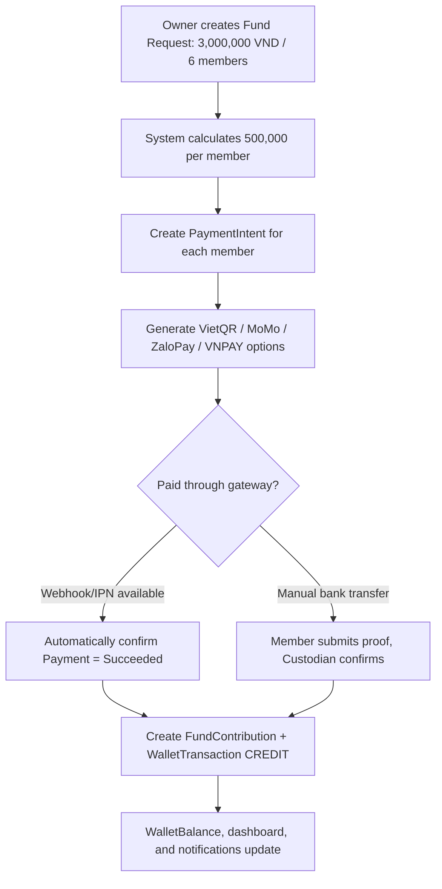
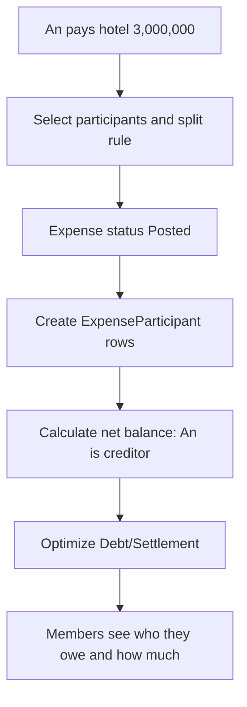
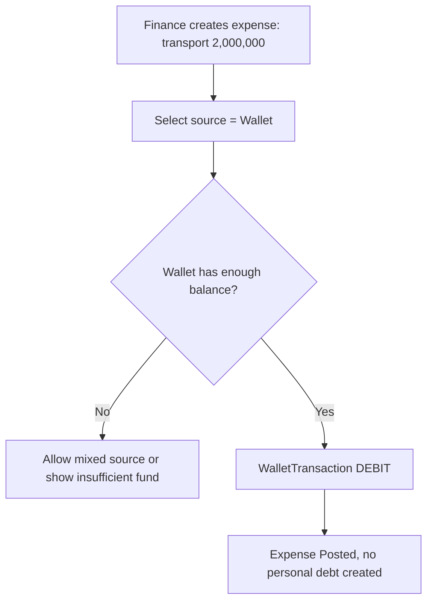
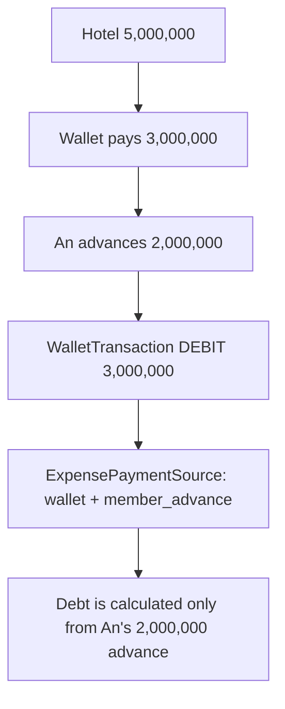
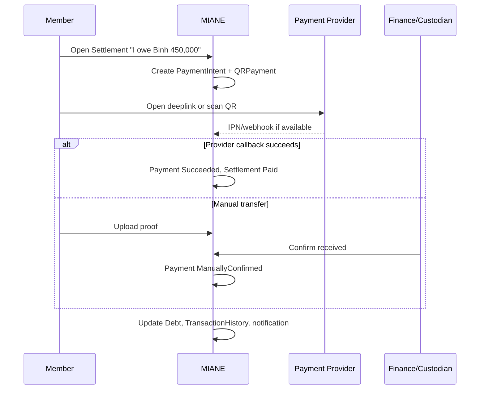
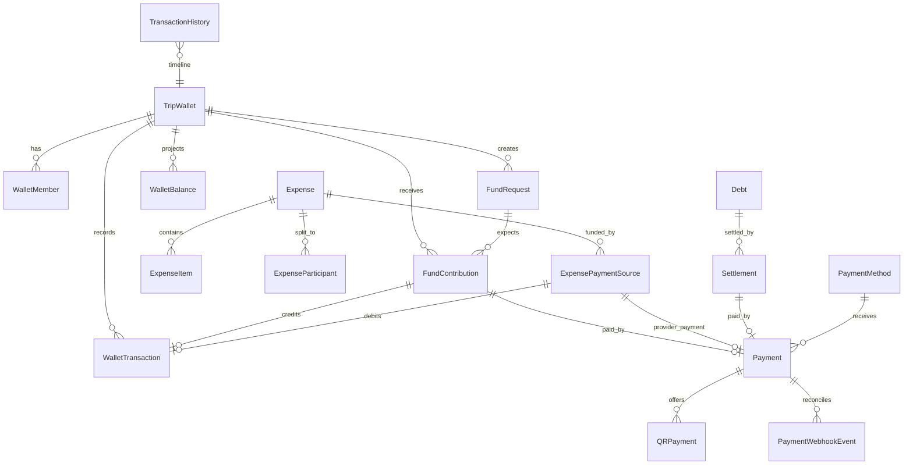
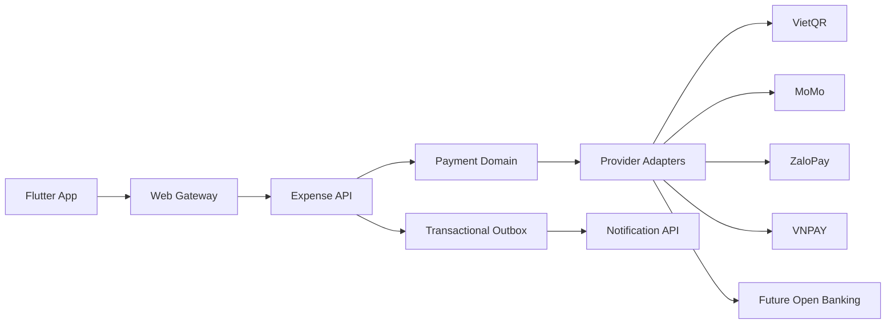

# MIANE SDS - Expense, Group Fund and Payment Redesign

**Version:** 1.0  
**Date:** 2026-07-10  
**Scope:** Expense Service, Trip Wallet, Debt Settlement, Payment Integration, Mobile UX  
**Current architecture:** Flutter mobile + ASP.NET Core microservices + PostgreSQL + Redis + in-app notifications + Transactional Outbox

---

## 1. Design Summary

The current expense module already contains `Expenses`, `ExpenseSplits`, `TripPools`, `PoolContributions`, `DebtRecords`, and a debt simplification algorithm. The redesigned module replaces `TripPool` with `TripWallet` using a ledger model: every cash movement is a `WalletTransaction`, balances are rebuildable projections, and all payments, refunds, and reconciliation flows are connected through `Payment` and `Settlement`.

Primary goals:

1. Transparency: show where the money is, who holds the fund, who contributed, who is missing payment, and who advanced money.
2. Automation: every expense updates wallet, debts, settlements, and dashboard through one consistent rule set.
3. Direct payment support: generate QR/deep links for VietQR, MoMo, ZaloPay, VNPAY, with safe fallbacks.
4. Extensibility: add Open Banking or new payment gateways through adapters without changing the domain core.

---

## 2. Business Analysis

### 2.1 User Roles

| Role | Main permissions |
|---|---|
| Owner | Manage trip, wallet, members, final debt closing, payment provider configuration |
| Finance | Create/edit expenses, create fund requests, manually confirm transactions, view financial dashboards |
| Wallet Custodian | Person currently holding the wallet cash/account; changes are tracked historically |
| Member | View expenses, contribute to the fund, pay own settlements, submit payment proof |
| Auditor/Admin | View history, disputes, webhook reconciliation, and duplicate transactions |

### 2.2 Current Problems and Proposed Design

| Problem | New design |
|---|---|
| Group fund balance and custodian are unclear | `TripWallet` + `WalletMember` + `WalletTransaction` + custodian transfer history |
| Expense can be paid partly by wallet and partly by a member | `ExpensePaymentSource` separates wallet, member advance, and external provider sources |
| Debts are hard to optimize | `DebtOptimizationService` computes net balances and minimal `Debt`/`Settlement` records |
| No proper fund contribution flow | `FundRequest` + `FundContribution` + `PaymentIntent` + QR/deep link |
| Payments are hard to reconcile | `Payment`, `QRPayment`, `PaymentWebhookEvent`, `TransactionHistory` |
| Editing/deleting expenses breaks debts | Expense versioning, reversal transactions, idempotent recalculation jobs |

### 2.3 Design Principles

- The ledger is the source of truth: wallet balance must not be updated without a matching transaction.
- The domain core is provider-independent: MoMo/ZaloPay/VNPAY/VietQR sit behind `PaymentProviderAdapter`.
- Every external callback must be idempotent by `providerTransactionId`, `paymentId`, and `signatureHash`.
- Settlement is a payment instruction with status; Debt is a calculated financial result.
- Financially effective expenses/transactions are not physically deleted; use `Void`, `Reverse`, and `Adjustment`.
- Round money only at the final step and store `roundingDelta` so split totals match the expense total.

---

## 3. User Flow

### 3.1 Create a Fund and Collect Contributions



### 3.2 Create an Expense Advanced by a Member



### 3.3 Create an Expense Paid by the Wallet



### 3.4 Create an Expense Paid by Wallet and Member Advance



### 3.5 Pay a Settlement



---

## 4. UX Flow and Proposed Wireframes

### 4.1 Trip Workspace Navigation

Split the finance area into 5 views:

1. **Overview:** KPIs, cash health, alerts.
2. **Wallet:** wallet balance, custodian, fund requests, transaction timeline.
3. **Expenses:** expense list, filters, OCR bill, add expense.
4. **Debts:** who owes whom, optimized payments, quick pay.
5. **Reports:** category chart, member spending, export.

### 4.2 Wallet Screen

```text
+------------------------------------------------+
| Da Nang Trip Wallet                            |
| Balance: 2,700,000 VND     Custodian: An       |
| Collected: 5,300,000       Spent: 2,600,000    |
+------------------------------------------------+
| [Add Funds] [Create Fund Request] [Transfer]   |
+------------------------------------------------+
| Fund request: Round 1 - 3,000,000              |
| Collected 2,500,000 / Missing 500,000          |
| An paid | Binh paid | Chi pending [Remind]     |
+------------------------------------------------+
| Timeline                                       |
| +500,000 Binh contributed via VietQR           |
| -2,000,000 Transport paid from wallet          |
| +300,000 Chi manual contribution, An confirmed |
+------------------------------------------------+
```

### 4.3 Expense Detail

```text
Hotel - 5,000,000 VND
Payment sources:
  - Group wallet: 3,000,000
  - An advanced:  2,000,000

Split between: An, Binh, Chi, Dung
Share per member: 1,250,000

Impact:
  - Wallet decreases by 3,000,000
  - Debt is calculated from An's 2,000,000 advance
  - New settlements: Binh -> An, Chi -> An, Dung -> An
```

### 4.4 Debt Screen

```text
Optimized debts
You need to pay: 450,000
You will receive: 0

[Pay all]

An pays Binh 450,000   [QR] [Open app]
Chi pays An 200,000    [Remind]

Paid
Binh paid An 300,000 via MoMo, 09:20
```

### 4.5 QR Payment Bottom Sheet

```text
Pay Binh
450,000 VND
Reference: DNANAN450K7

[VietQR QR]
[Open MoMo] [Open Banking] [Open ZaloPay] [VNPAY]

If the app cannot open, show the QR code for scanning.
Status: Pending, expires in 15 minutes.
```

---

## 5. Domain Model

### 5.1 Main Aggregates

| Aggregate | Responsibility |
|---|---|
| `TripWallet` | Trip fund, currency, current custodian, balance projection |
| `WalletTransaction` | Immutable ledger for money in/out/adjustments/custodian transfers |
| `Expense` | Expense record and lifecycle state |
| `ExpenseItem` | Bill line item, OCR support, category |
| `ExpenseParticipant` | Person who bears cost, weight/percent/fixed amount |
| `ExpensePaymentSource` | Expense funding source: wallet/member/provider |
| `Debt` | Net balance result between members after calculation |
| `Settlement` | Payment instruction to settle a debt |
| `Payment` | Payment intent/attempt/reconciliation status |
| `QRPayment` | QR/deep link/provider payload |
| `FundRequest` | Fund collection request |
| `FundContribution` | Member contribution to the fund |
| `TransactionHistory` | Unified audit timeline for UX |

### 5.2 States

**ExpenseStatus**

- `Draft`: being edited, no ledger/debt impact.
- `Posted`: recorded and applied to ledger/debt.
- `Adjusted`: has a new edited version or adjustment.
- `Voided`: canceled through reversal, history remains.

**PaymentStatus**

- `Pending`: intent created, waiting for payment.
- `Processing`: provider accepted or user opened payment app.
- `Succeeded`: provider confirmed or finance confirmed.
- `PartiallySucceeded`: partially paid.
- `Failed`: provider reported failure.
- `Expired`: expired.
- `Disputed`: amount/proof/payee mismatch.
- `Refunded` / `PartiallyRefunded`.

**SettlementStatus**

- `Open`, `PaymentPending`, `Paid`, `PartiallyPaid`, `Cancelled`, `Disputed`, `Superseded`.

---

## 6. Database Schema

All tables in `Miane_expense` use `uuid`, `CreatedAt`, `UpdatedAt`, `CreatedByUserId`, and `ConcurrencyToken` where editing is allowed. Money uses `numeric(18,4)`, currency uses ISO-4217, default `VND`.

### 6.1 `TripWallet`

| Column | Type | Constraint | Description |
|---|---|---|---|
| `Id` | uuid | PK | Wallet ID |
| `TripId` | uuid | Unique, index | One default wallet per trip |
| `Name` | varchar(120) | not null | Wallet/fund name |
| `Currency` | varchar(3) | not null | Wallet currency |
| `CurrentCustodianUserId` | uuid | nullable | Person currently holding the fund |
| `OpeningBalance` | numeric(18,4) | default 0 | Initial balance for import |
| `CurrentBalance` | numeric(18,4) | projection | Cached ledger balance |
| `TotalContributed` | numeric(18,4) | projection | Total collected |
| `TotalSpent` | numeric(18,4) | projection | Total spent |
| `Status` | varchar(30) | active/locked/closed | Wallet status |
| `Version` | bigint | concurrency | Optimistic locking |

### 6.2 Supporting Tables

| Table | Purpose |
|---|---|
| `WalletMember` | Member role, expected contribution, joined/left wallet dates |
| `WalletTransaction` | Immutable ledger entry with direction, amount, balanceAfter, references, metadata |
| `WalletBalance` | Per-user projection: contributed, expected, pending, refundable |
| `FundRequest` | Collection campaign with target amount, allocation type, due date |
| `FundContribution` | Confirmed or pending contribution linked to payment and wallet transaction |
| `Expense` | Expense header, amount, currency, exchange rate, split type, status |
| `ExpenseItem` | Itemized bill lines and assigned users |
| `ExpenseParticipant` | Member share details: amount, percent, weight, participation ratio |
| `ExpensePaymentSource` | Wallet/member/provider funding sources for one expense |
| `Debt` | Calculated open/settled/superseded debt between two users |
| `Settlement` | Payment instruction against a debt or manual settlement |
| `PaymentMethod` | Encrypted bank/wallet receiving method and capabilities |
| `Payment` | Payment intent/attempt, provider IDs, status, reference code |
| `QRPayment` | QR payload, image URL, deep link, universal link, pay URL |
| `PaymentWebhookEvent` | Raw provider callback, signature hash, processing status |
| `TransactionHistory` | Unified timeline projection for expense/payment/wallet/fund actions |

---

## 7. ERD



---

## 8. API Specification

All endpoints go through the Web Gateway, require JWT, and receive `X-User-Id`. Important POST/PUT/PATCH requests accept `Idempotency-Key`.

### 8.1 Wallet

#### `POST /expenses/wallets`

Create a wallet for a trip.

```json
{
  "tripId": "uuid",
  "name": "Da Nang Fund",
  "currency": "VND",
  "currentCustodianUserId": "uuid"
}
```

#### `GET /expenses/wallets/trip/{tripId}`

Returns wallet summary: balance, totals, custodian, members, active fund requests.

#### `PATCH /expenses/wallets/{walletId}/custodian`

Transfer fund custodian.

```json
{
  "newCustodianUserId": "uuid",
  "effectiveAt": "2026-07-10T10:00:00Z",
  "note": "Binh holds the fund on day 2"
}
```

Creates a `WalletTransaction` of type `CustodianTransfer` with amount 0 and a history entry.

#### `GET /expenses/wallets/{walletId}/transactions`

Query params: `from`, `to`, `type`, `userId`, `cursor`, `limit`.

### 8.2 Fund Requests and Contributions

#### `POST /expenses/wallets/{walletId}/fund-requests`

```json
{
  "title": "Fund round 1",
  "targetAmount": 3000000,
  "currency": "VND",
  "allocationType": "equal",
  "participants": [
    { "userId": "uuid", "weight": 1 },
    { "userId": "uuid", "weight": 1 }
  ],
  "dueAt": "2026-07-15T17:00:00Z"
}
```

Returns expected amount per member and optional payment intents.

#### `POST /expenses/fund-contributions/{contributionId}/payment-intent`

```json
{
  "providerPreference": ["vietqr", "momo", "zalopay", "vnpay"],
  "receivingPaymentMethodId": "uuid"
}
```

Returns `Payment` + `QRPayment[]`.

#### `POST /expenses/fund-contributions/{contributionId}/confirm`

Used for manual bank transfers.

```json
{
  "amount": 500000,
  "receivedAt": "2026-07-10T09:20:00Z",
  "paymentReference": "DNANB500K7",
  "proofFileId": "uuid"
}
```

### 8.3 Expense CRUD

#### `POST /expenses`

```json
{
  "tripId": "uuid",
  "title": "Hotel",
  "category": "hotel",
  "amount": 5000000,
  "currency": "VND",
  "paidAt": "2026-07-10T12:00:00Z",
  "splitType": "equal",
  "participants": [
    { "userId": "uuid-an", "participationRatio": 1 },
    { "userId": "uuid-binh", "participationRatio": 1 },
    { "userId": "uuid-chi", "participationRatio": 1 },
    { "userId": "uuid-dung", "participationRatio": 1 }
  ],
  "paymentSources": [
    { "sourceType": "wallet", "tripWalletId": "uuid", "amount": 3000000 },
    { "sourceType": "member_advance", "userId": "uuid-an", "amount": 2000000 }
  ],
  "items": []
}
```

#### `GET /expenses/trip/{tripId}`

Supports filters: `status`, `category`, `paidBy`, `from`, `to`, `sourceType`.

#### `GET /expenses/{expenseId}`

Returns full detail: items, participants, sources, wallet impact, debt impact.

#### `PUT /expenses/{expenseId}`

If the expense is already `Posted`, create an adjustment version:

1. Reverse ledger/debt impact of the old version.
2. Post the new version.
3. Run recalculation.

#### `POST /expenses/{expenseId}/void`

Voids an expense through reversal, reason required.

### 8.4 Debts and Settlements

#### `POST /expenses/trip/{tripId}/debts/recalculate`

```json
{
  "mode": "full",
  "includeWalletContributions": false,
  "roundingScale": 0
}
```

Returns `calculationRunId`, debts, and new settlements.

#### `GET /expenses/trip/{tripId}/debts`

Returns net balances, open/settled debts, and source explanation.

#### `POST /expenses/settlements`

Create a manual settlement or one from a debt.

```json
{
  "debtId": "uuid",
  "fromUserId": "uuid",
  "toUserId": "uuid",
  "amount": 450000,
  "currency": "VND"
}
```

#### `POST /expenses/settlements/{settlementId}/payment-intent`

Generates payment options from the receiver's payment method.

#### `POST /expenses/settlements/{settlementId}/confirm`

Manual confirmation with partial payment support.

```json
{
  "amount": 200000,
  "paymentReference": "DNANAN200K7",
  "proofFileId": "uuid",
  "confirmedAt": "2026-07-10T13:00:00Z"
}
```

### 8.5 Payments, QR and Deep Links

#### `POST /expenses/payments`

Shared endpoint for fund/debt/refund/expense payments.

```json
{
  "purpose": "debt_settlement",
  "tripId": "uuid",
  "payerUserId": "uuid",
  "payeeUserId": "uuid",
  "amount": 450000,
  "currency": "VND",
  "receivingPaymentMethodId": "uuid",
  "provider": "vietqr",
  "returnUrl": "miane://payments/return"
}
```

#### `POST /expenses/payments/{paymentId}/qr`

```json
{
  "providers": ["vietqr", "momo", "zalopay", "vnpay"],
  "preferredBankCodes": ["BIDV", "VCB"],
  "osType": "android"
}
```

Returns:

```json
{
  "paymentId": "uuid",
  "referenceCode": "DNANAN450K7",
  "options": [
    {
      "provider": "vietqr",
      "qrPayload": "000201...",
      "qrImageUrl": "https://...",
      "deepLink": null,
      "payUrl": "https://..."
    }
  ],
  "expiresAt": "2026-07-10T13:15:00Z"
}
```

#### `GET /expenses/payments/{paymentId}/status`

Returns current status and reconciliation history.

#### Webhooks/IPN

- `POST /expenses/payments/webhooks/momo`
- `POST /expenses/payments/webhooks/zalopay`
- `POST /expenses/payments/webhooks/vnpay`
- `POST /expenses/payments/webhooks/vietqr`
- `POST /expenses/payments/webhooks/open-banking/{provider}`

Each webhook:

1. Stores the raw event in `PaymentWebhookEvent`.
2. Validates signature/checksum.
3. Matches payment by provider order/reference/amount.
4. Updates `Payment` idempotently.
5. Publishes `PaymentSucceeded` or `PaymentFailed`.

---

## 9. Business Rules

### 9.1 Wallet

- Wallets cannot go negative unless Owner enables `AllowNegativeBalance`; if negative, UI must warn that more fund is required.
- A wallet has one `CurrentCustodianUserId`, but custodian transfer history is immutable.
- Manual contributions increase the wallet only after Finance/Custodian confirmation.
- Gateway contributions increase the wallet only when provider status succeeds and amount matches.
- If callback amount is greater than expected, the excess becomes `WalletBalance.RefundableAmount` or `AdjustmentCredit`.
- If callback amount is less than expected, contribution becomes `partial` and the rest remains pending.

### 9.2 Expense

- Sum of `ExpensePaymentSource.Amount` after conversion must equal `Expense.ConvertedAmount`.
- `wallet` source requires `TripWalletId` and creates a `WalletTransaction` debit.
- `member_advance` source requires `UserId` and participates in debt calculation.
- Expense paid 100% from wallet creates no personal debt.
- Mixed source expense creates debt only for the member/external advanced portion, not the wallet portion.
- `PaidByUserId` remains only for backward compatibility; new logic reads `ExpensePaymentSource`.

### 9.3 Split

- Equal: split among participants where `IsExcluded = false`, using `ParticipationRatio`.
- Percent: total percent must be 100%, tolerance <= 0.0001.
- Fixed amount: fixed totals must equal expense amount.
- Weight: `share = amount * userWeight / totalWeight`.
- Itemized: item assignments + service fee/tax/discount must equal total.
- Free children: `ParticipantType = child`, `IsExcluded = true`, or `Weight = 0`, depending on trip rule.
- Partial participation: `ParticipationRatio` from 0 to 1; equal split uses ratio as weight.
- Rounding: round each share by currency scale and assign delta to the largest share or selected participant.

### 9.4 Debt and Settlement

- Open Debt is always a projection from posted expenses and succeeded settlements.
- When settlement payment is pending, Debt stays open, but UI may subtract `pendingPaidAmount`.
- When settlement succeeds partially, update paid amount and recalculate.
- When an expense changes, paid settlements remain as real historical transactions; new debts are calculated after subtracting paid settlements.
- Do not create a settlement between the same user.

### 9.5 Payment

- Every payment has a unique `ReferenceCode` within the trip: short, ASCII, no special characters.
- Deep link is only a shortcut; a payment is not successful until callback/IPN or manual confirmation exists.
- Provider callback must validate signature/checksum before status update.
- ReturnUrl is for user display only; IPN/webhook/server query is the trusted confirmation source.
- If provider does not support refund API, create manual settlement/refund instead of calling provider.

---

## 10. Split Algorithms

### 10.1 Input

```text
amount: decimal
currencyScale: int (VND = 0, USD = 2)
participants: userId, ratio, weight, fixedAmount, percent, excluded
splitType: equal | percent | fixed | weight | itemized
```

### 10.2 Equal with Participation Ratio

```pseudo
eligible = participants where !excluded and ratio > 0
totalWeight = sum(ratio for eligible)
for p in eligible:
    rawShare[p] = amount * p.ratio / totalWeight
shares = roundAndDistributeDelta(rawShare, amount, currencyScale)
```

Example: BBQ 2,000,000, 6 people, 1 person does not eat:

- eligible = 5
- each person = 400,000
- excluded person = 0

### 10.3 Percent

```pseudo
assert abs(sum(percent) - 100) <= epsilon
share[p] = amount * percent[p] / 100
roundAndDistributeDelta()
```

### 10.4 Fixed Amount

```pseudo
assert sum(fixedAmount) == amount
share[p] = fixedAmount[p]
```

### 10.5 Weight

```pseudo
totalWeight = sum(weight)
share[p] = amount * weight[p] / totalWeight
```

### 10.6 Itemized

```pseudo
for item in items:
    itemEligible = assigned users
    split item by item rule
subtotalShares = sum item shares
allocate tax/service/discount by proportion of subtotalShares
roundAndDistributeDelta()
```

---

## 11. Debt Optimization Algorithm

### 11.1 Goal

Reduce the number of required settlement transactions. The original chain A -> B -> C -> D does not need to be preserved. The only requirement is that every user's net balance becomes 0 after settlement.

### 11.2 Net Balance Calculation

For each expense:

- The `wallet` portion does not create personal debt.
- The `member_advance` portion:
  - credits the advancing member by the amount advanced.
  - debits each participant by their share of that portion.
- If the payer is also a participant, the payer's own share cancels within net balance.

For succeeded settlements:

- `fromUser` increases net balance, reducing their debt.
- `toUser` decreases net balance, reducing the amount they should receive.

Convention:

- `net[user] > 0`: user should receive money.
- `net[user] < 0`: user should pay money.

### 11.3 Greedy Matching with Heaps

```pseudo
function simplify(netBalances):
    creditors = maxHeap((amount, userId) for net > epsilon)
    debtors = maxHeap((abs(net), userId) for net < -epsilon)
    settlements = []

    while creditors not empty and debtors not empty:
        creditAmount, creditor = creditors.pop()
        debtAmount, debtor = debtors.pop()

        amount = min(creditAmount, debtAmount)
        settlements.add(from=debtor, to=creditor, amount=round(amount))

        creditAmount -= amount
        debtAmount -= amount

        if creditAmount > epsilon:
            creditors.push(creditAmount, creditor)
        if debtAmount > epsilon:
            debtors.push(debtAmount, debtor)

    return mergeSmallSettlements(settlements)
```

Complexity: `O(n log n + m)`, where `n` is member count and `m` is generated settlement count. Transaction count is usually at most `n - 1` when there are no rounding/currency constraints.

### 11.4 Example

| User | Net |
|---|---:|
| A | -100 |
| B | 0 |
| C | 0 |
| D | +100 |

Old chain A -> B, B -> C, C -> D becomes one transaction: A -> D 100.

### 11.5 Practical Handling

- Multi-currency: calculate per currency/base currency; store exchange rate at expense time.
- Rounding: ignore debt <= threshold and put it into `RoundingAdjustment`.
- Paid settlements are not deleted during recalculation; they are historical transactions.
- Pending payments may be subtracted in UI but not in final net balance.

---

## 12. Wallet Management Algorithm

### 12.1 Ledger Posting

```pseudo
function postWalletTransaction(walletId, direction, amount, type):
    wallet = loadWalletForUpdate(walletId)
    if direction == debit and wallet.currentBalance < amount:
        throw InsufficientBalance
    newBalance = wallet.currentBalance + signed(direction, amount)
    insert WalletTransaction(balanceAfter = newBalance)
    update TripWallet projection totals
    insert TransactionHistory
```

Use a DB transaction plus optimistic concurrency or row lock to prevent double spending.

### 12.2 Rebuild Balance

```pseudo
balance = openingBalance
for tx in WalletTransaction where status=posted order by occurredAt, createdAt:
    balance += tx.direction == credit ? tx.amount : -tx.amount
    assert tx.balanceAfter == balance or repair projection
```

### 12.3 Fund Request Allocation

```pseudo
if equal:
    expected[user] = target / eligibleCount
if fixed:
    expected[user] = configured amount
if percent:
    expected[user] = target * percent / 100
if weight:
    expected[user] = target * weight / totalWeight
```

Each expected row creates a pending `FundContribution`. When partially paid, update confirmed amount and create another intent for the remaining amount if needed.

### 12.4 Transfer Custodian

Custodian transfer is a dedicated event:

1. Owner/Finance creates the request.
2. Old and new custodians confirm if required.
3. Create `WalletTransaction` type `CustodianTransfer` amount 0, metadata contains from/to.
4. Update `TripWallet.CurrentCustodianUserId`.

---

## 13. Payment and Reconciliation Flow

### 13.1 Manual Bank Transfer into Wallet

1. MIANE creates a `Payment` with purpose `fund_contribution`, provider `vietqr/manual_bank`.
2. QR includes amount and reference.
3. Member scans QR and transfers money.
4. If Open Banking is not integrated, Finance/Custodian confirms receipt.
5. System creates confirmed `FundContribution` + `WalletTransaction` credit.

### 13.2 Gateway Auto-confirm

1. MIANE creates provider order.
2. Provider returns QR/deep link/pay URL.
3. Provider calls webhook/IPN.
4. MIANE validates signature, amount, currency, order id.
5. Update `Payment = Succeeded`.
6. Domain handler creates ledger/debt/settlement side effects.

### 13.3 Reconciliation Job

Background job:

- Finds overdue `Processing/Pending` payments.
- Queries provider status if supported.
- Marks expired if TTL passed and payment is not paid.
- Detects duplicate callbacks by unique key.
- Detects amount/reference mismatch and moves payment to `Disputed`.

### 13.4 Proof and Dispute

Manual payment should store:

- receipt image/file id
- payment reference
- amount reported by user
- time reported by user
- confirming user
- mismatch note if any

If Finance reports a wrong amount, payment becomes `Disputed`; debt/wallet is not mutated until resolution.

---

## 14. VietQR, MoMo, ZaloPay, VNPAY and Deep Linking Integration

### 14.1 Payment Provider Abstraction

```csharp
public interface IPaymentProviderAdapter
{
    string ProviderCode { get; }
    Task<PaymentCreateResult> CreatePaymentAsync(PaymentCreateRequest request, CancellationToken ct);
    Task<PaymentStatusResult> QueryStatusAsync(string providerOrderId, CancellationToken ct);
    Task<RefundResult> RefundAsync(RefundRequest request, CancellationToken ct);
    Task<WebhookParseResult> ParseWebhookAsync(HttpRequest request, CancellationToken ct);
}
```

`PaymentCreateResult` contains:

- `providerOrderId`
- `providerTransactionToken`
- `payUrl`
- `deepLink`
- `universalLink`
- `qrPayload`
- `qrImageUrl`
- `expiresAt`
- `capabilities`

### 14.2 VietQR

Use cases:

- Generate QR for wallet/custodian bank transfer.
- Generate QR for member-to-member settlement.
- Common fallback when banking app auto-fill deep link is unavailable.

Rules:

- Use QR generation API with `accountNo`, `accountName`, `acqId`, `amount`, `addInfo`, `template`.
- `addInfo`/`content` must be ASCII, no special characters; API limits differ: VietQR quick generate states `addInfo <= 25`, host-to-host document states `content <= 19`.
- Generate a safe `ReferenceCode`, for example `DNANAN450K7`, instead of `TripDN_An_325000` if provider disallows underscore or long text.
- Store both `qrPayload` EMVCo string and `qrImageUrl/qrDataURL` if available.
- Auto-confirm is only possible with VietQR callback/Open Banking/bank transaction sync; otherwise use manual confirmation.

### 14.3 MoMo

Use cases:

- Payment gateway for settlement/fund contribution.
- Deep link into MoMo confirmation screen.
- QR fallback.

Rules:

- Backend calls One-Time Payment API `POST /v2/gateway/api/create` with `requestType = captureWallet`.
- Include `redirectUrl` to return to app/web and `ipnUrl` for server-to-server result.
- Response can include `payUrl`, `deeplink`, `qrCodeUrl`, `deeplinkMiniApp`; production usage requires MoMo permission for QR/deep link fields.
- `requestId`/`orderId` are used for idempotency.
- Treat as success only when `resultCode = 0` after signature validation.

### 14.4 ZaloPay

Use cases:

- App-to-app payment through ZaloPay SDK.
- QR multi-function/VietQR for both ZaloPay app and banking apps.
- Bank deep link list with auto-fill flag.

Rules:

- Backend calls Create Order API.
- Response includes `zp_trans_token`, `order_url`, `order_token`, `qr_code`.
- App-to-app uses token/order_url to open ZaloPay.
- QR multi-function can display `qr_code` or redirect `order_url`.
- ZaloPay provides bank deeplink list by `bank_codes`, `os_type`, `order_token`; response includes `deep_link` and `is_auto_fill`.
- If callback is missed, query order status every minute until payment expiry.

### 14.5 VNPAY

Use cases:

- Gateway payment via VNPAY-QR, ATM, bank account, card.
- Refund/query status through merchant API.

Rules:

- Create Payment URL GET to `https://sandbox.vnpayment.vn/paymentv2/vpcpay.html` or production endpoint.
- `vnp_Amount` must be multiplied by 100.
- `vnp_BankCode = VNPAYQR` for QR, `VNBANK` for domestic ATM/bank account, `INTCARD` for international card; omit it to let user choose on VNPAY.
- `vnp_ReturnUrl` only displays result to user; `IPN URL` updates payment result.
- Query/refund uses `POST /merchant_webapi/api/transaction` with `vnp_Command=querydr` or `refund`.
- Validate `vnp_SecureHash`; mark success only when response/transaction status is successful.

### 14.6 Banking App Deep Link

Do not hard-code each bank's private scheme in the core because these schemes change and no unified public standard exists. Strategy:

1. Prefer providers with valid deeplink APIs, such as ZaloPay bank deeplink list.
2. If `is_auto_fill=true`, show "Open banking app" and use provider deep link.
3. If `is_auto_fill=false`, open the app, copy/show reference, and display QR.
4. If app is unavailable or `canLaunch` fails, fall back to VietQR QR.
5. Store capability by provider/bank/os in `PaymentMethod.CapabilitiesJson` and refresh periodically.

### 14.7 Mobile Deep Link Back to MIANE

MIANE should register:

- Android App Links: `https://miane.app/payments/return`
- iOS Universal Links: same domain
- Custom scheme fallback: `miane://payments/return`

Return handler only refreshes payment status from backend; it must not trust provider query string data without server confirmation.

---

## 15. Financial Reports

### 15.1 KPIs

- Total spent: sum `Expense.ConvertedAmount` where status is posted.
- Wallet balance: wallet current balance.
- Total contributed: sum confirmed `FundContribution.Amount`.
- Total advanced: sum `ExpensePaymentSource` where type is member_advance.
- Total outstanding debt: sum unpaid open debts/settlements.
- Top spender: sum advances + wallet managed spending if needed.
- Members missing fund contribution: `WalletBalance.ExpectedAmount - ContributedAmount - PendingAmount`.
- Burn rate: totalSpent / elapsed trip days.
- Low wallet alert: wallet balance < forecast next planned expenses.

### 15.2 Charts

- Category breakdown: pie/donut or bar.
- Transaction timeline: expense/payment/wallet combined.
- Member contribution matrix: expected/paid/pending/refundable.
- Debt network: simple list on mobile, optional graph on dashboard.

### 15.3 Export

- CSV/PDF includes: expense list, wallet ledger, member balances, settlement history.
- Export must include generated time, currency, and exchange-rate policy.

---

## 16. Notifications

### 16.1 Event -> Notification

| Event | Recipients | Content |
|---|---|---|
| `FundRequestCreated` | Members | You need to contribute X before Y |
| `FundContributionConfirmed` | Member + Finance | Fund contribution completed |
| `WalletLowBalance` | Owner/Finance | Wallet only has X left |
| `ExpensePosted` | Participants | An added expense X |
| `DebtCalculated` | Debtors | You still owe Binh X |
| `SettlementPaymentPending` | Payee | An is paying X |
| `PaymentSucceeded` | Payer/Payee | Payment completed |
| `PaymentDisputed` | Finance | Transaction needs reconciliation |

### 16.2 Rules

- Batch notifications to avoid spam when recalculation creates many debts.
- Fund contribution reminders: T-24h, due date, and overdue every 48h.
- Debt reminders are sent only when trip is completed or Owner taps "Remind payment".

---

## 17. Edge Cases

| Edge case | Handling |
|---|---|
| Member leaves mid-trip | Keep `WalletMember.LeftAt`; still included in expenses before leaving; debts remain |
| Member joins late | Default inclusion only for expenses/fund requests after `JoinedAt`, with manual include option |
| Posted expense is canceled | Create reversal ledger/debt, status `Voided`, recalculate |
| Shared expense is edited | Create version/adjustment; do not overwrite history |
| Expense refund | Create negative adjustment or `RefundCredit`; create Payment refund if provider supports |
| Payer changes | Reverse old payment source, post new source, recalculate |
| Custodian changes | `CustodianTransfer` amount 0 + audit |
| Partial payment | Payment/Settlement `PartiallySucceeded`, remaining amount stays open |
| Multiple payments | Multiple Payment attempts linked to same Settlement, update `PaidAmount` |
| One person pays for several people | Create settlement payer override with beneficiaries metadata; confirmed payment reduces beneficiaries' debts |
| Offline during payment | App creates local draft/proof; sync status online; never mark success offline |
| Failed transaction | Payment `Failed`, settlement returns to `Open`, allow new attempt |
| Duplicate transaction | Unique provider id/reference/amount/time window; ignore duplicate webhook |
| Amount mismatch | Underpay = partial; overpay = refundable/adjustment; large mismatch -> disputed |
| Callback arrives before create response | Match by provider order id/idempotency; hold event pending if payment is not persisted yet |
| Callback retried | Idempotent by provider event/order/transaction id |
| Provider timeout on create | Retry with same idempotency key; do not create a new order before querying status |
| QR expires but user already transferred | Gateway: query provider; manual bank: finance confirms late success |
| Wallet insufficient balance | Block debit or convert to mixed source if user chooses |
| Multi-currency | Convert expense into base currency; wallet supports one currency in v1 |
| Exchange rate changes after edit | New version stores new exchange rate; old history remains |
| Trip completed | Allow ledger closing; lock new expenses unless Owner reopens |
| Member has no payment method | Use custodian/default receiving method or manual cash |
| Payee is not a member | Create guest payee/payment method; do not calculate member debt |
| Provider has no deeplink | Show QR/payUrl only |
| Banking app is not installed | Fallback to QR + copy reference |
| Partial refund | Create partial refund payment, update settlement/payment paid amount |
| Fraud/dispute | Freeze payment; do not mutate ledger/debt until resolved |

---

## 18. Migration from Current System

### 18.1 Old Table -> New Table Mapping

| Current | New |
|---|---|
| `TripPools` | `TripWallet` |
| `PoolContributions` | `FundContribution` + `WalletTransaction` |
| `Expenses` | `Expense` |
| `ExpenseSplits` | `ExpenseParticipant` |
| `DebtRecords` | `Debt` + `Settlement` |
| `IsPaidFromPool` | `ExpensePaymentSource(sourceType=wallet)` |
| `PaidByUserId` | `ExpensePaymentSource(sourceType=member_advance)` |

### 18.2 Migration Steps

1. Create new tables alongside old ones.
2. Backfill every `TripPool` into `TripWallet`.
3. Backfill `PoolContribution` into confirmed `FundContribution` and `WalletTransaction ContributionCredit`.
4. Backfill expenses:
   - `IsPaidFromPool=true`: 100% wallet source.
   - `IsPaidFromPool=false`: member_advance source by `PaidByUserId`.
5. Backfill `ExpenseSplits` into `ExpenseParticipant`.
6. Run debt recalculation to create new `Debt`; keep `DebtRecords` read-only during transition.
7. Update mobile APIs to new endpoints.
8. Enable feature flag `ExpenseWalletV2`.
9. After reconciliation, retire old tables or create compatibility views.

---

## 19. Extensible Architecture

### 19.1 Payment Module Boundaries



### 19.2 Future Open Banking

Add a new adapter:

- `IBankTransactionSyncProvider`
- `SyncTransactionsAsync(account, from, to)`
- Match transaction by amount + reference + time window + receiver account.
- Create synthetic `PaymentWebhookEvent` when sync finds a matching transaction.
- Domain core still only receives `PaymentSucceeded`.

### 19.3 Provider Configuration

Proposed `PaymentProviderConfig` table:

| Column | Description |
|---|---|
| `Provider` | momo/zalopay/vnpay/vietqr/open_banking |
| `Environment` | sandbox/production |
| `MerchantId` | partner/app/tmn code |
| `CredentialsRef` | key to secret vault |
| `WebhookSecretRef` | key for callback validation |
| `CapabilitiesJson` | qr/deeplink/refund/query/manual_confirm |
| `IsEnabled` | Enable/disable provider |

Secrets must not be stored as plain text in DB; use environment variables or a secret manager.

---

## 20. Security, Compliance and Audit

- Encrypt bank account/phone/payment tokens at rest.
- Redact raw webhook payloads before logging.
- Always validate provider signature/checksum.
- Use idempotency for create payment/confirm/contribution.
- RBAC: only Owner/Finance/Custodian can confirm money into wallet.
- Immutable audit for expense adjustment, wallet transaction, payment status changes.
- Rate limit QR/payment creation to avoid provider spam.
- Do not store card data; if using VNPAY/tokenization, store only provider token according to provider terms.
- Return URL must not directly update financial state.

---

## 21. Observability and Testing

### 21.1 Logs/Metrics

- `payment_create_total{provider,status}`
- `payment_webhook_total{provider,result}`
- `payment_reconciliation_lag_seconds`
- `wallet_balance_rebuild_mismatch_total`
- `debt_recalculation_duration_ms`
- `duplicate_webhook_total`

### 21.2 Required Test Cases

- Equal/percent/fixed/weight/itemized split with rounding.
- 100% wallet-paid expense creates no debt.
- Mixed wallet + member advance creates debt only for advanced portion.
- Partial settlement and multiple attempts.
- Duplicate webhook does not double-credit wallet.
- Invalid callback signature is rejected.
- Concurrent wallet debits cannot create negative balance.
- Migration sample from old `TripPool` to `TripWallet`.
- Ledger rebuild matches `CurrentBalance`.

---

## 22. Delivery Plan

### Phase 1 - Domain and DB

- Add new wallet/payment/settlement schema.
- Write migration/backfill.
- Implement wallet ledger, split calculator, debt optimizer v2.

### Phase 2 - API and Mobile v1

- Wallet screen, fund request, mixed-source expense.
- Debt screen + settlement QR bottom sheet.
- Manual confirmation + proof.

### Phase 3 - Provider Integrations

- VietQR dynamic.
- MoMo one-time payment.
- ZaloPay order + QR/deeplink.
- VNPAY payment URL + IPN + querydr.

### Phase 4 - Automation and Reporting

- Reconciliation jobs.
- Financial dashboard.
- Notification rules.
- Export report.

### Phase 5 - Open Banking Readiness

- Bank transaction sync adapter.
- Auto-match bank transfers.
- Advanced dispute workflow.

---

## 23. Open Questions

1. Should a trip support multiple wallets, such as "Food fund" and "Hotel fund", or should v1 support only one wallet?
2. Is the custodian always the receiver for fund transfers, or can the wallet receive into a company/merchant account?
3. Should Basic/Pro plans limit payment providers?
4. Should v1 support guests without MIANE accounts?
5. Should non-VND currencies be supported by payment gateways or only for expense recording/conversion?

---

## 24. Provider References

- VietQR quick generate API: https://www.vietqr.io/danh-sach-api/link-tao-ma-nhanh/api-tao-ma-qr/
- VietQR host-to-host integrated document: https://doc.vietqr.vn/doc/api-vietqr-callback/api-vietqr-host2host/integrated-document-for-payment-service-vietqr
- MoMo One-Time Payments: https://developers.momo.vn/v3/docs/payment/api/wallet/onetime/
- MoMo payment response/deeplink fields: https://developers.momo.vn/v3/docs/payment/api/payment-api/promotioninfo/
- ZaloPay SDK/App-to-App overview: https://docs.zalopay.vn/docs/sdk/intro/
- ZaloPay Create Order API: https://docs.zalopay.vn/docs/specs/order-create/
- ZaloPay QR multi-function and bank deeplink flow: https://docs.zalopay.vn/docs/guides/payment-acceptance/zalopay-emvco-qr/intro/
- VNPAY PAY integration: https://sandbox.vnpayment.vn/apis/docs/thanh-toan-pay/pay.html
- VNPAY query/refund API: https://sandbox.vnpayment.vn/apis/docs/truy-van-hoan-tien/querydr%26refund.html
