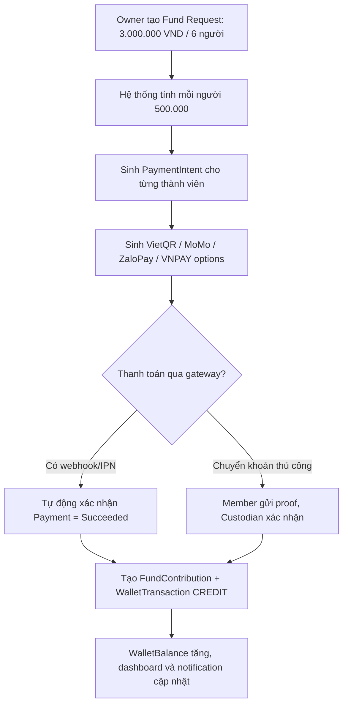
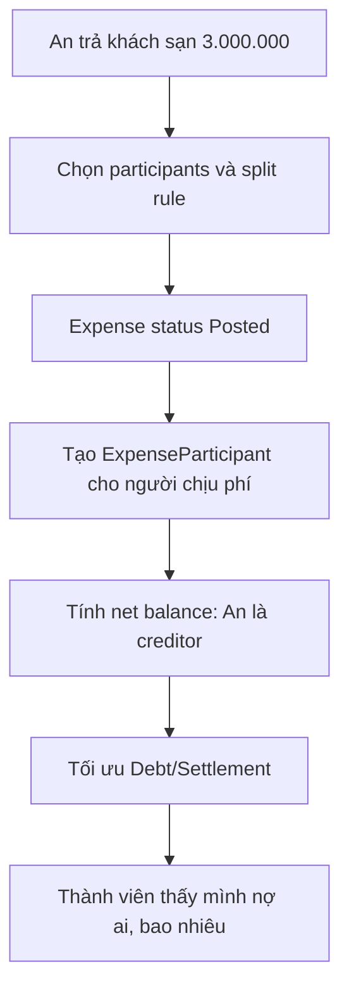
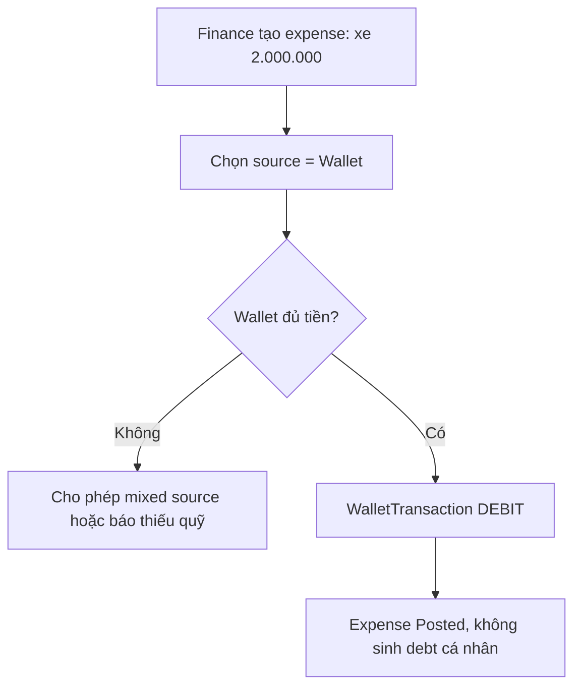
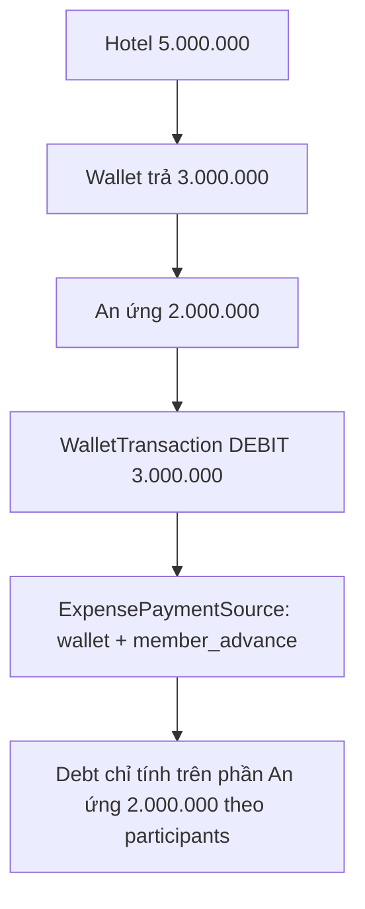
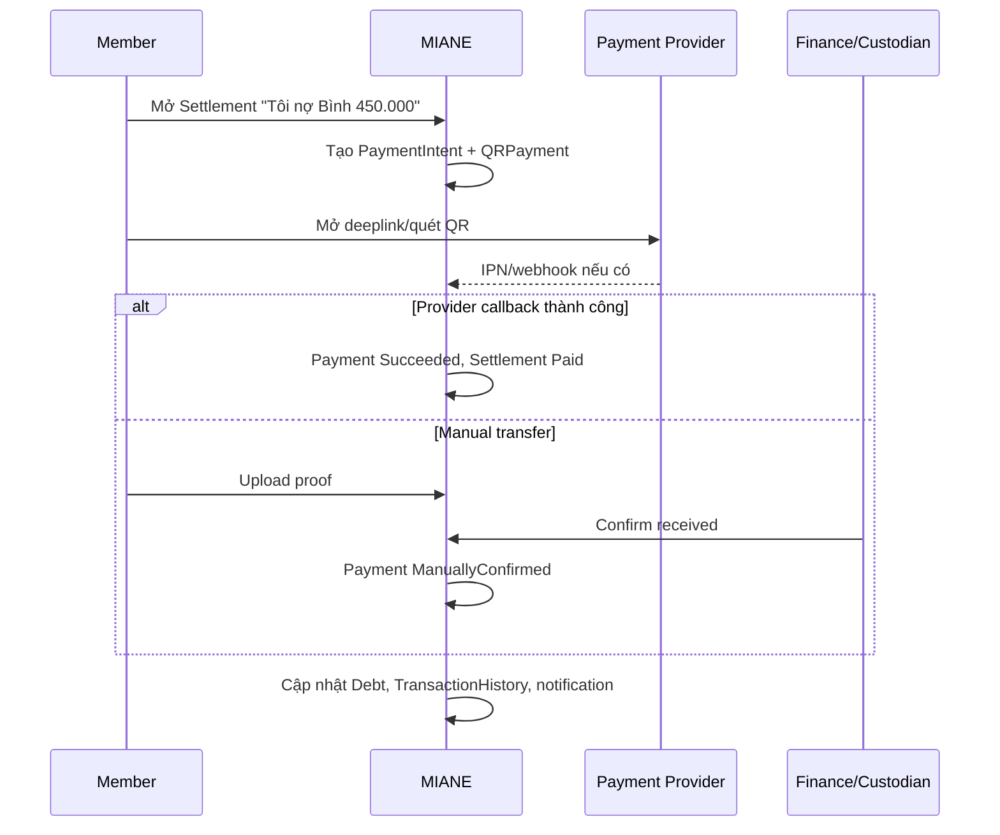
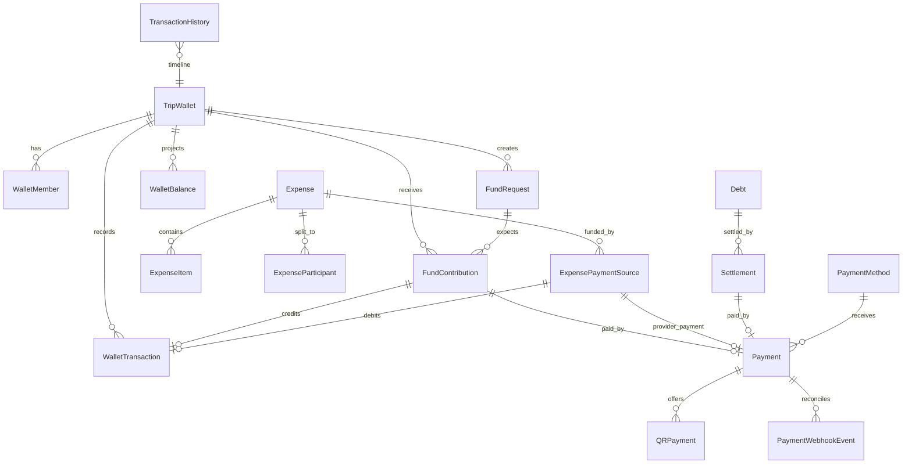
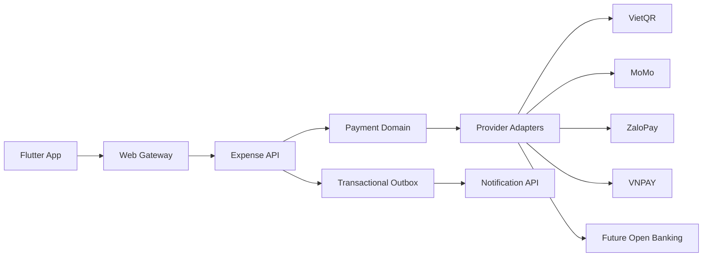

# MIANE SDS - Thiết kế lại Chi phí, Quỹ nhóm và Thanh toán

**Phiên bản:** 1.0  
**Ngày:** 10/07/2026  
**Phạm vi:** Expense Service, Trip Wallet, Debt Settlement, Payment Integration, Mobile UX  
**Kiến trúc hiện tại:** Flutter mobile + ASP.NET Core microservices + PostgreSQL + Redis + thông báo trong app + Transactional Outbox

---

## 1. Tóm tắt thiết kế

Module chi phí hiện tại đã có `Expenses`, `ExpenseSplits`, `TripPools`, `PoolContributions`, `DebtRecords` và thuật toán đơn giản hóa công nợ. Thiết kế mới chuyển `TripPool` thành `TripWallet` theo mô hình sổ cái: mọi dòng tiền vào/ra đều là một `WalletTransaction`, số dư là projection có thể tính lại, và toàn bộ thanh toán, hoàn tiền, đối soát đều gắn với `Payment`/`Settlement`.

Mục tiêu chính:

1. Minh bạch: biết tiền đang ở đâu, ai giữ quỹ, ai đã nộp, ai còn thiếu, ai đang ứng.
2. Tự động: mỗi khoản chi tự cập nhật wallet, công nợ, settlement và dashboard theo cùng một bộ quy tắc.
3. Thanh toán trực tiếp: sinh QR/deep link cho VietQR, MoMo, ZaloPay, VNPAY và fallback an toàn.
4. Mở rộng: thêm Open Banking hoặc payment gateway mới bằng adapter, không thay đổi domain core.

---

## 2. Phân tích nghiệp vụ

### 2.1 Vai trò người dùng

| Vai trò | Quyền chính |
|---|---|
| Owner | Quản lý chuyến đi, wallet, thành viên, chốt công nợ, cấu hình payment provider |
| Finance | Tạo/sửa chi phí, tạo yêu cầu thu quỹ, xác nhận giao dịch thủ công, xem dashboard tài chính |
| Wallet Custodian | Người đang giữ tiền mặt/tài khoản của wallet, có lịch sử chuyển quyền |
| Member | Xem chi phí, nộp quỹ, thanh toán settlement của mình, gửi bằng chứng thanh toán |
| Auditor/Admin | Xem lịch sử, dispute, đối soát webhook và giao dịch trùng |

### 2.2 Vấn đề hiện tại và hướng xử lý

| Vấn đề | Thiết kế mới |
|---|---|
| Quỹ nhóm không rõ số dư/người giữ | `TripWallet` + `WalletMember` + `WalletTransaction` + lịch sử chuyển người giữ quỹ |
| Khoản chi vừa từ quỹ vừa do cá nhân ứng | `ExpensePaymentSource` tách nguồn chi: wallet, member advance, external provider |
| Công nợ khó tối ưu | `DebtOptimizationService` tính net balance và sinh `Debt`/`Settlement` tối thiểu |
| Chưa có luồng nộp quỹ | `FundRequest` + `FundContribution` + `PaymentIntent` + QR/deep link |
| Thanh toán không đối soát được | `Payment`, `QRPayment`, `PaymentWebhookEvent`, `TransactionHistory` |
| Sửa/xóa expense làm lệch nợ | Expense có version, reversal transaction, recalculation job idempotent |

### 2.3 Nguyên tắc thiết kế

- Ledger là source of truth: không cập nhật số dư wallet trực tiếp nếu không có transaction tương ứng.
- Domain core không phụ thuộc provider: MoMo/ZaloPay/VNPAY/VietQR nằm sau `PaymentProviderAdapter`.
- Mọi external callback phải idempotent theo `providerTransactionId`, `paymentId`, `signatureHash`.
- Settlement là đề xuất/lệnh thanh toán có trạng thái; Debt là kết quả tính toán tài chính.
- Không xóa vật lý expense/transaction đã ảnh hưởng tài chính; dùng `Void`, `Reverse`, `Adjustment`.
- Làm tròn tiền ở bước cuối, lưu `roundingDelta` để tổng split bằng tổng expense.

---

## 3. User Flow

### 3.1 Tạo quỹ và thu tiền



### 3.2 Tạo expense do thành viên ứng tiền



### 3.3 Tạo expense trả bằng quỹ



### 3.4 Tạo expense vừa từ quỹ vừa do cá nhân ứng



### 3.5 Thanh toán settlement



---

## 4. UX Flow và Wireframe đề xuất

### 4.1 Navigation trong Trip Workspace

Tách tab tài chính thành 5 view:

1. **Tổng quan:** KPI, cash health, alerts.
2. **Quỹ:** wallet balance, custodian, fund requests, transaction timeline.
3. **Chi phí:** expense list, filters, OCR bill, add expense.
4. **Công nợ:** ai nợ ai, tối ưu giao dịch, thanh toán nhanh.
5. **Báo cáo:** category chart, member spending, export.

### 4.2 Wallet Screen

```text
+------------------------------------------------+
| Quỹ chuyến đi Đà Nẵng                          |
| Số dư: 2.700.000 VND       Người giữ: An       |
| Đã thu: 5.300.000          Đã chi: 2.600.000   |
+------------------------------------------------+
| [Nạp quỹ] [Tạo yêu cầu thu] [Chuyển người giữ] |
+------------------------------------------------+
| Fund request: Quỹ đợt 1 - 3.000.000            |
| Đã thu 2.500.000 / Còn thiếu 500.000           |
| An paid | Bình paid | Chi pending [Nhắc]       |
+------------------------------------------------+
| Timeline                                       |
| +500.000 Bình nộp quỹ qua VietQR               |
| -2.000.000 Trả xe từ quỹ                       |
| +300.000 Chi nộp quỹ manual, An confirmed      |
+------------------------------------------------+
```

### 4.3 Expense Detail

```text
Khách sạn - 5.000.000 VND
Nguồn thanh toán:
  - Quỹ nhóm: 3.000.000
  - An ứng:   2.000.000

Chia cho: An, Bình, Chi, Dũng
Mỗi người chịu: 1.250.000

Tác động:
  - Quỹ giảm 3.000.000
  - Công nợ tính từ phần An ứng 2.000.000
  - Settlement mới: Bình -> An, Chi -> An, Dũng -> An
```

### 4.4 Debt Screen

```text
Công nợ tối ưu
Bạn cần trả: 450.000
Bạn sẽ nhận: 0

[Thanh toán tất cả]

An cần trả Bình 450.000   [QR] [Mở app]
Chi cần trả An 200.000    [Nhắc]

Đã thanh toán
Bình đã trả An 300.000 qua MoMo, 09:20
```

### 4.5 QR Payment Bottom Sheet

```text
Thanh toán cho Bình
450.000 VND
Nội dung: DNANAN450K7

[QR VietQR]
[Mở MoMo] [Mở Banking] [Mở ZaloPay] [VNPAY]

Nếu app không mở được, hiển thị QR để quét.
Trạng thái: Chờ thanh toán, hết hạn sau 15 phút.
```

### 4.6 Payment Confirmation

```text
Đã nhận tiền?
Người trả: An
Người nhận: Bình
Số tiền: 450.000 VND
Provider: Bank Transfer / VietQR
Reference: DNANAN450K7

[Xác nhận đã nhận] [Báo sai số tiền] [Yêu cầu proof]
```

---

## 5. Domain Model

### 5.1 Aggregate chính

| Aggregate | Trách nhiệm |
|---|---|
| `TripWallet` | Ví/quỹ của chuyến đi, currency, người giữ quỹ hiện tại, balance projection |
| `WalletTransaction` | Ledger immutable cho tiền vào/ra/điều chỉnh/chuyển người giữ |
| `Expense` | Khoản chi và trạng thái lifecycle |
| `ExpenseItem` | Dòng hàng trong bill, hỗ trợ OCR và category |
| `ExpenseParticipant` | Ai chịu chi phí, weight/percent/fixed amount |
| `ExpensePaymentSource` | Nguồn tiền thanh toán expense: wallet/member/provider |
| `Debt` | Kết quả net balance giữa members sau tính toán |
| `Settlement` | Đề xuất/lệnh thanh toán để settle debt |
| `Payment` | Payment intent/attempt/trạng thái đối soát |
| `QRPayment` | Dữ liệu QR/deep link/provider payload |
| `FundRequest` | Đợt thu quỹ |
| `FundContribution` | Khoản nộp quỹ của member |
| `TransactionHistory` | Audit timeline hợp nhất cho UX |

### 5.2 Trạng thái

**ExpenseStatus**

- `Draft`: đang nhập, chưa tác động ledger/debt.
- `Posted`: đã ghi nhận, đã tạo ledger/debt.
- `Adjusted`: đã có bản sửa mới hoặc adjustment.
- `Voided`: hủy bằng reversal, không xóa lịch sử.

**PaymentStatus**

- `Pending`: đã tạo intent, chờ thanh toán.
- `Processing`: provider đã nhận hoặc người dùng đã mở app.
- `Succeeded`: provider confirmed hoặc finance confirmed.
- `PartiallySucceeded`: thanh toán một phần.
- `Failed`: provider báo lỗi.
- `Expired`: hết hạn.
- `Disputed`: có lệch tiền/proof/người nhận.
- `Refunded` / `PartiallyRefunded`.

**SettlementStatus**

- `Open`, `PaymentPending`, `Paid`, `PartiallyPaid`, `Cancelled`, `Disputed`, `Superseded`.

**WalletTransactionType**

- `ContributionCredit`
- `ExpenseDebit`
- `RefundCredit`
- `SettlementCredit`
- `SettlementDebit`
- `CustodianTransfer`
- `AdjustmentCredit`
- `AdjustmentDebit`
- `Reversal`

---

## 6. Database Schema

Tất cả bảng trong `Miane_expense` dùng `uuid`, `CreatedAt`, `UpdatedAt`, `CreatedByUserId`, `ConcurrencyToken` nếu có chỉnh sửa. Tiền dùng `numeric(18,4)`, currency dùng ISO-4217, mặc định `VND`.

### 6.1 `TripWallet`

| Cột | Kiểu | Ràng buộc | Mô tả |
|---|---|---|---|
| `Id` | uuid | PK | Wallet ID |
| `TripId` | uuid | Unique, index | Mỗi trip có 1 wallet mặc định |
| `Name` | varchar(120) | not null | Tên quỹ |
| `Currency` | varchar(3) | not null | Tiền tệ wallet |
| `CurrentCustodianUserId` | uuid | nullable | Người đang giữ tiền |
| `OpeningBalance` | numeric(18,4) | default 0 | Số dư khởi tạo nếu import |
| `CurrentBalance` | numeric(18,4) | projection | Cache từ ledger |
| `TotalContributed` | numeric(18,4) | projection | Tổng đã thu |
| `TotalSpent` | numeric(18,4) | projection | Tổng đã chi |
| `Status` | varchar(30) | active/locked/closed | Trạng thái wallet |
| `Version` | bigint | concurrency | Optimistic locking |

### 6.2 `WalletMember`

| Cột | Kiểu | Mô tả |
|---|---|---|
| `Id` | uuid | PK |
| `TripWalletId` | uuid | Wallet |
| `UserId` | uuid | Thành viên |
| `Role` | varchar(30) | member/finance/custodian |
| `ExpectedContribution` | numeric(18,4) | Mức đóng góp mặc định |
| `JoinedAt` | timestamptz | Tham gia wallet |
| `LeftAt` | timestamptz | Rời wallet |
| `IsActive` | bool | Còn tham gia hay không |

### 6.3 `WalletTransaction`

| Cột | Kiểu | Mô tả |
|---|---|---|
| `Id` | uuid | PK |
| `TripWalletId` | uuid | Wallet |
| `TransactionNo` | varchar(40) | Mã hiển thị, unique |
| `Type` | varchar(40) | Loại giao dịch |
| `Direction` | varchar(10) | credit/debit |
| `Amount` | numeric(18,4) | Số tiền |
| `Currency` | varchar(3) | Tiền tệ |
| `BalanceAfter` | numeric(18,4) | Số dư sau giao dịch |
| `ActorUserId` | uuid | Người tạo/xác nhận |
| `CounterpartyUserId` | uuid | Người nộp/nhận |
| `ExpenseId` | uuid | Link expense |
| `FundContributionId` | uuid | Link contribution |
| `PaymentId` | uuid | Link payment |
| `ReversesTransactionId` | uuid | Giao dịch bị reverse |
| `OccurredAt` | timestamptz | Thời điểm nghiệp vụ |
| `Status` | varchar(30) | posted/reversed/pending |
| `MetadataJson` | jsonb | Provider/proof/context |

### 6.4 `WalletBalance`

Projection theo user để trả UI nhanh; có thể rebuild từ ledger.

| Cột | Kiểu | Mô tả |
|---|---|---|
| `Id` | uuid | PK |
| `TripWalletId` | uuid | Wallet |
| `UserId` | uuid | Thành viên |
| `ContributedAmount` | numeric(18,4) | Đã nộp quỹ |
| `ExpectedAmount` | numeric(18,4) | Cần nộp |
| `PendingAmount` | numeric(18,4) | Đã tạo intent nhưng chưa confirmed |
| `RefundableAmount` | numeric(18,4) | Được hoàn nếu thừa |
| `LastCalculatedAt` | timestamptz | Lần rebuild projection |

### 6.5 `FundRequest`

| Cột | Kiểu | Mô tả |
|---|---|---|
| `Id` | uuid | PK |
| `TripWalletId` | uuid | Wallet |
| `Title` | varchar(200) | Tên đợt thu |
| `TargetAmount` | numeric(18,4) | Tổng cần thu |
| `Currency` | varchar(3) | Tiền tệ |
| `AllocationType` | varchar(30) | equal/fixed/percent/weight |
| `DueAt` | timestamptz | Hạn nộp |
| `Status` | varchar(30) | draft/open/closed/cancelled |
| `CreatedByUserId` | uuid | Người tạo |
| `Note` | varchar(500) | Ghi chú |

### 6.6 `FundContribution`

| Cột | Kiểu | Mô tả |
|---|---|---|
| `Id` | uuid | PK |
| `FundRequestId` | uuid | Đợt thu |
| `TripWalletId` | uuid | Wallet |
| `UserId` | uuid | Người nộp |
| `ExpectedAmount` | numeric(18,4) | Cần nộp trong đợt |
| `Amount` | numeric(18,4) | Đã nộp confirmed |
| `Currency` | varchar(3) | Tiền tệ |
| `PaymentId` | uuid | Link payment |
| `WalletTransactionId` | uuid | Ledger credit |
| `Status` | varchar(30) | pending/confirmed/partial/refunded/cancelled |
| `ConfirmedByUserId` | uuid | Người xác nhận |
| `ConfirmedAt` | timestamptz | Thời điểm xác nhận |

### 6.7 `Expense`

| Cột | Kiểu | Mô tả |
|---|---|---|
| `Id` | uuid | PK |
| `TripId` | uuid | Index |
| `Title` | varchar(300) | Tên khoản chi |
| `Description` | varchar(1000) | Mô tả |
| `Category` | varchar(60) | hotel/food/transport/activity/other |
| `Amount` | numeric(18,4) | Số tiền gốc |
| `Currency` | varchar(3) | Tiền tệ gốc |
| `ConvertedAmount` | numeric(18,4) | Theo base currency |
| `ExchangeRate` | numeric(18,8) | Tỷ giá |
| `PaidByUserId` | uuid | Backward compatibility |
| `SplitType` | varchar(30) | equal/percent/fixed/weight/itemized |
| `Status` | varchar(30) | draft/posted/adjusted/voided |
| `PaidAt` | timestamptz | Thời điểm trả |
| `ReceiptFileId` | uuid | File hóa đơn |
| `ParentExpenseId` | uuid | Version/adjustment |
| `RoundingDelta` | numeric(18,4) | Chênh lệch làm tròn |

### 6.8 `ExpenseItem`

| Cột | Kiểu | Mô tả |
|---|---|---|
| `Id` | uuid | PK |
| `ExpenseId` | uuid | FK |
| `Name` | varchar(200) | Tên item |
| `Quantity` | numeric(12,3) | Số lượng |
| `UnitAmount` | numeric(18,4) | Đơn giá |
| `TotalAmount` | numeric(18,4) | Thành tiền |
| `Category` | varchar(60) | Category riêng |
| `AssignedUserIdsJson` | jsonb | Ai chịu item |

### 6.9 `ExpenseParticipant`

| Cột | Kiểu | Mô tả |
|---|---|---|
| `Id` | uuid | PK |
| `ExpenseId` | uuid | FK |
| `UserId` | uuid | Người chịu phí |
| `ShareAmount` | numeric(18,4) | Số tiền phải chịu |
| `SharePercent` | numeric(9,6) | Nếu split percent |
| `Weight` | numeric(12,4) | Nếu split weight |
| `ParticipantType` | varchar(30) | adult/child/guest/exempt |
| `ParticipationRatio` | numeric(9,6) | 0..1, tham gia một phần |
| `IsExcluded` | bool | Không tham gia |
| `Reason` | varchar(200) | Lý do miễn/loại |

### 6.10 `ExpensePaymentSource`

| Cột | Kiểu | Mô tả |
|---|---|---|
| `Id` | uuid | PK |
| `ExpenseId` | uuid | FK |
| `SourceType` | varchar(30) | wallet/member_advance/external_provider |
| `TripWalletId` | uuid | Wallet nếu source là wallet |
| `UserId` | uuid | Người ứng nếu source là member_advance |
| `PaymentId` | uuid | Provider payment nếu có |
| `Amount` | numeric(18,4) | Số tiền nguồn chi |
| `Currency` | varchar(3) | Tiền tệ |
| `WalletTransactionId` | uuid | Ledger debit nếu có |

### 6.11 `Debt`

`Debt` là kết quả tính net theo cặp user, có thể bị thay thế khi recalculation.

| Cột | Kiểu | Mô tả |
|---|---|---|
| `Id` | uuid | PK |
| `TripId` | uuid | Index |
| `FromUserId` | uuid | Người nợ |
| `ToUserId` | uuid | Người nhận |
| `Amount` | numeric(18,4) | Số tiền còn nợ |
| `Currency` | varchar(3) | Tiền tệ |
| `Status` | varchar(30) | open/settled/superseded |
| `CalculationRunId` | uuid | Đợt tính toán |
| `SourceHash` | varchar(128) | Hash expense+settlement source |

### 6.12 `Settlement`

| Cột | Kiểu | Mô tả |
|---|---|---|
| `Id` | uuid | PK |
| `TripId` | uuid | Index |
| `DebtId` | uuid | Debt liên quan |
| `FromUserId` | uuid | Người trả |
| `ToUserId` | uuid | Người nhận |
| `Amount` | numeric(18,4) | Số tiền đề nghị thanh toán |
| `PaidAmount` | numeric(18,4) | Đã trả |
| `Currency` | varchar(3) | Tiền tệ |
| `Status` | varchar(30) | open/payment_pending/paid/partial/cancelled/disputed |
| `PaymentId` | uuid | Link payment |
| `SettledAt` | timestamptz | Thời điểm settle |
| `SupersededBySettlementId` | uuid | Settlement thay thế |

### 6.13 `PaymentMethod`

| Cột | Kiểu | Mô tả |
|---|---|---|
| `Id` | uuid | PK |
| `UserId` | uuid | Chủ sở hữu |
| `Type` | varchar(30) | bank_account/momo/zalopay/vnpay/manual_cash |
| `Provider` | varchar(30) | vietqr/momo/zalopay/vnpay/manual |
| `DisplayName` | varchar(120) | Tên hiển thị |
| `BankCode` | varchar(30) | NAPAS/VietQR/ZaloPay bank code |
| `BankAccountNoEncrypted` | text | Số tài khoản đã mã hóa |
| `BankAccountName` | varchar(120) | Tên chủ tài khoản |
| `WalletPhoneEncrypted` | text | Số ví điện tử đã mã hóa |
| `IsDefaultReceive` | bool | Mặc định nhận tiền |
| `CapabilitiesJson` | jsonb | qr/deeplink/autofill/refund/webhook |
| `Status` | varchar(30) | active/disabled/verification_required |

### 6.14 `Payment`

| Cột | Kiểu | Mô tả |
|---|---|---|
| `Id` | uuid | PK |
| `TripId` | uuid | Index |
| `Purpose` | varchar(40) | fund_contribution/debt_settlement/refund/expense_payment |
| `PayerUserId` | uuid | Người trả |
| `PayeeUserId` | uuid | Người nhận |
| `ReceivingPaymentMethodId` | uuid | Tài khoản/ví nhận |
| `Provider` | varchar(30) | vietqr/momo/zalopay/vnpay/manual |
| `ProviderOrderId` | varchar(100) | Mã order gửi provider |
| `ProviderTransactionId` | varchar(100) | Mã giao dịch provider |
| `Amount` | numeric(18,4) | Số tiền |
| `Currency` | varchar(3) | Tiền tệ |
| `ReferenceCode` | varchar(30) | Nội dung chuyển khoản ngắn gọn |
| `Status` | varchar(30) | pending/processing/succeeded/failed/expired/disputed/refunded |
| `ExpiresAt` | timestamptz | Hết hạn QR/deeplink |
| `ConfirmedAt` | timestamptz | Thời điểm xác nhận |
| `ConfirmedByUserId` | uuid | Người xác nhận |
| `FailureCode` | varchar(60) | Mã lỗi |
| `FailureMessage` | varchar(500) | Thông báo lỗi |
| `IdempotencyKey` | varchar(120) | Unique |

### 6.15 `QRPayment`

| Cột | Kiểu | Mô tả |
|---|---|---|
| `Id` | uuid | PK |
| `PaymentId` | uuid | FK |
| `Provider` | varchar(30) | vietqr/momo/zalopay/vnpay |
| `QrType` | varchar(30) | emvco/dynamic/static/semi_dynamic |
| `QrPayload` | text | EMVCo string / provider string |
| `QrImageUrl` | text | Link image/base64 URL nếu provider trả |
| `DeepLink` | text | App deeplink nếu có |
| `UniversalLink` | text | Web/app link |
| `PayUrl` | text | Gateway URL |
| `ProviderPayloadJson` | jsonb | Raw response đã redact |
| `Status` | varchar(30) | active/expired/revoked |

### 6.16 `PaymentWebhookEvent`

| Cột | Kiểu | Mô tả |
|---|---|---|
| `Id` | uuid | PK |
| `Provider` | varchar(30) | momo/zalopay/vnpay/vietqr/open_banking |
| `PaymentId` | uuid | Payment match được |
| `ProviderEventId` | varchar(120) | Event ID provider |
| `SignatureHash` | varchar(256) | Hash chữ ký |
| `PayloadJson` | jsonb | Raw callback đã redact |
| `ReceivedAt` | timestamptz | Thời điểm nhận |
| `ProcessedAt` | timestamptz | Thời điểm xử lý |
| `ProcessingStatus` | varchar(30) | received/processed/ignored/failed |
| `Error` | text | Lỗi nếu có |

### 6.17 `TransactionHistory`

Projection hợp nhất cho timeline.

| Cột | Kiểu | Mô tả |
|---|---|---|
| `Id` | uuid | PK |
| `TripId` | uuid | Index |
| `ActorUserId` | uuid | Ai thực hiện |
| `EntityType` | varchar(40) | expense/payment/wallet/debt/fund |
| `EntityId` | uuid | ID entity |
| `Action` | varchar(60) | created/posted/paid/confirmed/reversed |
| `Amount` | numeric(18,4) | Số tiền |
| `Currency` | varchar(3) | Tiền tệ |
| `Title` | varchar(200) | Text ngắn cho UI |
| `MetadataJson` | jsonb | Chi tiết |
| `OccurredAt` | timestamptz | Sắp xếp timeline |

---

## 7. ERD



---

## 8. API Specification

Tất cả endpoint đi qua Web Gateway, bắt buộc JWT, truyền `X-User-Id`. Mọi POST/PUT/PATCH quan trọng nhận `Idempotency-Key`.

### 8.1 Wallet

#### `POST /expenses/wallets`

Tạo wallet cho trip.

```json
{
  "tripId": "uuid",
  "name": "Quỹ Đà Nẵng",
  "currency": "VND",
  "currentCustodianUserId": "uuid"
}
```

#### `GET /expenses/wallets/trip/{tripId}`

Trả về wallet summary: balance, totals, custodian, members, active fund requests.

#### `PATCH /expenses/wallets/{walletId}/custodian`

Chuyển người giữ quỹ.

```json
{
  "newCustodianUserId": "uuid",
  "effectiveAt": "2026-07-10T10:00:00Z",
  "note": "Bình giữ quỹ ngày 2"
}
```

Tạo `WalletTransaction` type `CustodianTransfer` amount 0 và history.

#### `GET /expenses/wallets/{walletId}/transactions`

Query params: `from`, `to`, `type`, `userId`, `cursor`, `limit`.

### 8.2 Fund Request và Contribution

#### `POST /expenses/wallets/{walletId}/fund-requests`

```json
{
  "title": "Quỹ đợt 1",
  "targetAmount": 3000000,
  "currency": "VND",
  "allocationType": "equal",
  "participants": [
    { "userId": "uuid", "weight": 1 },
    { "userId": "uuid", "weight": 1 }
  ],
  "dueAt": "2026-07-15T17:00:00Z"
}
```

Kết quả: danh sách member expected amount và payment intents optional.

#### `POST /expenses/fund-contributions/{contributionId}/payment-intent`

```json
{
  "providerPreference": ["vietqr", "momo", "zalopay", "vnpay"],
  "receivingPaymentMethodId": "uuid"
}
```

Trả về `Payment` + `QRPayment[]`.

#### `POST /expenses/fund-contributions/{contributionId}/confirm`

Dùng cho chuyển khoản thủ công.

```json
{
  "amount": 500000,
  "receivedAt": "2026-07-10T09:20:00Z",
  "paymentReference": "DNANB500K7",
  "proofFileId": "uuid"
}
```

### 8.3 Expense CRUD

#### `POST /expenses`

```json
{
  "tripId": "uuid",
  "title": "Khách sạn",
  "category": "hotel",
  "amount": 5000000,
  "currency": "VND",
  "paidAt": "2026-07-10T12:00:00Z",
  "splitType": "equal",
  "participants": [
    { "userId": "uuid-an", "participationRatio": 1 },
    { "userId": "uuid-binh", "participationRatio": 1 },
    { "userId": "uuid-chi", "participationRatio": 1 },
    { "userId": "uuid-dung", "participationRatio": 1 }
  ],
  "paymentSources": [
    { "sourceType": "wallet", "tripWalletId": "uuid", "amount": 3000000 },
    { "sourceType": "member_advance", "userId": "uuid-an", "amount": 2000000 }
  ],
  "items": []
}
```

#### `GET /expenses/trip/{tripId}`

Hỗ trợ filter: `status`, `category`, `paidBy`, `from`, `to`, `sourceType`.

#### `GET /expenses/{expenseId}`

Trả về full detail: items, participants, sources, wallet impact, debt impact.

#### `PUT /expenses/{expenseId}`

Nếu expense đã `Posted`, tạo adjustment version:

1. Reverse ledger/debt impact của version cũ.
2. Post version mới.
3. Chạy recalculation.

#### `POST /expenses/{expenseId}/void`

Hủy expense bằng reversal, bắt buộc reason.

### 8.4 Debt và Settlement

#### `POST /expenses/trip/{tripId}/debts/recalculate`

```json
{
  "mode": "full",
  "includeWalletContributions": false,
  "roundingScale": 0
}
```

Trả về `calculationRunId`, debts và settlements mới.

#### `GET /expenses/trip/{tripId}/debts`

Trả về net balances, debts open/settled, giải thích source.

#### `POST /expenses/settlements`

Tạo settlement thủ công hoặc từ debt.

```json
{
  "debtId": "uuid",
  "fromUserId": "uuid",
  "toUserId": "uuid",
  "amount": 450000,
  "currency": "VND"
}
```

#### `POST /expenses/settlements/{settlementId}/payment-intent`

Sinh payment options từ payment method của người nhận.

#### `POST /expenses/settlements/{settlementId}/confirm`

Manual confirm, hỗ trợ partial.

```json
{
  "amount": 200000,
  "paymentReference": "DNANAN200K7",
  "proofFileId": "uuid",
  "confirmedAt": "2026-07-10T13:00:00Z"
}
```

### 8.5 Payment, QR và Deep Link

#### `POST /expenses/payments`

Dùng chung cho fund/debt/refund/expense payment.

```json
{
  "purpose": "debt_settlement",
  "tripId": "uuid",
  "payerUserId": "uuid",
  "payeeUserId": "uuid",
  "amount": 450000,
  "currency": "VND",
  "receivingPaymentMethodId": "uuid",
  "provider": "vietqr",
  "returnUrl": "miane://payments/return"
}
```

#### `POST /expenses/payments/{paymentId}/qr`

```json
{
  "providers": ["vietqr", "momo", "zalopay", "vnpay"],
  "preferredBankCodes": ["BIDV", "VCB"],
  "osType": "android"
}
```

Trả về:

```json
{
  "paymentId": "uuid",
  "referenceCode": "DNANAN450K7",
  "options": [
    {
      "provider": "vietqr",
      "qrPayload": "000201...",
      "qrImageUrl": "https://...",
      "deepLink": null,
      "payUrl": "https://..."
    }
  ],
  "expiresAt": "2026-07-10T13:15:00Z"
}
```

#### `GET /expenses/payments/{paymentId}/status`

Trả về status hiện tại và lịch sử đối soát.

#### `POST /expenses/payments/{paymentId}/cancel`

Chỉ cho `Pending`/`Expired`, không xóa record.

#### Webhooks/IPN

- `POST /expenses/payments/webhooks/momo`
- `POST /expenses/payments/webhooks/zalopay`
- `POST /expenses/payments/webhooks/vnpay`
- `POST /expenses/payments/webhooks/vietqr`
- `POST /expenses/payments/webhooks/open-banking/{provider}`

Mỗi webhook:

1. Lưu raw event vào `PaymentWebhookEvent`.
2. Validate signature/checksum.
3. Match payment theo provider order/ref/reference amount.
4. Idempotent update `Payment`.
5. Publish domain event `PaymentSucceeded`/`PaymentFailed`.

### 8.6 Reports

#### `GET /expenses/trip/{tripId}/financial-dashboard`

Trả về:

- `totalSpent`
- `walletBalance`
- `totalContributed`
- `totalAdvanced`
- `totalOutstandingDebt`
- `topSpenders`
- `membersMissingContribution`
- `categoryBreakdown`
- `timeline`
- `pendingPayments`
- `lowWalletAlert`

---

## 9. Business Rules

### 9.1 Wallet

- Wallet không được âm, trừ khi Owner bật cấu hình `AllowNegativeBalance`; nếu âm thì UI phải hiển thị cảnh báo cần bổ sung quỹ.
- Một wallet chỉ có một `CurrentCustodianUserId`, nhưng lịch sử chuyển người giữ là immutable.
- Nếu contribution manual, wallet chỉ tăng khi finance/custodian confirm.
- Nếu contribution qua gateway/webhook, wallet tăng khi provider status thành công và amount khớp.
- Nếu amount callback lớn hơn expected, phần dư tạo `WalletBalance.RefundableAmount` hoặc `AdjustmentCredit`.
- Nếu amount nhỏ hơn expected, contribution chuyển `partial`, phần còn lại vẫn pending.

### 9.2 Expense

- Tổng `ExpensePaymentSource.Amount` sau quy đổi phải bằng `Expense.ConvertedAmount`.
- Expense source `wallet` bắt buộc có `TripWalletId` và tạo `WalletTransaction` debit.
- Expense source `member_advance` bắt buộc có `UserId` và tham gia tính debt.
- Expense trả 100% từ wallet không sinh debt cá nhân.
- Expense mixed source chỉ sinh debt trên phần do member/external ứng, không sinh debt trên phần wallet.
- `PaidByUserId` chỉ giữ để backward compatibility; logic mới đọc `ExpensePaymentSource`.

### 9.3 Split

- Equal: chia cho participants có `IsExcluded = false`, tính theo `ParticipationRatio`.
- Percent: tổng percent phải bằng 100%, cho sai số <= 0.0001.
- Fixed amount: tổng fixed amount phải bằng expense amount.
- Weight: `share = amount * userWeight / totalWeight`.
- Itemized: tổng item assignments + service fee/tax/discount phải bằng total.
- Trẻ em miễn phí: `ParticipantType = child`, `IsExcluded = true` hoặc `Weight = 0` tùy rule trip.
- Người tham gia một phần: `ParticipationRatio` 0..1; equal split sẽ dùng ratio như weight.
- Làm tròn: làm tròn từng share theo currency scale, delta gán cho participant có share lớn nhất hoặc người tạo chọn.

### 9.4 Debt/Settlement

- Debt open luôn là projection từ expense posted + settlement succeeded.
- Khi settlement pending payment, Debt vẫn open nhưng UI trừ tạm `pendingPaidAmount`.
- Khi settlement succeeded partial, cập nhật paid amount và recalculation.
- Khi expense thay đổi, settlements đã paid được giữ như transaction thực tế; debts mới tính net sau khi trừ paid settlements.
- Không tạo settlement giữa cùng một user.

### 9.5 Payment

- Mỗi payment có `ReferenceCode` duy nhất trong trip, ngắn, không dấu, không ký tự đặc biệt.
- Deep link chỉ là shortcut; payment không được coi thành công nếu chưa có callback/IPN hoặc manual confirmation.
- Provider callback phải validate signature/checksum trước khi update status.
- ReturnUrl chỉ để hiển thị kết quả cho user; IPN/webhook/server query mới là nguồn xác nhận tin cậy.
- Nếu provider không hỗ trợ refund API, tạo settlement/refund manual thay vì gọi provider.

---

## 10. Thuật toán chia tiền

### 10.1 Input

```text
amount: decimal
currencyScale: int (VND = 0, USD = 2)
participants: userId, ratio, weight, fixedAmount, percent, excluded
splitType: equal | percent | fixed | weight | itemized
```

### 10.2 Equal có participation ratio

```pseudo
eligible = participants where !excluded and ratio > 0
totalWeight = sum(ratio for eligible)
for p in eligible:
    rawShare[p] = amount * p.ratio / totalWeight
shares = roundAndDistributeDelta(rawShare, amount, currencyScale)
```

Ví dụ BBQ 2.000.000, 6 người, 1 người không ăn:

- eligible = 5
- mỗi người = 400.000
- người không ăn = 0

### 10.3 Percent

```pseudo
assert abs(sum(percent) - 100) <= epsilon
share[p] = amount * percent[p] / 100
roundAndDistributeDelta()
```

### 10.4 Fixed amount

```pseudo
assert sum(fixedAmount) == amount
share[p] = fixedAmount[p]
```

### 10.5 Weight

```pseudo
totalWeight = sum(weight)
share[p] = amount * weight[p] / totalWeight
```

### 10.6 Itemized

```pseudo
for item in items:
    itemEligible = assigned users
    split item by item rule
subtotalShares = sum item shares
allocate tax/service/discount by proportion of subtotalShares
roundAndDistributeDelta()
```

---

## 11. Thuật toán tối ưu công nợ

### 11.1 Mục tiêu

Giảm số giao dịch cần thanh toán, không cần giữ nguyên chuỗi A -> B -> C -> D. Chỉ cần đảm bảo sau khi thanh toán, net balance của mỗi người về 0.

### 11.2 Cách tính net balance

Với mỗi expense:

- Phần `wallet` không vào debt cá nhân.
- Phần `member_advance`:
  - người ứng được credit theo số tiền đã ứng.
  - mỗi participant bị debit theo share của mình trên phần được chia.
- Nếu payer cũng là participant, share của payer tự trừ trong net.

Với settlement đã thành công:

- `fromUser` tăng net balance, tức giảm nợ.
- `toUser` giảm net balance, tức giảm khoản được nhận.

Quy ước:

- `net[user] > 0`: user cần nhận tiền.
- `net[user] < 0`: user cần trả tiền.

### 11.3 Greedy matching bằng heap

```pseudo
function simplify(netBalances):
    creditors = maxHeap((amount, userId) for net > epsilon)
    debtors = maxHeap((abs(net), userId) for net < -epsilon)
    settlements = []

    while creditors not empty and debtors not empty:
        creditAmount, creditor = creditors.pop()
        debtAmount, debtor = debtors.pop()

        amount = min(creditAmount, debtAmount)
        settlements.add(from=debtor, to=creditor, amount=round(amount))

        creditAmount -= amount
        debtAmount -= amount

        if creditAmount > epsilon:
            creditors.push(creditAmount, creditor)
        if debtAmount > epsilon:
            debtors.push(debtAmount, debtor)

    return mergeSmallSettlements(settlements)
```

Độ phức tạp: `O(n log n + m)`, với `n` là số thành viên, `m` là số settlement sinh ra. Số giao dịch tối đa thường không vượt quá `n - 1` nếu không có rào cản làm tròn/currency.

### 11.4 Ví dụ

Net:

| User | Net |
|---|---:|
| A | -100 |
| B | 0 |
| C | 0 |
| D | +100 |

Chuỗi cũ A -> B, B -> C, C -> D được rút gọn thành A -> D 100.

### 11.5 Xử lý thực tế

- Multi-currency: mỗi currency/base currency tính riêng; nếu quy đổi thì lưu exchange rate tại thời điểm expense.
- Rounding: bỏ qua debt <= threshold, đưa vào `RoundingAdjustment`.
- Paid settlements không bị xóa khi recalculation; chúng là transaction lịch sử.
- Pending payments có thể trừ tạm trong UI nhưng không trừ vào net final.

---

## 12. Thuật toán quản lý quỹ

### 12.1 Ledger posting

```pseudo
function postWalletTransaction(walletId, direction, amount, type):
    wallet = loadWalletForUpdate(walletId)
    if direction == debit and wallet.currentBalance < amount:
        throw InsufficientBalance
    newBalance = wallet.currentBalance + signed(direction, amount)
    insert WalletTransaction(balanceAfter = newBalance)
    update TripWallet projection totals
    insert TransactionHistory
```

Cần dùng DB transaction + optimistic concurrency/row lock để tránh double spend.

### 12.2 Rebuild balance

```pseudo
balance = openingBalance
for tx in WalletTransaction where status=posted order by occurredAt, createdAt:
    balance += tx.direction == credit ? tx.amount : -tx.amount
    assert tx.balanceAfter == balance or repair projection
```

### 12.3 Fund request allocation

```pseudo
if equal:
    expected[user] = target / eligibleCount
if fixed:
    expected[user] = configured amount
if percent:
    expected[user] = target * percent / 100
if weight:
    expected[user] = target * weight / totalWeight
```

Mỗi expected row tạo `FundContribution` status pending. Khi paid partial, cập nhật amount confirmed và tạo intent còn lại nếu cần.

### 12.4 Đổi người giữ quỹ

Chuyển người giữ quỹ là event riêng:

1. Owner/Finance tạo request.
2. Người giữ cũ và mới xác nhận nếu cần.
3. Tạo `WalletTransaction` type `CustodianTransfer` amount 0, metadata gồm from/to.
4. Cập nhật `TripWallet.CurrentCustodianUserId`.

---

## 13. Luồng thanh toán và đối soát

### 13.1 Manual bank transfer vào wallet

1. MIANE sinh `Payment` purpose `fund_contribution`, provider `vietqr/manual_bank`.
2. QR có amount và reference.
3. Member quét QR, chuyển khoản.
4. Nếu chưa có Open Banking, Finance/Custodian xác nhận đã nhận.
5. Hệ thống tạo `FundContribution` confirmed + `WalletTransaction` credit.

### 13.2 Gateway auto-confirm

1. MIANE tạo order qua provider.
2. Provider trả QR/deep link/pay URL.
3. Provider gọi webhook/IPN.
4. MIANE validate signature, amount, currency, order id.
5. Update `Payment = Succeeded`.
6. Domain handler tạo ledger/debt/settlement side effects.

### 13.3 Reconciliation job

Background job:

- Tìm payment `Processing/Pending` quá hạn.
- Gọi query status nếu provider hỗ trợ.
- Mark expired nếu quá TTL và chưa paid.
- Detect duplicate callback theo unique key.
- Detect mismatch amount/reference, chuyển `Disputed`.

### 13.4 Proof và dispute

Manual payment cần lưu:

- ảnh biên lai/file id
- payment reference
- amount user khai báo
- thời gian user khai báo
- người confirm
- note mismatch nếu có

Nếu finance báo sai số tiền, payment sang `Disputed`, không update debt/wallet cho đến khi resolve.

---

## 14. Tích hợp VietQR, MoMo, ZaloPay, VNPAY và Deep Linking

### 14.1 Payment Provider Abstraction

```csharp
public interface IPaymentProviderAdapter
{
    string ProviderCode { get; }
    Task<PaymentCreateResult> CreatePaymentAsync(PaymentCreateRequest request, CancellationToken ct);
    Task<PaymentStatusResult> QueryStatusAsync(string providerOrderId, CancellationToken ct);
    Task<RefundResult> RefundAsync(RefundRequest request, CancellationToken ct);
    Task<WebhookParseResult> ParseWebhookAsync(HttpRequest request, CancellationToken ct);
}
```

`PaymentCreateResult` chứa:

- `providerOrderId`
- `providerTransactionToken`
- `payUrl`
- `deepLink`
- `universalLink`
- `qrPayload`
- `qrImageUrl`
- `expiresAt`
- `capabilities`

### 14.2 VietQR

Use cases:

- Sinh QR chuyển khoản vào wallet/custodian.
- Sinh QR settlement member -> member.
- Fallback chung cho banking app khi không có deeplink auto-fill.

Quy tắc:

- Dùng API generate QR với `accountNo`, `accountName`, `acqId`, `amount`, `addInfo`, `template`.
- `addInfo`/`content` phải không dấu, không ký tự đặc biệt; giới hạn tùy API: VietQR quick generate ghi `addInfo <= 25`, host-to-host document ghi `content <= 19`.
- Sinh `ReferenceCode` an toàn, ví dụ `DNANAN450K7` thay vì `TripDN_An_325000` nếu provider không cho underscore/chuỗi dài.
- Lưu cả `qrPayload` EMVCo string và `qrImageUrl/qrDataURL` nếu có.
- Auto-confirm chỉ khả thi khi tích hợp VietQR callback/Open Banking/bank transaction sync; nếu không thì manual confirm.

### 14.3 MoMo

Use cases:

- Payment gateway cho settlement/fund contribution.
- App deep link vào MoMo confirmation screen.
- QR fallback.

Quy tắc:

- Backend gọi One-Time Payment API `POST /v2/gateway/api/create` với `requestType = captureWallet`.
- Cần truyền `redirectUrl` để quay về app/web và `ipnUrl` cho server-to-server result.
- Response có thể có `payUrl`, `deeplink`, `qrCodeUrl`, `deeplinkMiniApp`; production cần được MoMo cấp quyền dùng các field QR/deeplink.
- `requestId`/`orderId` dùng cho idempotency.
- `resultCode = 0` mới coi thành công, sau khi validate signature.

### 14.4 ZaloPay

Use cases:

- App-to-app payment qua ZaloPay SDK.
- QR multi-function/VietQR cho cả ZaloPay app và banking app.
- Bank deeplink list có auto-fill flag.

Quy tắc:

- Backend gọi Create Order API.
- Response có `zp_trans_token`, `order_url`, `order_token`, `qr_code`.
- App-to-app dùng token/order_url để mở ZaloPay.
- QR multi-function có thể display `qr_code` hoặc redirect `order_url`.
- ZaloPay có API danh sách bank deeplink theo `bank_codes`, `os_type`, `order_token`; response có `deep_link` và `is_auto_fill`.
- Nếu callback bị mất, query order status mỗi phút đến khi hết hạn payment.

### 14.5 VNPAY

Use cases:

- Gateway payment bằng VNPAY-QR, ATM, bank account, card.
- Refund/query status qua merchant API.

Quy tắc:

- Tạo Payment URL GET đến `https://sandbox.vnpayment.vn/paymentv2/vpcpay.html` hoặc production endpoint.
- `vnp_Amount` phải nhân 100.
- `vnp_BankCode = VNPAYQR` nếu muốn QR, `VNBANK` cho ATM/bank nội địa, `INTCARD` cho card quốc tế; bỏ trống để user chọn tại VNPAY.
- `vnp_ReturnUrl` chỉ hiển thị kết quả cho user; `IPN URL` mới dùng cập nhật kết quả thanh toán.
- Query/refund dùng `POST /merchant_webapi/api/transaction` với `vnp_Command=querydr` hoặc `refund`.
- Validate `vnp_SecureHash`; chỉ mark success khi response/transaction status thành công.

### 14.6 Banking App Deep Link

Không nên hard-code private scheme của từng ngân hàng trong core vì chúng thay đổi và không có chuẩn công khai đồng nhất. Chiến lược:

1. Ưu tiên provider có API deeplink hợp lệ, ví dụ ZaloPay bank deeplink list.
2. Nếu `is_auto_fill=true`, hiển thị nút "Mở app ngân hàng" và truyền deeplink do provider trả.
3. Nếu `is_auto_fill=false`, chỉ mở app, đồng thời copy/reference và hiển thị QR.
4. Nếu không có app hoặc `canLaunch` fail, fallback sang VietQR QR.
5. Lưu capability theo provider/bank/os trong `PaymentMethod.CapabilitiesJson` và refresh định kỳ.

### 14.7 Mobile deep link vào MIANE

MIANE cần đăng ký:

- Android App Links: `https://miane.app/payments/return`
- iOS Universal Links: cùng domain
- Custom scheme fallback: `miane://payments/return`

Return handler chỉ refresh payment status từ backend, không tự tin dữ liệu query string từ provider nếu chưa có server confirmation.

---

## 15. Báo cáo tài chính

### 15.1 KPI

- Tổng chi: sum `Expense.ConvertedAmount` status posted.
- Tổng quỹ: wallet current balance.
- Tổng đã đóng: sum `FundContribution.Amount` confirmed.
- Tổng ứng trước: sum `ExpensePaymentSource` type member_advance.
- Tổng còn nợ: sum open debts/settlements unpaid.
- Người chi nhiều nhất: sum advances + wallet managed spending nếu cần.
- Người chưa đóng quỹ: `WalletBalance.ExpectedAmount - ContributedAmount - PendingAmount`.
- Burn rate: totalSpent / trip days elapsed.
- Low wallet alert: wallet balance < forecast next planned expenses.

### 15.2 Charts

- Category breakdown: pie/donut hoặc bar.
- Timeline giao dịch: expense/payment/wallet combined.
- Member contribution matrix: expected/paid/pending/refundable.
- Debt network: simple list trên mobile, graph optional trên dashboard.

### 15.3 Export

- CSV/PDF gồm: expense list, wallet ledger, member balances, settlement history.
- Export phải có generated time, currency, exchange-rate policy.

---

## 16. Thông báo

### 16.1 Event -> notification

| Event | Người nhận | Nội dung |
|---|---|---|
| `FundRequestCreated` | Members | Bạn cần nộp quỹ X trước ngày Y |
| `FundContributionConfirmed` | Member + Finance | Thanh toán quỹ đã hoàn tất |
| `WalletLowBalance` | Owner/Finance | Quỹ chỉ còn X |
| `ExpensePosted` | Participants | An vừa thêm chi phí X |
| `DebtCalculated` | Debtors | Bạn còn nợ Bình X |
| `SettlementPaymentPending` | Payee | An đang thanh toán X |
| `PaymentSucceeded` | Payer/Payee | Thanh toán đã hoàn tất |
| `PaymentDisputed` | Finance | Giao dịch cần đối soát |

### 16.2 Rules

- Gom notification để tránh spam khi recalculation tạo nhiều debt.
- Reminder fund contribution: T-24h, due date, overdue mỗi 48h.
- Debt reminder chỉ gửi khi trip completed hoặc Owner bấm "Nhắc thanh toán".

---

## 17. Edge Cases

| Edge case | Xử lý |
|---|---|
| Thành viên rời nhóm giữa chuyến đi | Giữ `WalletMember.LeftAt`; vẫn tham gia các expense trước khi rời; không xóa debt |
| Thành viên tham gia muộn | Default chỉ tham gia expense/fund request sau `JoinedAt`, có option include manually |
| Hủy khoản chi đã posted | Tạo reversal ledger/debt, status `Voided`, chạy recalculation |
| Sửa khoản chi đã chia | Tạo version/adjustment, không overwrite lịch sử |
| Hoàn tiền expense | Tạo negative adjustment hoặc `RefundCredit`; nếu provider hỗ trợ thì tạo Payment refund |
| Đổi người trả | Reverse payment source cũ, post source mới, recalculation |
| Đổi người giữ quỹ | `CustodianTransfer` amount 0 + audit |
| Thanh toán một phần | Payment/Settlement `PartiallySucceeded`, phần còn lại vẫn open |
| Thanh toán nhiều lần | Nhiều Payment attempts link cùng Settlement, cập nhật `PaidAmount` |
| Một người trả thay nhiều người | Tạo settlement payer override, metadata beneficiaries; debt recalculation trừ vào người được trả thay nếu confirmed |
| Offline khi thanh toán | App tạo local draft/proof; khi online sync payment status; không mark success offline |
| Giao dịch thất bại | Payment `Failed`, settlement quay `Open`, cho tạo attempt mới |
| Trùng giao dịch | Unique provider id/reference/amount/time window; duplicate webhook ignored |
| Chênh lệch số tiền | Underpay = partial; overpay = refundable/adjustment; mismatch lớn -> disputed |
| Callback đến trước response create | Match bằng provider order id/idempotency; event pending nếu payment chưa persist |
| Callback bị gửi lại | Idempotent theo provider event/order/trans id |
| Provider timeout khi create | Retry với cùng idempotency key; không tạo order mới nếu chưa query status |
| QR hết hạn nhưng user đã chuyển khoản | Gateway: query provider; manual bank: finance confirm và mark late success |
| Wallet không đủ tiền | Chặn debit hoặc chuyển sang mixed source nếu user chọn |
| Multi-currency | Convert expense sang base currency; wallet chỉ một currency trong v1 |
| Tỷ giá thay đổi sau khi sửa | Version mới lưu exchange rate mới; lịch sử cũ giữ nguyên |
| Trip completed | Cho chốt ledger, khóa expense mới trừ Owner reopen |
| Member không có payment method | Dùng custodian/default receive method hoặc manual cash |
| Người nhận không phải thành viên | Tạo guest payee/payment method, không tính debt member |
| Provider không hỗ trợ deeplink | Hiển thị QR/payUrl only |
| Banking app không cài | Fallback QR + copy nội dung |
| Refund một phần | Tạo payment refund partial, update settlement/payment paid amount |
| Fraud/dispute | Đóng payment, không mutate ledger/debt đến khi resolve |

---

## 18. Migration từ hệ thống hiện tại

### 18.1 Mapping bảng cũ -> mới

| Hiện tại | Mới |
|---|---|
| `TripPools` | `TripWallet` |
| `PoolContributions` | `FundContribution` + `WalletTransaction` |
| `Expenses` | `Expense` |
| `ExpenseSplits` | `ExpenseParticipant` |
| `DebtRecords` | `Debt` + `Settlement` |
| `IsPaidFromPool` | `ExpensePaymentSource(sourceType=wallet)` |
| `PaidByUserId` | `ExpensePaymentSource(sourceType=member_advance)` |

### 18.2 Migration steps

1. Tạo bảng mới song song với bảng cũ.
2. Backfill mỗi `TripPool` thành `TripWallet`.
3. Backfill `PoolContribution` thành `FundContribution confirmed` và `WalletTransaction ContributionCredit`.
4. Backfill expense:
   - `IsPaidFromPool=true`: source wallet 100%.
   - `IsPaidFromPool=false`: source member_advance theo `PaidByUserId`.
5. Backfill `ExpenseSplits` thành `ExpenseParticipant`.
6. Chạy debt recalculation tạo `Debt` mới, giữ `DebtRecords` read-only trong thời gian chuyển tiếp.
7. Cập nhật API mobile theo endpoint mới.
8. Bật feature flag `ExpenseWalletV2`.
9. Sau khi đối soát data, retire bảng cũ hoặc tạo view compatibility.

---

## 19. Kiến trúc mở rộng

### 19.1 Payment module boundaries



### 19.2 Thêm Open Banking sau này

Thêm adapter mới:

- `IBankTransactionSyncProvider`
- `SyncTransactionsAsync(account, from, to)`
- Match transaction by amount + reference + time window + receiver account.
- Tạo `PaymentWebhookEvent` synthetic khi sync thấy giao dịch.
- Domain core vẫn chỉ nhận `PaymentSucceeded`.

### 19.3 Cấu hình provider

Bang đề xuất `PaymentProviderConfig`:

| Cột | Mô tả |
|---|---|
| `Provider` | momo/zalopay/vnpay/vietqr/open_banking |
| `Environment` | sandbox/production |
| `MerchantId` | partner/app/tmn code |
| `CredentialsRef` | key đến secret vault |
| `WebhookSecretRef` | key validate callback |
| `CapabilitiesJson` | qr/deeplink/refund/query/manual_confirm |
| `IsEnabled` | Bật/tắt provider |

Secrets không lưu plain text trong DB; dùng environment variables/secret manager.

---

## 20. Security, Compliance và Audit

- Mã hóa bank account/phone/payment tokens at rest.
- Redact raw webhook payload trước khi log.
- Validate provider signature/checksum bắt buộc.
- Idempotency cho mọi create payment/confirm/contribution.
- RBAC: chỉ Owner/Finance/Custodian được confirm tiền vào wallet.
- Audit immutable cho expense adjustment, wallet transaction, payment status changes.
- Rate limit QR/payment creation để tránh spam provider.
- Không lưu card data; nếu dùng VNPAY/tokenization thì chỉ lưu provider token theo điều khoản provider.
- Return URL không được cập nhật tài chính trực tiếp.

---

## 21. Observability và Testing

### 21.1 Logs/metrics

- `payment_create_total{provider,status}`
- `payment_webhook_total{provider,result}`
- `payment_reconciliation_lag_seconds`
- `wallet_balance_rebuild_mismatch_total`
- `debt_recalculation_duration_ms`
- `duplicate_webhook_total`

### 21.2 Test cases bắt buộc

- Split equal/percent/fixed/weight/itemized với rounding.
- Expense 100% wallet không sinh debt.
- Expense mixed wallet + member advance chỉ sinh debt phần advance.
- Settlement partial/multiple attempts.
- Duplicate webhook không double credit wallet.
- Callback invalid signature bị reject.
- Wallet debit concurrent không âm tiền.
- Migration sample từ `TripPool` cũ sang `TripWallet`.
- Rebuild ledger ra đúng `CurrentBalance`.

---

## 22. Delivery Plan

### Phase 1 - Domain và DB

- Thêm schema wallet/payment/settlement mới.
- Viết migration/backfill.
- Viết services: wallet ledger, split calculator, debt optimizer v2.

### Phase 2 - API và Mobile v1

- Wallet screen, fund request, expense mixed source.
- Debt screen + settlement QR bottom sheet.
- Manual confirmation + proof.

### Phase 3 - Provider integrations

- VietQR dynamic.
- MoMo one-time payment.
- ZaloPay order + QR/deeplink.
- VNPAY payment URL + IPN + querydr.

### Phase 4 - Automation và Reporting

- Reconciliation jobs.
- Financial dashboard.
- Notification rules.
- Export report.

### Phase 5 - Open Banking readiness

- Bank transaction sync adapter.
- Auto-match bank transfers.
- Advanced dispute workflow.

---

## 23. Open Questions

1. Trip có cần nhiều wallet không, ví dụ "Quỹ ăn uống" và "Quỹ khách sạn", hay v1 chỉ một wallet?
2. Custodian có phải luôn là người nhận chuyển khoản vào quỹ không, hay wallet có thể nhận vào tài khoản công ty/merchant?
3. Basic/Pro có giới hạn provider thanh toán nào không?
4. Có cần hỗ trợ guest không có tài khoản MIANE trong v1?
5. Currency khác VND có cần thanh toán gateway hay chỉ dùng để ghi expense/quy đổi?

---

## 24. Tài liệu tham chiếu provider

- VietQR quick generate API: https://www.vietqr.io/danh-sach-api/link-tao-ma-nhanh/api-tao-ma-qr/
- VietQR host-to-host integrated document: https://doc.vietqr.vn/doc/api-vietqr-callback/api-vietqr-host2host/integrated-document-for-payment-service-vietqr
- MoMo One-Time Payments: https://developers.momo.vn/v3/docs/payment/api/wallet/onetime/
- MoMo payment response/deeplink fields: https://developers.momo.vn/v3/docs/payment/api/payment-api/promotioninfo/
- ZaloPay SDK/App-to-App overview: https://docs.zalopay.vn/docs/sdk/intro/
- ZaloPay Create Order API: https://docs.zalopay.vn/docs/specs/order-create/
- ZaloPay QR multi-function and bank deeplink flow: https://docs.zalopay.vn/docs/guides/payment-acceptance/zalopay-emvco-qr/intro/
- VNPAY PAY integration: https://sandbox.vnpayment.vn/apis/docs/thanh-toan-pay/pay.html
- VNPAY query/refund API: https://sandbox.vnpayment.vn/apis/docs/truy-van-hoan-tien/querydr%26refund.html
