# Software Requirements Specification — MIANE

**Version:** 1.0  
**Date:** 2026-07-05  

---

## 1. System Overview

MIANE is a mobile-first group travel management application that solves two core problems: **collaborative trip planning** and **automated expense splitting**. The system uses a microservices architecture with a Flutter client (iOS & Android), ASP.NET Core backend services, a Python/FastAPI AI service, and Firebase push notifications.

### 1.1 Target Users

| Segment | Profile |
|---------|---------|
| Young professionals | Frequent travelers, value speed and transparency |
| Students / Backpackers | Budget-conscious group trips, need precise cost splitting |

### 1.2 Subscription Tiers

| Constraint | Basic (Free) | Pro (Paid) |
|---|---|---|
| Active trips | ≤ 2 | Unlimited |
| Members per trip | ≤ 7 | Unlimited |
| Expense split types | Equal, Custom | + Percentage, TripPool |
| Multi-currency | Single currency | Real-time exchange rate |
| AI features | None | OCR scan bill (on-device), AI trip planner |
| Offline expense cache | 20 records max | Unlimited |
| Media storage | 100 MB / trip | Unlimited |

---

## 2. System Architecture

```
Flutter Client
      │
      ▼
Web Gateway (YARP Reverse Proxy :8080)
  ├── JWT validation (all protected routes)
  ├── Rate limiting (100 req / 60s per client)
  └── Routes:
        /auth/**        → Identity API  (:5127)
        /users/**       → Identity API  (:5127)
        /trips/**       → Trip API      (:5128)
        /expenses/**    → Expense API   (:5129)
        /notifications/**→ Notification API (:5130)

Infrastructure:
  PostgreSQL 16  — 4 separate databases (Miane_identity, Miane_trip, Miane_expense, Miane_notification)
  Redis 7        — session cache, token store
  Firebase FCM   — push notifications
  AI Service     — FastAPI (:8000), trip cover image generation + trip planning
                   (receipt OCR runs on-device in the Flutter app, not here — see 3.3a)
```

---

## 3. Functional Requirements

### 3.1 Identity Service (`/auth`, `/users`)

#### FR-AUTH-01: User Registration (OTP Flow)

| Step | Endpoint | Action |
|------|----------|--------|
| 1 | `POST /auth/register/send-otp` | Validate email uniqueness, send 6-digit OTP via SMTP |
| 2 | `POST /auth/register/verify-otp` | Verify OTP, create account, return JWT in HttpOnly cookies |

**Fields required:** `email`, `password` (min 6 chars), `fullName` (max 200 chars), `avatarUrl?`

#### FR-AUTH-02: Login

`POST /auth/login`

- Validates email + password credentials
- Returns `access_token` (30-min TTL) and `refresh_token` (7-day TTL) as `HttpOnly; SameSite=Strict` cookies
- Response body: `AuthResponse` with `accessToken`, `refreshToken`, `user` (id, email, fullName, avatarUrl), `roles`, `permissions`

#### FR-AUTH-03: Logout

`POST /auth/logout` *(protected)*

- Invalidates tokens server-side (Redis)
- Clears `access_token` and `refresh_token` cookies

#### FR-AUTH-04: Token Validation

`GET /auth/validate` *(protected)*

- Used by Gateway and downstream services to verify JWT
- Returns `userId`, `email`, `fullName`, `roles`, `permissions`

#### FR-AUTH-05: Get Current User

`GET /auth/me` *(protected)*

- Returns authenticated user's profile: `id`, `email`, `fullName`, `roles`

---

### 3.2 Trip Service (`/trips`)

#### FR-TRIP-01: Create Trip

`POST /trips` *(protected)*

**Business rules:**
- `UserTier = 0` (Basic): max 2 active trips enforced
- Generates a unique 6-character alphanumeric `InviteCode` (e.g., `A3KZ7P`)
- Auto-creates 6 system roles with fixed permission sets:

| Role | Permissions |
|------|-------------|
| Owner | All permissions (full control) |
| Admin | manage_members, manage_expense, manage_itinerary, manage_files, manage_booking, manage_weather, manage_settings, view_trip, manage_map, manage_memories |
| Finance | manage_expense, view_trip |
| Planner | manage_itinerary, manage_booking, manage_weather, view_trip, manage_map |
| Photographer | manage_files, view_trip, manage_memories |
| Member | view_trip |

- Creator is automatically assigned the **Owner** role
- Auto-generates a `TripInvitation` and `TripShareLink` at `https://miane.app/trip/{inviteCode}`
- Publishes `TripCreatedEvent` to event bus

**Request fields:** `name`*, `description?`, `baseCurrency?` (default `VND`), `destination?`, `destinationCity?`, `destinationCountry?`, `latitude?`, `longitude?`, `startDate?`, `endDate?`, `coverImageUrl?`

**Response:** `{ tripId, inviteCode, shareUrl }`

#### FR-TRIP-02: Join Trip via Invite Code

`POST /trips/join`

- Looks up active `TripInvitation` by `inviteCode`
- Validates user is not already a member
- Assigns the **Member** role by default
- Supports optional `nickName`
- Enforces member tier limits

#### FR-TRIP-03: Get Single Trip

`GET /trips/{id}` *(protected)*

- Returns trip details including members list, roles, invitation codes, images
- Only accessible to trip members

#### FR-TRIP-04: Get User's Trips

`GET /trips` *(protected)*

- Returns all trips where the authenticated user is a member

#### FR-TRIP-05: Update Trip

`PUT /trips/{id}` *(protected)*

- Updatable fields: `name`, `description`, `status`
- `TripStatus` values: `Active (0)`, `Completed (1)`, `Archived (2)`
- Requires Owner or Admin role

#### FR-TRIP-06: Remove Member

`DELETE /trips/{id}/members/{userId}` *(protected)*

- Removes a member from the trip
- Requires `manage_members` permission

#### FR-TRIP-07: Leave Trip

`POST /trips/{id}/leave` *(protected)*

- Authenticated user removes themselves from the trip
- Owner cannot leave without transferring ownership first

---

### 3.3 Expense Service (`/expenses`)

#### FR-EXP-01: Create Expense

`POST /expenses` *(protected)*

**Split types:**

| Type | Logic |
|------|-------|
| `Equal (0)` | `convertedAmount / members.count` per person |
| `Custom (1)` | Each split specifies an explicit `amount` |
| `Percentage (2)` | Each split specifies a `percentage`; system calculates `convertedAmount × pct / 100` |
| `TripPool (3)` | Deducted from shared trip pool; no individual debt records created |

**Currency conversion:**
- If expense currency ≠ trip base currency, calls `CurrencyConversionService` to get real-time exchange rate
- Stores `amount` (original), `convertedAmount` (base currency), `exchangeRate` on the record

**Debt simplification:**
- After every non-pool expense, `DebtSimplificationService` runs automatically
- Computes minimum-transaction debt graph for the whole trip

**Event published:** `ExpenseCreatedEvent` → Notification Service triggers push

#### FR-EXP-02: Get Trip Expenses

`GET /expenses/trip/{tripId}` *(protected)*

- Returns all expenses for a trip with splits detail

#### FR-EXP-03: Get Trip Balances

`GET /expenses/trip/{tripId}/balances` *(protected)*

Returns:
```json
{
  "tripId": "...",
  "unsettledDebts": [{ "debtRecordId", "fromUserId", "toUserId", "amount", "currency" }],
  "settledDebts": [...]
}
```

#### FR-EXP-04: Settle Debt

`POST /expenses/settle`

- Marks a `DebtRecord` as `IsSettled = true`, records `SettledAt` timestamp
- Caller must be the debtor (`fromUserId`)

#### FR-EXP-05: Trip Pool — Contribute

`POST /expenses/pool/contribute` *(protected)*

- Adds contribution to the trip's shared `TripPool`
- Amount is converted to trip's base currency at current exchange rate
- Creates/updates `TripPool` aggregate and adds a `PoolContribution` record

#### FR-EXP-06: Trip Pool — Get Pool State

`GET /expenses/pool/{tripId}` *(protected)*

- Returns current pool balance, total contributed, total spent

---

### 3.3a AI Bill Scan (OCR) — On-Device, No Backend Endpoint

FR-EXP-07 (originally a `POST /expenses/ai/scan-bill` backend endpoint forwarding to
the Python AI service) was superseded: receipt OCR now runs **entirely on-device**
in the Flutter app, not on any server.

- Capture/pick a receipt photo → recognize text via Apple's Vision framework
  (`VNRecognizeTextRequest`, called directly from a Flutter platform channel —
  no third-party OCR plugin; app is iOS-only)
  → parse into structured items with a rule-based Vietnamese-receipt parser
  (`VnReceiptParser`) → user reviews/edits the draft → confirmed data is submitted
  through the existing `POST /expenses` (FR-EXP-01), same as manual entry.
- No image, and no intermediate OCR data, ever leaves the device.
- **Pro tier only** — since there's no backend call to gate, tier enforcement for
  this feature is client-side (check user tier before allowing entry into the scan
  flow).
- Full spec: [AI_OCR_LOCAL_REQUIREMENTS.md](AI_OCR_LOCAL_REQUIREMENTS.md).
- Implementation: `ios/Runner/AppDelegate.swift` (Vision platform channel),
  `src/Clients/mobile/lib/features/expense/domain/services/vn_receipt_parser.dart`,
  `.../presentation/controllers/scan_bill_controller.dart`,
  `.../presentation/screens/scan_bill_screen.dart` + `scan_result_review_screen.dart`.

---

### 3.4 Notification Service (`/notifications`)

#### FR-NOTIF-01: Get Notification History

`GET /notifications?page=1&pageSize=20` *(protected)*

Returns paginated list of the user's notifications:
```json
{
  "notifications": [{ "id", "title", "body", "eventType", "sentAt", "isRead", "data" }],
  "unreadCount": 3,
  "page": 1,
  "pageSize": 20
}
```

#### FR-NOTIF-02: Mark Single Notification as Read

`PUT /notifications/{id}/read` *(protected)*

#### FR-NOTIF-03: Mark All as Read

`PUT /notifications/read-all` *(protected)*

- Bulk update via `ExecuteUpdateAsync` (single SQL statement)

#### FR-NOTIF-04: Register Device for Push

`POST /notifications/devices/register` *(protected)*

- Upserts FCM token for the authenticated user
- Supports multiple platforms (`ios`, `android`, `web`)
- Prevents duplicate token registrations

#### FR-NOTIF-05: Unregister Device

`DELETE /notifications/devices/{token}` *(protected)*

- Soft-deletes: sets `IsActive = false`

---

## 4. Non-Functional Requirements

### 4.1 Security

| Requirement | Implementation |
|---|---|
| Token transport | HttpOnly, SameSite=Strict cookies (no localStorage) |
| Secure flag | Enabled in non-Development environments |
| Service-to-service auth | Gateway injects `X-User-Id` and `X-User-Tier` headers after JWT validation; downstream services trust these headers only |
| Rate limiting | 100 requests / 60-second sliding window per client at gateway |

### 4.2 Performance

- Gateway rate limit: 100 req / 60s
- Debt simplification runs synchronously after each expense creation (optimizable to async if needed)
- Notification history uses keyset pagination (`skip/take`) with `OrderByDescending(SentAt)` index

### 4.3 Availability

- All services have Docker healthchecks (PostgreSQL: `pg_isready -U Miane -d Miane_identity`, Redis: `redis-cli ping`)
- Downstream services `depends_on` with `service_healthy` condition

### 4.4 Data Isolation

Each microservice owns its own database — no cross-service DB queries:

| Service | Database |
|---|---|
| Identity API | `Miane_identity` |
| Trip API | `Miane_trip` |
| Expense API | `Miane_expense` |
| Notification API | `Miane_notification` |

Inter-service communication happens via **integration events** over an in-process event bus (upgradeable to RabbitMQ/Kafka).

---

## 5. Domain Model Summary

### Trip Aggregate

```
TripEntity
├── InviteCode: string (6-char alphanumeric)
├── BaseCurrency: string (ISO 4217)
├── Status: Active | Completed | Archived
├── Members: TripMember[]
│     └── Role: Owner | Admin | Member
│     └── RoleId → TripRole (with permissions[])
├── Invitations: TripInvitation[]
├── ShareLinks: TripShareLink[]
└── Images: TripImage[]
```

### Expense Aggregate

```
ExpenseEntity
├── Amount: decimal (original currency)
├── Currency: string (ISO 4217)
├── ConvertedAmount: decimal (base currency)
├── ExchangeRate: decimal
├── SplitType: Equal | Custom | Percentage | TripPool
├── IsPaidFromPool: bool
└── Splits: ExpenseSplit[] (UserId, Amount)

DebtRecord (computed by DebtSimplificationService)
├── FromUserId, ToUserId
├── Amount, Currency
└── IsSettled, SettledAt
```

---

## 6. API Endpoint Reference

### Public Endpoints (no auth required)

| Method | Path | Description |
|--------|------|-------------|
| POST | `/auth/register/send-otp` | Send OTP to email |
| POST | `/auth/register/verify-otp` | Verify OTP, create account |
| POST | `/auth/login` | Login with email + password |

### Protected Endpoints (JWT required)

| Method | Path | Service | Description |
|--------|------|---------|-------------|
| POST | `/auth/logout` | Identity | Logout and clear cookies |
| GET | `/auth/validate` | Identity | Validate token, get claims |
| GET | `/auth/me` | Identity | Get current user profile |
| POST | `/trips` | Trip | Create trip |
| POST | `/trips/join` | Trip | Join trip via invite code |
| GET | `/trips` | Trip | List user's trips |
| GET | `/trips/{id}` | Trip | Get trip details |
| PUT | `/trips/{id}` | Trip | Update trip |
| POST | `/trips/{id}/leave` | Trip | Leave trip |
| DELETE | `/trips/{id}/members/{userId}` | Trip | Remove a member |
| POST | `/expenses` | Expense | Create expense |
| GET | `/expenses/trip/{tripId}` | Expense | Get all trip expenses |
| GET | `/expenses/trip/{tripId}/balances` | Expense | Get debt balances |
| POST | `/expenses/settle` | Expense | Settle a debt record |
| POST | `/expenses/pool/contribute` | Expense | Contribute to trip pool |
| GET | `/expenses/pool/{tripId}` | Expense | Get trip pool state |
| GET | `/notifications` | Notification | Get notification history |
| PUT | `/notifications/{id}/read` | Notification | Mark notification read |
| PUT | `/notifications/read-all` | Notification | Mark all read |
| POST | `/notifications/devices/register` | Notification | Register FCM device |
| DELETE | `/notifications/devices/{token}` | Notification | Unregister FCM device |

---

## 7. Event Flow

```
User creates expense
    │
    ▼
Expense API
  ├── ConvertCurrency (if needed)
  ├── DeductFromPool (if TripPool type)
  ├── CalculateSplits (Equal / Custom / Percentage)
  ├── RunDebtSimplification
  └── Publish ExpenseCreatedEvent
              │
              ▼
        Notification API
          └── Send FCM push to all trip members
```

```
User registers
    │
    ▼
Identity API
  ├── Send OTP via SMTP
  ├── Verify OTP
  ├── Create User (ASP.NET Identity)
  └── Return JWT in HttpOnly cookies
```

---

## 8. Out of Scope (Planned / Not Yet Implemented)

| Feature | Notes |
|---|---|
| Google / Apple OAuth login | Firebase auth planned, not wired |
| AI Trip Planner | AI service exists, trip planning endpoint not yet exposed |
| VietQR / MoMo deep linking | Designed but not implemented in current API |
| Bank webhook auto-reconciliation | Planned for Phase 2 |
| Offline sync | Client-side only; no sync conflict resolution on server |
| Shared cloud album | Storage endpoints not yet implemented |
| Trip checklist | Not yet implemented |
| Export report (Excel / PDF) | Not yet implemented |

---

## 9. Database Schema

PostgreSQL 16, one database per service (database-per-service pattern). All non-Identity databases share an `OutboxMessages` table (Transactional Outbox pattern) for reliable event publishing.

### 9.1 `Miane_identity`

| Table | Key Columns | Notes |
|---|---|---|
| `Users` | `Id` (PK, uuid), `Email` (unique), `PasswordHash`, `FullName`, `AvatarUrl`, `IsActive`, `UserTier` (0=Basic, 1=Pro), `TripPassTripIds` (JSON), `IsEmployee`, `EmployeeId` | Extends ASP.NET Identity `IdentityUser<Guid>` |
| `Roles`, `UserRoles`, `UserClaims`, `UserLogins`, `RoleClaims`, `UserTokens` | — | Standard ASP.NET Core Identity tables |

### 9.2 `Miane_trip`

| Table | Key Columns | Notes |
|---|---|---|
| `Trips` | `Id`, `Name`, `InviteCode` (unique), `BaseCurrency`, `CreatedByUserId`, `Status` (Active/Completed/Archived), `DestinationCity`, `DestinationCountry`, `Latitude`, `Longitude`, `StartDate`, `EndDate`, `CoverImageUrl` | Aggregate root |
| `TripMembers` | `Id`, `TripId` (FK), `UserId`, `RoleId` (FK → TripRoles), `Role` (Owner/Admin/Member), `JoinedAt`, `NickName`, `UserTier` | |
| `TripRoles` | `Id`, `TripId` (FK), `RoleName`, `Description`, `Permissions` (JSON), `IsSystem` | 6 system roles auto-created per trip |
| `TripRolePermissions` | `Id`, `TripRoleId` (FK), `PermissionKey`, `Description` | Normalized permission list |
| `TripInvitations` | `Id`, `TripId` (FK), `Code`, `ShareUrl`, `Method`, `Status`, `CreatedByUserId`, `ExpiresAt`, `RevokedAt` | |
| `TripShareLinks` | `Id`, `TripId` (FK), `Code`, `Url`, `Type`, `CreatedByUserId`, `ExpiresAt`, `RevokedAt`, `IsActive` | |
| `TripJoinRequests` | `Id`, `TripId` (FK), `UserId`, `NickName`, `Message`, `Status` (Pending/Approved/Rejected), `RespondedByUserId`, `RespondedAt` | |
| `TripImages` | `Id`, `TripId` (FK), `ImageUrl`, `Destination`, `Prompt`, `CacheKey`, `IsCover`, `IsGenerated`, `UploadedByUserId` | `IsGenerated` = AI cover art |
| `TripPlans` | `Id`, `TripId` (FK), `PlanDate`, `Title`, `Notes`, `SortOrder` | One row per itinerary day |
| `TripActivities` | `Id`, `TripPlanId` (FK), `TripId` (FK), `Title`, `Slot`, `Category`, `LocationName`, `Latitude`, `Longitude`, `StartsAt`, `EndsAt`, `Notes`, `SortOrder`, `ColorHex` | Itinerary items within a plan day |
| `TripBookings` | `Id`, `TripId` (FK), `Type` (Hotel/Flight/...), `Title`, `ConfirmationNumber`, `StartsAt`, `EndsAt`, `LocationName`, `Status`, `AttachmentUrl`, `Notes` | |
| `TripLocations` | `Id`, `TripId` (FK), `Name`, `Type`, `Latitude`, `Longitude`, `Address`, `Notes` | Map pins |
| `TripFiles` | `Id`, `TripId` (FK), `Folder`, `FileName`, `FileUrl`, `ContentType`, `FileSizeBytes`, `UploadedByUserId`, `Permissions` (JSON), `Tags` (JSON) | |
| `TripWeatherCache` | `Id`, `TripId` (FK), `Destination`, `ForecastDate`, `PayloadJson`, `ExpiresAt` | External weather API cache |

### 9.3 `Miane_expense`

| Table | Key Columns | Notes |
|---|---|---|
| `Expenses` | `Id`, `TripId` (index), `Description`, `Amount` (18,4), `Currency` (3), `ConvertedAmount` (18,4), `ExchangeRate` (18,8), `PaidByUserId`, `SplitType` (Equal/Custom/Percentage/TripPool), `IsPaidFromPool` | |
| `ExpenseSplits` | `Id`, `ExpenseId` (FK, cascade), `UserId` (composite index w/ ExpenseId), `Amount` (18,4), `IsPaid` | |
| `TripPools` | `Id`, `TripId` (unique index), `Balance` (18,4), `Currency` | One pool per trip |
| `PoolContributions` | `Id`, `TripPoolId` (FK, cascade), `UserId`, `Amount`, `ContributedAt` | |
| `DebtRecords` | `Id`, `TripId` (composite index w/ IsSettled), `FromUserId`, `ToUserId`, `Amount`, `Currency`, `IsSettled`, `SettledAt` | Output of debt simplification algorithm |

### 9.4 `Miane_notification`

| Table | Key Columns | Notes |
|---|---|---|
| `DeviceRegistrations` | `Id`, `UserId` (index), `FcmToken` (unique), `DevicePlatform` (ios/android/web), `RegisteredAt`, `IsActive` | Upserted by token |
| `NotificationLogs` | `Id`, `UserId` (composite index w/ IsRead), `Title`, `Body`, `EventType`, `SentAt`, `IsRead`, `Data` (JSON) | |

### 9.5 Shared: Outbox Pattern

| Table | Key Columns | Notes |
|---|---|---|
| `OutboxMessages` | `Id`, `Type`, `Content` (JSON), `OccurredOn`, `ProcessedOn` (nullable, indexed for unprocessed filter), `Error`, `RetryCount` | Present in Trip, Expense, Notification DBs (not Identity) |

All entities inherit `Id` (uuid PK), `CreatedAt`, `UpdatedAt` from `BaseEntity` unless noted otherwise.

---

## 10. Entity-Relationship Diagram

```mermaid
erDiagram
    USERS ||--o{ TRIP_MEMBERS : "joins"
    USERS ||--o{ EXPENSES : "pays"
    USERS ||--o{ DEVICE_REGISTRATIONS : "registers"
    USERS ||--o{ NOTIFICATION_LOGS : "receives"

    TRIPS ||--o{ TRIP_MEMBERS : "has"
    TRIPS ||--o{ TRIP_ROLES : "defines"
    TRIPS ||--o{ TRIP_INVITATIONS : "issues"
    TRIPS ||--o{ TRIP_SHARE_LINKS : "issues"
    TRIPS ||--o{ TRIP_JOIN_REQUESTS : "receives"
    TRIPS ||--o{ TRIP_IMAGES : "has"
    TRIPS ||--o{ TRIP_PLANS : "has"
    TRIPS ||--o{ TRIP_BOOKINGS : "has"
    TRIPS ||--o{ TRIP_LOCATIONS : "has"
    TRIPS ||--o{ TRIP_FILES : "has"
    TRIPS ||--o{ TRIP_WEATHER_CACHE : "caches"
    TRIPS ||--o{ EXPENSES : "records"
    TRIPS ||--o| TRIP_POOLS : "funds"

    TRIP_ROLES ||--o{ TRIP_ROLE_PERMISSIONS : "grants"
    TRIP_ROLES ||--o{ TRIP_MEMBERS : "assigned to"

    TRIP_PLANS ||--o{ TRIP_ACTIVITIES : "contains"

    EXPENSES ||--o{ EXPENSE_SPLITS : "splits into"
    TRIP_POOLS ||--o{ POOL_CONTRIBUTIONS : "receives"
    TRIPS ||--o{ DEBT_RECORDS : "generates"

    USERS {
        uuid Id PK
        string Email UK
        string FullName
        int UserTier
        bool IsActive
    }

    TRIPS {
        uuid Id PK
        string Name
        string InviteCode UK
        string BaseCurrency
        uuid CreatedByUserId
        int Status
    }

    TRIP_MEMBERS {
        uuid Id PK
        uuid TripId FK
        uuid UserId
        uuid RoleId FK
        int Role
    }

    TRIP_ROLES {
        uuid Id PK
        uuid TripId FK
        string RoleName
        string Permissions
        bool IsSystem
    }

    EXPENSES {
        uuid Id PK
        uuid TripId FK
        decimal Amount
        string Currency
        decimal ConvertedAmount
        int SplitType
        uuid PaidByUserId
    }

    EXPENSE_SPLITS {
        uuid Id PK
        uuid ExpenseId FK
        uuid UserId
        decimal Amount
        bool IsPaid
    }

    TRIP_POOLS {
        uuid Id PK
        uuid TripId FK "unique"
        decimal Balance
        string Currency
    }

    DEBT_RECORDS {
        uuid Id PK
        uuid TripId FK
        uuid FromUserId
        uuid ToUserId
        decimal Amount
        bool IsSettled
    }

    NOTIFICATION_LOGS {
        uuid Id PK
        uuid UserId
        string EventType
        bool IsRead
    }

    DEVICE_REGISTRATIONS {
        uuid Id PK
        uuid UserId
        string FcmToken UK
        string DevicePlatform
    }
```



**Note:** `USERS` lives in `Miane_identity`; `TRIPS`/`TRIP_*` live in `Miane_trip`; `EXPENSES`/`EXPENSE_SPLITS`/`TRIP_POOLS`/`POOL_CONTRIBUTIONS`/`DEBT_RECORDS` live in `Miane_expense`; `NOTIFICATION_LOGS`/`DEVICE_REGISTRATIONS` live in `Miane_notification`. Cross-database relationships (dashed in a true diagram) are enforced at the application level via `UserId`/`TripId` references only — there are no physical foreign keys across service boundaries.
