# Đặc tả Yêu cầu Phần mềm — MIANE

**Phiên bản:** 1.0
**Ngày:** 05/07/2026

---

## 1. Tổng quan Hệ thống

MIANE là ứng dụng quản lý du lịch nhóm ưu tiên di động, giải quyết hai bài toán cốt lõi: **lập kế hoạch chuyến đi có sự cộng tác** và **chia chi phí tự động**. Hệ thống sử dụng kiến trúc microservices với client Flutter (iOS & Android), các dịch vụ backend ASP.NET Core, dịch vụ AI Python/FastAPI, và thông báo đẩy Firebase.

### 1.1 Người dùng Mục tiêu

| Phân khúc | Đặc điểm |
|---------|---------|
| Người đi làm trẻ | Đi du lịch thường xuyên, coi trọng tốc độ và sự minh bạch |
| Sinh viên / Phượt thủ | Chuyến đi nhóm tiết kiệm chi phí, cần chia tiền chính xác |

### 1.2 Các Gói Đăng ký

| Giới hạn | Basic (Miễn phí) | Pro (Trả phí) |
|---|---|---|
| Chuyến đi đang hoạt động | ≤ 2 | Không giới hạn |
| Thành viên mỗi chuyến đi | ≤ 7 | Không giới hạn |
| Kiểu chia chi phí | Đều nhau (Equal), Tùy chỉnh (Custom) | + Theo phần trăm (Percentage), Quỹ chung (TripPool) |
| Đa tiền tệ | Một loại tiền tệ | Tỷ giá quy đổi thời gian thực |
| Tính năng AI | Không có | Quét hóa đơn OCR (xử lý ngay trên thiết bị), lập kế hoạch chuyến đi bằng AI |
| Bộ nhớ đệm chi phí offline | Tối đa 20 bản ghi | Không giới hạn |
| Dung lượng lưu trữ media | 100 MB / chuyến đi | Không giới hạn |

---

## 2. Kiến trúc Hệ thống

```
Flutter Client
      │
      ▼
Web Gateway (YARP Reverse Proxy :8080)
  ├── Xác thực JWT (tất cả route được bảo vệ)
  ├── Giới hạn tần suất (100 request / 60s mỗi client)
  └── Định tuyến:
        /auth/**        → Identity API  (:5127)
        /users/**       → Identity API  (:5127)
        /trips/**       → Trip API      (:5128)
        /expenses/**    → Expense API   (:5129)
        /notifications/**→ Notification API (:5130)

Hạ tầng:
  PostgreSQL 16  — 4 database riêng biệt (Miane_identity, Miane_trip, Miane_expense, Miane_notification)
  Redis 7        — cache phiên đăng nhập, lưu trữ token
  Firebase FCM   — thông báo đẩy
  AI Service     — FastAPI (:8000), tạo ảnh bìa chuyến đi + lập kế hoạch chuyến đi
                   (quét hóa đơn OCR chạy ngay trên thiết bị Flutter, không qua service này — xem mục 3.3a)
```

---

## 3. Yêu cầu Chức năng

### 3.1 Dịch vụ Identity (`/auth`, `/users`)

#### FR-AUTH-01: Đăng ký Người dùng (Luồng OTP)

| Bước | Endpoint | Hành động |
|------|----------|--------|
| 1 | `POST /auth/register/send-otp` | Kiểm tra email chưa tồn tại, gửi mã OTP 6 số qua SMTP |
| 2 | `POST /auth/register/verify-otp` | Xác thực OTP, tạo tài khoản, trả JWT trong cookie HttpOnly |

**Trường dữ liệu bắt buộc:** `email`, `password` (tối thiểu 6 ký tự), `fullName` (tối đa 200 ký tự), `avatarUrl?`

#### FR-AUTH-02: Đăng nhập

`POST /auth/login`

- Kiểm tra thông tin đăng nhập email + mật khẩu
- Trả về `access_token` (TTL 30 phút) và `refresh_token` (TTL 7 ngày) dưới dạng cookie `HttpOnly; SameSite=Strict`
- Nội dung phản hồi: `AuthResponse` gồm `accessToken`, `refreshToken`, `user` (id, email, fullName, avatarUrl), `roles`, `permissions`

#### FR-AUTH-03: Đăng xuất

`POST /auth/logout` *(được bảo vệ)*

- Vô hiệu hóa token phía server (Redis)
- Xóa cookie `access_token` và `refresh_token`

#### FR-AUTH-04: Xác thực Token

`GET /auth/validate` *(được bảo vệ)*

- Được Gateway và các dịch vụ downstream sử dụng để xác thực JWT
- Trả về `userId`, `email`, `fullName`, `roles`, `permissions`

#### FR-AUTH-05: Lấy Thông tin Người dùng Hiện tại

`GET /auth/me` *(được bảo vệ)*

- Trả về hồ sơ người dùng đã xác thực: `id`, `email`, `fullName`, `roles`

---

### 3.2 Dịch vụ Trip (`/trips`)

#### FR-TRIP-01: Tạo Chuyến đi

`POST /trips` *(được bảo vệ)*

**Quy tắc nghiệp vụ:**
- `UserTier = 0` (Basic): áp dụng giới hạn tối đa 2 chuyến đi đang hoạt động
- Sinh mã `InviteCode` gồm 6 ký tự chữ-số duy nhất (ví dụ: `A3KZ7P`)
- Tự động tạo 6 vai trò hệ thống với bộ quyền cố định:

| Vai trò | Quyền hạn |
|------|-------------|
| Owner | Toàn quyền (kiểm soát hoàn toàn) |
| Admin | manage_members, manage_expense, manage_itinerary, manage_files, manage_booking, manage_weather, manage_settings, view_trip, manage_map, manage_memories |
| Finance | manage_expense, view_trip |
| Planner | manage_itinerary, manage_booking, manage_weather, view_trip, manage_map |
| Photographer | manage_files, view_trip, manage_memories |
| Member | view_trip |

- Người tạo chuyến đi được tự động gán vai trò **Owner**
- Tự động sinh một `TripInvitation` và `TripShareLink` tại `https://miane.app/trip/{inviteCode}`
- Phát sự kiện `TripCreatedEvent` lên event bus

**Trường dữ liệu request:** `name`*, `description?`, `baseCurrency?` (mặc định `VND`), `destination?`, `destinationCity?`, `destinationCountry?`, `latitude?`, `longitude?`, `startDate?`, `endDate?`, `coverImageUrl?`

**Phản hồi:** `{ tripId, inviteCode, shareUrl }`

#### FR-TRIP-02: Tham gia Chuyến đi bằng Mã Mời

`POST /trips/join`

- Tra cứu `TripInvitation` đang hoạt động theo `inviteCode`
- Kiểm tra người dùng chưa phải là thành viên
- Mặc định gán vai trò **Member**
- Hỗ trợ trường `nickName` tùy chọn
- Áp dụng giới hạn số thành viên theo gói đăng ký

#### FR-TRIP-03: Lấy Thông tin Một Chuyến đi

`GET /trips/{id}` *(được bảo vệ)*

- Trả về chi tiết chuyến đi gồm danh sách thành viên, vai trò, mã mời, hình ảnh
- Chỉ thành viên chuyến đi mới truy cập được

#### FR-TRIP-04: Lấy Danh sách Chuyến đi của Người dùng

`GET /trips` *(được bảo vệ)*

- Trả về tất cả chuyến đi mà người dùng đã xác thực là thành viên

#### FR-TRIP-05: Cập nhật Chuyến đi

`PUT /trips/{id}` *(được bảo vệ)*

- Các trường có thể cập nhật: `name`, `description`, `status`
- Giá trị `TripStatus`: `Active (0)`, `Completed (1)`, `Archived (2)`
- Yêu cầu vai trò Owner hoặc Admin

#### FR-TRIP-06: Xóa Thành viên

`DELETE /trips/{id}/members/{userId}` *(được bảo vệ)*

- Xóa một thành viên khỏi chuyến đi
- Yêu cầu quyền `manage_members`

#### FR-TRIP-07: Rời Chuyến đi

`POST /trips/{id}/leave` *(được bảo vệ)*

- Người dùng đã xác thực tự rời khỏi chuyến đi
- Owner không thể rời đi nếu chưa chuyển quyền sở hữu

---

### 3.3 Dịch vụ Expense (`/expenses`)

#### FR-EXP-01: Tạo Khoản Chi

`POST /expenses` *(được bảo vệ)*

**Các kiểu chia chi phí:**

| Kiểu | Logic tính |
|------|-------|
| `Equal (0)` | `convertedAmount / số thành viên` mỗi người |
| `Custom (1)` | Mỗi phần chia chỉ định `amount` cụ thể |
| `Percentage (2)` | Mỗi phần chia chỉ định `percentage`; hệ thống tính `convertedAmount × pct / 100` |
| `TripPool (3)` | Trừ trực tiếp từ quỹ chung của chuyến đi; không tạo bản ghi nợ cá nhân |

**Quy đổi tiền tệ:**
- Nếu tiền tệ của khoản chi ≠ tiền tệ gốc của chuyến đi, gọi `CurrencyConversionService` để lấy tỷ giá thời gian thực
- Lưu `amount` (gốc), `convertedAmount` (tiền tệ gốc của chuyến đi), `exchangeRate` vào bản ghi

**Đơn giản hóa công nợ:**
- Sau mỗi khoản chi không thuộc quỹ chung, `DebtSimplificationService` tự động chạy
- Tính toán đồ thị công nợ với số giao dịch tối thiểu cho toàn bộ chuyến đi

**Sự kiện phát ra:** `ExpenseCreatedEvent` → Dịch vụ Notification kích hoạt thông báo đẩy

#### FR-EXP-02: Lấy Danh sách Chi phí của Chuyến đi

`GET /expenses/trip/{tripId}` *(được bảo vệ)*

- Trả về toàn bộ khoản chi của chuyến đi kèm chi tiết phần chia

#### FR-EXP-03: Lấy Số dư Công nợ của Chuyến đi

`GET /expenses/trip/{tripId}/balances` *(được bảo vệ)*

Trả về:
```json
{
  "tripId": "...",
  "unsettledDebts": [{ "debtRecordId", "fromUserId", "toUserId", "amount", "currency" }],
  "settledDebts": [...]
}
```

#### FR-EXP-04: Tất toán Công nợ

`POST /expenses/settle`

- Đánh dấu một `DebtRecord` là `IsSettled = true`, ghi lại thời điểm `SettledAt`
- Người gọi phải là người nợ (`fromUserId`)

#### FR-EXP-05: Quỹ chung Chuyến đi — Đóng góp

`POST /expenses/pool/contribute` *(được bảo vệ)*

- Thêm khoản đóng góp vào `TripPool` chung của chuyến đi
- Số tiền được quy đổi sang tiền tệ gốc của chuyến đi theo tỷ giá hiện tại
- Tạo/cập nhật đối tượng tổng hợp `TripPool` và thêm một bản ghi `PoolContribution`

#### FR-EXP-06: Quỹ chung Chuyến đi — Lấy Trạng thái Quỹ

`GET /expenses/pool/{tripId}` *(được bảo vệ)*

- Trả về số dư quỹ hiện tại, tổng đã đóng góp, tổng đã chi

---

### 3.3a Quét Hóa đơn bằng AI (OCR) — Chạy trên thiết bị, không có endpoint backend

FR-EXP-07 (ban đầu là endpoint backend `POST /expenses/ai/scan-bill` chuyển tiếp đến
AI Service Python) đã được thay thế: quét hóa đơn OCR giờ chạy **hoàn toàn trên thiết
bị** trong app Flutter, không qua bất kỳ server nào.

- Chụp/chọn ảnh hóa đơn → nhận diện văn bản bằng framework Vision của Apple
  (`VNRecognizeTextRequest`, gọi thẳng qua platform channel của Flutter —
  không dùng plugin OCR bên thứ ba; app chỉ target iOS)
  → phân tích thành các mục chi tiết bằng bộ parser dựa trên quy tắc dành riêng cho
  hóa đơn Việt Nam (`VnReceiptParser`) → người dùng xem lại/chỉnh sửa bản nháp →
  dữ liệu đã xác nhận được gửi qua `POST /expenses` (FR-EXP-01) có sẵn, giống như
  nhập thủ công.
- Không có ảnh nào, và không có dữ liệu OCR trung gian nào, rời khỏi thiết bị.
- **Chỉ dành cho gói Pro** — vì không còn gọi backend để kiểm soát, việc giới hạn
  gói cước cho tính năng này được thực hiện phía client (kiểm tra gói người dùng
  trước khi cho vào luồng quét).
- Đặc tả đầy đủ: [AI_OCR_LOCAL_REQUIREMENTS.md](AI_OCR_LOCAL_REQUIREMENTS.md).
- Triển khai: `ios/Runner/AppDelegate.swift` (platform channel gọi Vision),
  `src/Clients/mobile/lib/features/expense/domain/services/vn_receipt_parser.dart`,
  `.../presentation/controllers/scan_bill_controller.dart`,
  `.../presentation/screens/scan_bill_screen.dart` + `scan_result_review_screen.dart`.

---

### 3.4 Dịch vụ Notification (`/notifications`)

#### FR-NOTIF-01: Lấy Lịch sử Thông báo

`GET /notifications?page=1&pageSize=20` *(được bảo vệ)*

Trả về danh sách thông báo phân trang của người dùng:
```json
{
  "notifications": [{ "id", "title", "body", "eventType", "sentAt", "isRead", "data" }],
  "unreadCount": 3,
  "page": 1,
  "pageSize": 20
}
```

#### FR-NOTIF-02: Đánh dấu Một Thông báo Đã đọc

`PUT /notifications/{id}/read` *(được bảo vệ)*

#### FR-NOTIF-03: Đánh dấu Tất cả Đã đọc

`PUT /notifications/read-all` *(được bảo vệ)*

- Cập nhật hàng loạt qua `ExecuteUpdateAsync` (một câu lệnh SQL duy nhất)

#### FR-NOTIF-04: Đăng ký Thiết bị Nhận Thông báo Đẩy

`POST /notifications/devices/register` *(được bảo vệ)*

- Upsert token FCM cho người dùng đã xác thực
- Hỗ trợ nhiều nền tảng (`ios`, `android`, `web`)
- Ngăn chặn đăng ký token trùng lặp

#### FR-NOTIF-05: Hủy Đăng ký Thiết bị

`DELETE /notifications/devices/{token}` *(được bảo vệ)*

- Xóa mềm: đặt `IsActive = false`

---

## 4. Yêu cầu Phi Chức năng

### 4.1 Bảo mật

| Yêu cầu | Cách triển khai |
|---|---|
| Truyền tải token | Cookie HttpOnly, SameSite=Strict (không dùng localStorage) |
| Cờ Secure | Được bật ở các môi trường ngoài Development |
| Xác thực giữa các dịch vụ | Gateway chèn header `X-User-Id` và `X-User-Tier` sau khi xác thực JWT; các dịch vụ downstream chỉ tin tưởng các header này |
| Giới hạn tần suất | 100 request / cửa sổ trượt 60 giây cho mỗi client tại gateway |

### 4.2 Hiệu năng

- Giới hạn tần suất Gateway: 100 request / 60s
- Đơn giản hóa công nợ chạy đồng bộ ngay sau mỗi lần tạo khoản chi (có thể tối ưu thành bất đồng bộ nếu cần)
- Lịch sử thông báo dùng phân trang keyset (`skip/take`) với chỉ mục `OrderByDescending(SentAt)`

### 4.3 Tính sẵn sàng

- Tất cả các dịch vụ đều có Docker healthcheck (PostgreSQL: `pg_isready -U Miane -d Miane_identity`, Redis: `redis-cli ping`)
- Các dịch vụ downstream `depends_on` với điều kiện `service_healthy`

### 4.4 Cách ly Dữ liệu

Mỗi microservice sở hữu database riêng — không truy vấn chéo database giữa các dịch vụ:

| Dịch vụ | Database |
|---|---|
| Identity API | `Miane_identity` |
| Trip API | `Miane_trip` |
| Expense API | `Miane_expense` |
| Notification API | `Miane_notification` |

Giao tiếp giữa các dịch vụ thực hiện qua **sự kiện tích hợp (integration events)** trên event bus nội bộ (có thể nâng cấp lên RabbitMQ/Kafka).

---

## 5. Tóm tắt Mô hình Domain

### Trip Aggregate

```
TripEntity
├── InviteCode: string (6 ký tự chữ-số)
├── BaseCurrency: string (ISO 4217)
├── Status: Active | Completed | Archived
├── Members: TripMember[]
│     └── Role: Owner | Admin | Member
│     └── RoleId → TripRole (kèm permissions[])
├── Invitations: TripInvitation[]
├── ShareLinks: TripShareLink[]
└── Images: TripImage[]
```

### Expense Aggregate

```
ExpenseEntity
├── Amount: decimal (tiền tệ gốc)
├── Currency: string (ISO 4217)
├── ConvertedAmount: decimal (tiền tệ gốc của chuyến đi)
├── ExchangeRate: decimal
├── SplitType: Equal | Custom | Percentage | TripPool
├── IsPaidFromPool: bool
└── Splits: ExpenseSplit[] (UserId, Amount)

DebtRecord (tính toán bởi DebtSimplificationService)
├── FromUserId, ToUserId
├── Amount, Currency
└── IsSettled, SettledAt
```

---

## 6. Danh mục Tham chiếu API

### Endpoint Công khai (không yêu cầu xác thực)

| Phương thức | Đường dẫn | Mô tả |
|--------|------|-------------|
| POST | `/auth/register/send-otp` | Gửi OTP đến email |
| POST | `/auth/register/verify-otp` | Xác thực OTP, tạo tài khoản |
| POST | `/auth/login` | Đăng nhập bằng email + mật khẩu |

### Endpoint Được bảo vệ (yêu cầu JWT)

| Phương thức | Đường dẫn | Dịch vụ | Mô tả |
|--------|------|---------|-------------|
| POST | `/auth/logout` | Identity | Đăng xuất và xóa cookie |
| GET | `/auth/validate` | Identity | Xác thực token, lấy claims |
| GET | `/auth/me` | Identity | Lấy hồ sơ người dùng hiện tại |
| POST | `/trips` | Trip | Tạo chuyến đi |
| POST | `/trips/join` | Trip | Tham gia chuyến đi bằng mã mời |
| GET | `/trips` | Trip | Danh sách chuyến đi của người dùng |
| GET | `/trips/{id}` | Trip | Lấy chi tiết chuyến đi |
| PUT | `/trips/{id}` | Trip | Cập nhật chuyến đi |
| POST | `/trips/{id}/leave` | Trip | Rời chuyến đi |
| DELETE | `/trips/{id}/members/{userId}` | Trip | Xóa một thành viên |
| POST | `/expenses` | Expense | Tạo khoản chi |
| GET | `/expenses/trip/{tripId}` | Expense | Lấy tất cả chi phí của chuyến đi |
| GET | `/expenses/trip/{tripId}/balances` | Expense | Lấy số dư công nợ |
| POST | `/expenses/settle` | Expense | Tất toán một bản ghi công nợ |
| POST | `/expenses/pool/contribute` | Expense | Đóng góp vào quỹ chung chuyến đi |
| GET | `/expenses/pool/{tripId}` | Expense | Lấy trạng thái quỹ chung chuyến đi |
| GET | `/notifications` | Notification | Lấy lịch sử thông báo |
| PUT | `/notifications/{id}/read` | Notification | Đánh dấu thông báo đã đọc |
| PUT | `/notifications/read-all` | Notification | Đánh dấu tất cả đã đọc |
| POST | `/notifications/devices/register` | Notification | Đăng ký thiết bị FCM |
| DELETE | `/notifications/devices/{token}` | Notification | Hủy đăng ký thiết bị FCM |

---

## 7. Luồng Sự kiện

```
Người dùng tạo khoản chi
    │
    ▼
Expense API
  ├── Quy đổi tiền tệ (nếu cần)
  ├── Trừ từ Quỹ chung (nếu kiểu TripPool)
  ├── Tính toán phần chia (Equal / Custom / Percentage)
  ├── Chạy Đơn giản hóa Công nợ
  └── Phát ExpenseCreatedEvent
              │
              ▼
        Notification API
          └── Gửi thông báo đẩy FCM đến tất cả thành viên chuyến đi
```

```
Người dùng đăng ký
    │
    ▼
Identity API
  ├── Gửi OTP qua SMTP
  ├── Xác thực OTP
  ├── Tạo User (ASP.NET Identity)
  └── Trả JWT trong cookie HttpOnly
```

---

## 8. Ngoài Phạm vi (Đã lên kế hoạch / Chưa triển khai)

| Tính năng | Ghi chú |
|---|---|
| Đăng nhập Google / Apple OAuth | Đã lên kế hoạch dùng Firebase auth, chưa tích hợp |
| AI Trip Planner (lập kế hoạch chuyến đi bằng AI) | Dịch vụ AI đã có, endpoint lập kế hoạch chuyến đi chưa được công bố |
| Deep linking VietQR / MoMo | Đã thiết kế nhưng chưa triển khai trong API hiện tại |
| Tự động đối soát qua webhook ngân hàng | Dự kiến cho Giai đoạn 2 |
| Đồng bộ offline | Chỉ ở phía client; server chưa xử lý xung đột đồng bộ |
| Album ảnh đám mây dùng chung | Endpoint lưu trữ chưa được triển khai |
| Checklist chuyến đi | Chưa triển khai |
| Xuất báo cáo (Excel / PDF) | Chưa triển khai |

---

## 9. Lược đồ Cơ sở Dữ liệu

PostgreSQL 16, mỗi dịch vụ một database riêng (mô hình database-per-service). Tất cả database ngoài Identity đều dùng chung bảng `OutboxMessages` (mẫu thiết kế Transactional Outbox) để đảm bảo phát sự kiện tin cậy.

### 9.1 `Miane_identity`

| Bảng | Cột chính | Ghi chú |
|---|---|---|
| `Users` | `Id` (PK, uuid), `Email` (duy nhất), `PasswordHash`, `FullName`, `AvatarUrl`, `IsActive`, `UserTier` (0=Basic, 1=Pro), `TripPassTripIds` (JSON), `IsEmployee`, `EmployeeId` | Kế thừa `IdentityUser<Guid>` của ASP.NET Identity |
| `Roles`, `UserRoles`, `UserClaims`, `UserLogins`, `RoleClaims`, `UserTokens` | — | Các bảng chuẩn của ASP.NET Core Identity |

### 9.2 `Miane_trip`

| Bảng | Cột chính | Ghi chú |
|---|---|---|
| `Trips` | `Id`, `Name`, `InviteCode` (duy nhất), `BaseCurrency`, `CreatedByUserId`, `Status` (Active/Completed/Archived), `DestinationCity`, `DestinationCountry`, `Latitude`, `Longitude`, `StartDate`, `EndDate`, `CoverImageUrl` | Aggregate root |
| `TripMembers` | `Id`, `TripId` (FK), `UserId`, `RoleId` (FK → TripRoles), `Role` (Owner/Admin/Member), `JoinedAt`, `NickName`, `UserTier` | |
| `TripRoles` | `Id`, `TripId` (FK), `RoleName`, `Description`, `Permissions` (JSON), `IsSystem` | 6 vai trò hệ thống tự tạo cho mỗi chuyến đi |
| `TripRolePermissions` | `Id`, `TripRoleId` (FK), `PermissionKey`, `Description` | Danh sách quyền đã chuẩn hóa |
| `TripInvitations` | `Id`, `TripId` (FK), `Code`, `ShareUrl`, `Method`, `Status`, `CreatedByUserId`, `ExpiresAt`, `RevokedAt` | |
| `TripShareLinks` | `Id`, `TripId` (FK), `Code`, `Url`, `Type`, `CreatedByUserId`, `ExpiresAt`, `RevokedAt`, `IsActive` | |
| `TripJoinRequests` | `Id`, `TripId` (FK), `UserId`, `NickName`, `Message`, `Status` (Pending/Approved/Rejected), `RespondedByUserId`, `RespondedAt` | |
| `TripImages` | `Id`, `TripId` (FK), `ImageUrl`, `Destination`, `Prompt`, `CacheKey`, `IsCover`, `IsGenerated`, `UploadedByUserId` | `IsGenerated` = ảnh bìa do AI tạo |
| `TripPlans` | `Id`, `TripId` (FK), `PlanDate`, `Title`, `Notes`, `SortOrder` | Mỗi dòng ứng với một ngày trong lịch trình |
| `TripActivities` | `Id`, `TripPlanId` (FK), `TripId` (FK), `Title`, `Slot`, `Category`, `LocationName`, `Latitude`, `Longitude`, `StartsAt`, `EndsAt`, `Notes`, `SortOrder`, `ColorHex` | Các mục trong lịch trình của một ngày |
| `TripBookings` | `Id`, `TripId` (FK), `Type` (Hotel/Flight/...), `Title`, `ConfirmationNumber`, `StartsAt`, `EndsAt`, `LocationName`, `Status`, `AttachmentUrl`, `Notes` | |
| `TripLocations` | `Id`, `TripId` (FK), `Name`, `Type`, `Latitude`, `Longitude`, `Address`, `Notes` | Điểm ghim trên bản đồ |
| `TripFiles` | `Id`, `TripId` (FK), `Folder`, `FileName`, `FileUrl`, `ContentType`, `FileSizeBytes`, `UploadedByUserId`, `Permissions` (JSON), `Tags` (JSON) | |
| `TripWeatherCache` | `Id`, `TripId` (FK), `Destination`, `ForecastDate`, `PayloadJson`, `ExpiresAt` | Cache dữ liệu từ API thời tiết bên ngoài |

### 9.3 `Miane_expense`

| Bảng | Cột chính | Ghi chú |
|---|---|---|
| `Expenses` | `Id`, `TripId` (index), `Description`, `Amount` (18,4), `Currency` (3), `ConvertedAmount` (18,4), `ExchangeRate` (18,8), `PaidByUserId`, `SplitType` (Equal/Custom/Percentage/TripPool), `IsPaidFromPool` | |
| `ExpenseSplits` | `Id`, `ExpenseId` (FK, cascade), `UserId` (composite index với ExpenseId), `Amount` (18,4), `IsPaid` | |
| `TripPools` | `Id`, `TripId` (unique index), `Balance` (18,4), `Currency` | Mỗi chuyến đi có một quỹ chung |
| `PoolContributions` | `Id`, `TripPoolId` (FK, cascade), `UserId`, `Amount`, `ContributedAt` | |
| `DebtRecords` | `Id`, `TripId` (composite index với IsSettled), `FromUserId`, `ToUserId`, `Amount`, `Currency`, `IsSettled`, `SettledAt` | Kết quả của thuật toán đơn giản hóa công nợ |

### 9.4 `Miane_notification`

| Bảng | Cột chính | Ghi chú |
|---|---|---|
| `DeviceRegistrations` | `Id`, `UserId` (index), `FcmToken` (duy nhất), `DevicePlatform` (ios/android/web), `RegisteredAt`, `IsActive` | Upsert theo token |
| `NotificationLogs` | `Id`, `UserId` (composite index với IsRead), `Title`, `Body`, `EventType`, `SentAt`, `IsRead`, `Data` (JSON) | |

### 9.5 Chung: Mẫu Outbox

| Bảng | Cột chính | Ghi chú |
|---|---|---|
| `OutboxMessages` | `Id`, `Type`, `Content` (JSON), `OccurredOn`, `ProcessedOn` (nullable, có index cho bộ lọc chưa xử lý), `Error`, `RetryCount` | Có mặt trong database Trip, Expense, Notification (không có ở Identity) |

Tất cả entity đều kế thừa `Id` (uuid PK), `CreatedAt`, `UpdatedAt` từ `BaseEntity`, trừ khi có ghi chú khác.

---

## 10. Sơ đồ Quan hệ Thực thể (ERD)

```mermaid
erDiagram
    USERS ||--o{ TRIP_MEMBERS : "joins"
    USERS ||--o{ EXPENSES : "pays"
    USERS ||--o{ DEVICE_REGISTRATIONS : "registers"
    USERS ||--o{ NOTIFICATION_LOGS : "receives"

    TRIPS ||--o{ TRIP_MEMBERS : "has"
    TRIPS ||--o{ TRIP_ROLES : "defines"
    TRIPS ||--o{ TRIP_INVITATIONS : "issues"
    TRIPS ||--o{ TRIP_SHARE_LINKS : "issues"
    TRIPS ||--o{ TRIP_JOIN_REQUESTS : "receives"
    TRIPS ||--o{ TRIP_IMAGES : "has"
    TRIPS ||--o{ TRIP_PLANS : "has"
    TRIPS ||--o{ TRIP_BOOKINGS : "has"
    TRIPS ||--o{ TRIP_LOCATIONS : "has"
    TRIPS ||--o{ TRIP_FILES : "has"
    TRIPS ||--o{ TRIP_WEATHER_CACHE : "caches"
    TRIPS ||--o{ EXPENSES : "records"
    TRIPS ||--o| TRIP_POOLS : "funds"

    TRIP_ROLES ||--o{ TRIP_ROLE_PERMISSIONS : "grants"
    TRIP_ROLES ||--o{ TRIP_MEMBERS : "assigned to"

    TRIP_PLANS ||--o{ TRIP_ACTIVITIES : "contains"

    EXPENSES ||--o{ EXPENSE_SPLITS : "splits into"
    TRIP_POOLS ||--o{ POOL_CONTRIBUTIONS : "receives"
    TRIPS ||--o{ DEBT_RECORDS : "generates"

    USERS {
        uuid Id PK
        string Email UK
        string FullName
        int UserTier
        bool IsActive
    }

    TRIPS {
        uuid Id PK
        string Name
        string InviteCode UK
        string BaseCurrency
        uuid CreatedByUserId
        int Status
    }

    TRIP_MEMBERS {
        uuid Id PK
        uuid TripId FK
        uuid UserId
        uuid RoleId FK
        int Role
    }

    TRIP_ROLES {
        uuid Id PK
        uuid TripId FK
        string RoleName
        string Permissions
        bool IsSystem
    }

    EXPENSES {
        uuid Id PK
        uuid TripId FK
        decimal Amount
        string Currency
        decimal ConvertedAmount
        int SplitType
        uuid PaidByUserId
    }

    EXPENSE_SPLITS {
        uuid Id PK
        uuid ExpenseId FK
        uuid UserId
        decimal Amount
        bool IsPaid
    }

    TRIP_POOLS {
        uuid Id PK
        uuid TripId FK "unique"
        decimal Balance
        string Currency
    }

    DEBT_RECORDS {
        uuid Id PK
        uuid TripId FK
        uuid FromUserId
        uuid ToUserId
        decimal Amount
        bool IsSettled
    }

    NOTIFICATION_LOGS {
        uuid Id PK
        uuid UserId
        string EventType
        bool IsRead
    }

    DEVICE_REGISTRATIONS {
        uuid Id PK
        uuid UserId
        string FcmToken UK
        string DevicePlatform
    }
```



**Ghi chú:** `USERS` nằm trong `Miane_identity`; `TRIPS`/`TRIP_*` nằm trong `Miane_trip`; `EXPENSES`/`EXPENSE_SPLITS`/`TRIP_POOLS`/`POOL_CONTRIBUTIONS`/`DEBT_RECORDS` nằm trong `Miane_expense`; `NOTIFICATION_LOGS`/`DEVICE_REGISTRATIONS` nằm trong `Miane_notification`. Các quan hệ liên database (đường nét đứt trong sơ đồ thực) chỉ được thực thi ở tầng ứng dụng thông qua tham chiếu `UserId`/`TripId` — không có khóa ngoại vật lý xuyên ranh giới dịch vụ.

