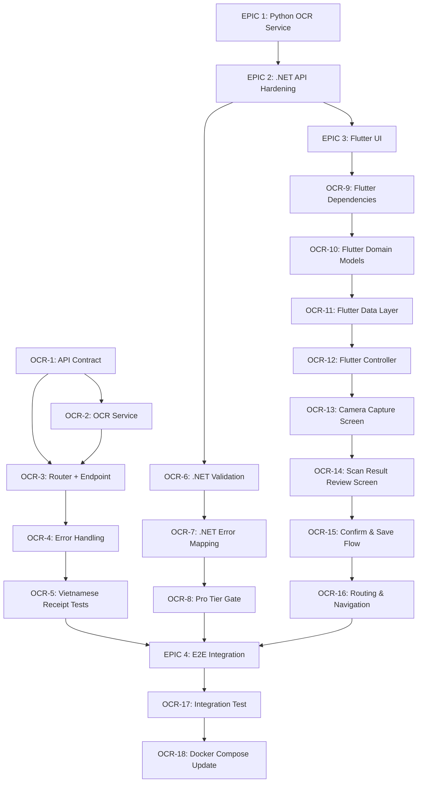

# AI OCR Bill Scanning — Development Task Breakdown

> **Project:** MIANE — Smart Travel Expense Splitter  
> **Feature:** AI OCR Receipt Scanning → Draft Expense Record  
> **Date:** 2026-07-03  
> **Status:** 📋 Ready for Development

---

## Executive Summary

This document breaks down the complete "AI OCR Bill Scanning to Expense Record" pipeline into actionable development tasks. The pipeline flow is:

```
Flutter (Camera) → .NET Gateway → .NET Expense.API → Python FastAPI OCR → OpenAI Vision
                                                    ← Structured JSON ←
                 ← Draft Expense ←
Flutter (Confirmation UI) → .NET Expense.API → PostgreSQL (Miane_expense)
```

### Current State of Implementation (Workspace Analysis)

| Layer | Component | Status |
|-------|-----------|--------|
| **Python AI Service** | OCR Router / Service / Schemas | ❌ Not implemented |
| **Python AI Service** | `requirements.txt` (missing `python-multipart`) | ⚠️ Incomplete |
| **.NET BuildingBlocks** | `IAiServiceClient.ScanReceiptAsync()` | ✅ Fully implemented |
| **.NET BuildingBlocks** | `AiReceiptScanResult` / `AiScannedItem` DTOs | ✅ Defined |
| **.NET Expense.API** | `ScanBillCommand` / `ScanBillHandler` (CQRS) | ✅ Implemented |
| **.NET Expense.API** | `ExpenseController.ScanBill` endpoint (`[FromForm]`) | ✅ Exists |
| **.NET Gateway** | YARP route `POST /expenses/scan-bill` | ✅ Configured |
| **Flutter** | `image_picker` dependency | ❌ Not installed |
| **Flutter** | Scan bill datasource / repository / controller | ❌ Not implemented |
| **Flutter** | Scan bill screen + confirmation UI | ❌ Not implemented |
| **Flutter** | `ApiEndpoints.scanBill` constant | ❌ Not defined |
| **Flutter** | GoRouter route for scan screen | ❌ Not defined |

> [!IMPORTANT]
> The .NET layer (BuildingBlocks + Expense.API + Gateway) is **already wired end-to-end**. The primary development work is in the **Python OCR service** and the **Flutter mobile UI**.

---

## Dependency Graph



---

## EPIC 1: Python FastAPI — OCR Receipt Scanning Service

> **Owner:** AI/Python Developer  
> **Goal:** Build the `/api/ocr/scan-receipt` endpoint that accepts a receipt image and returns structured JSON with extracted line items, prices, and totals.

---

### OCR-1: Define OCR API Contract (Pydantic Schemas)

| Field | Value |
|-------|-------|
| **Assignee Role** | AI/Python Developer |
| **Priority** | 🔴 Critical (Blocks all other tasks) |
| **Estimate** | 2 Story Points |
| **Dependencies** | None (first task) |

**Description:**  
Create the Pydantic request/response schemas for the OCR receipt scanning endpoint. These schemas define the **API contract** that both the Python service and .NET client (`AiReceiptScanResult`) must honor. The schemas must match the existing .NET DTOs exactly.

**Acceptance Criteria (DoD):**
- [ ] File `app/schemas/ocr.py` is created.
- [ ] `OcrScanResponse` Pydantic model is defined with fields: `description: str`, `total_amount: float`, `currency: str`, `items: List[ScannedItem]`.
- [ ] `ScannedItem` Pydantic model is defined with fields: `name: str`, `price: float`, `quantity: int`.
- [ ] Field names use `snake_case` in Python but serialize to `camelCase` in JSON (using Pydantic `alias_generator` or `model_config`) to match the .NET `AiReceiptScanResult` record (`Description`, `TotalAmount`, `Currency`, `Items` → each `Name`, `Price`, `Quantity`).
- [ ] `OcrScanResponse` includes a `model_config` example showing a Vietnamese receipt response (e.g., bún chả items).
- [ ] Unit test validates serialization output matches expected JSON shape.

**Technical Implementation Notes:**
- **Existing .NET DTO to match** — [AiReceiptScanResult.cs](file:///c:/Users/Admin/Desktop/miane/src/BuildingBlocks/AI/AiReceiptScanResult.cs): `record AiReceiptScanResult(string Description, decimal TotalAmount, string Currency, List<AiScannedItem> Items)`.
- **Existing schema pattern** — Follow the structure in [app/schemas/trip_planner.py](file:///c:/Users/Admin/Desktop/miane/services/ai-image/app/schemas/trip_planner.py).
- Use `pydantic.ConfigDict(populate_by_name=True)` so both snake_case and PascalCase are accepted.

---

### OCR-2: Implement OCR Service Logic (OpenAI Vision)

| Field | Value |
|-------|-------|
| **Assignee Role** | AI/Python Developer |
| **Priority** | 🔴 Critical |
| **Estimate** | 8 Story Points |
| **Dependencies** | OCR-1 |

**Description:**  
Implement the core OCR service that takes a receipt image (as bytes), sends it to the OpenAI Vision API (GPT-4o), and returns structured receipt data. This is the AI "brain" of the feature. The service must handle Vietnamese receipts — including handwritten bills, printed thermal receipts, and long itemized bills from restaurants and boat tours.

**Acceptance Criteria (DoD):**
- [ ] File `app/services/ocr_service.py` is created.
- [ ] Class `OcrService` is implemented with method `async def scan_receipt(self, image_bytes: bytes, filename: str) -> OcrScanResponse`.
- [ ] The service constructs a multimodal prompt for OpenAI Vision that instructs the model to:
  - Extract all line items (dish/service name, unit price, quantity).
  - Calculate or verify the total amount.
  - Detect the currency (default `VND` for Vietnamese receipts).
  - Generate a concise description (e.g., "Dinner at Bún Chả Hàng Mành").
- [ ] The prompt includes explicit instructions for handling Vietnamese text (diacritics: ă, â, ê, ô, ơ, ư, đ, etc.).
- [ ] The prompt instructs the model to return **valid JSON only** (using `response_format={"type": "json_object"}`).
- [ ] The service uses the OpenAI API key from `config.py` (`settings.OPENAI_API_KEY`).
- [ ] The service uses `gpt-4o` (or configurable via `settings.MODEL_NAME`) for Vision capabilities.
- [ ] Image is base64-encoded before sending to OpenAI.
- [ ] Service handles the following edge cases:
  - Blurry/unreadable image → returns a meaningful error.
  - Non-receipt image → returns an appropriate error message.
  - Receipt with no itemized breakdown → returns total only with empty items list.
  - Receipt in foreign language (Thai, Japanese) → still attempts extraction.
- [ ] Service includes retry logic (max 2 retries) for transient OpenAI API failures.
- [ ] Response is parsed and validated against the `OcrScanResponse` Pydantic schema.

**Technical Implementation Notes:**
- **OpenAI SDK is already installed** — `openai==1.50.0` in [requirements.txt](file:///c:/Users/Admin/Desktop/miane/services/ai-image/requirements.txt).
- **Config pattern** — Follow [app/config.py](file:///c:/Users/Admin/Desktop/miane/services/ai-image/app/config.py) which already has `OPENAI_API_KEY`, `MODEL_NAME`, `MAX_TOKENS`.
- **Service pattern** — Follow [app/services/trip_planner_service.py](file:///c:/Users/Admin/Desktop/miane/services/ai-image/app/services/trip_planner_service.py) for structure.
- **OpenAI Vision call structure:**
  ```python
  response = await client.chat.completions.create(
      model=settings.MODEL_NAME,  # "gpt-4o"
      response_format={"type": "json_object"},
      messages=[
          {"role": "system", "content": SYSTEM_PROMPT},
          {"role": "user", "content": [
              {"type": "text", "text": "Extract all items, prices and total from this receipt."},
              {"type": "image_url", "image_url": {"url": f"data:image/{ext};base64,{b64_image}"}}
          ]}
      ],
      max_tokens=settings.MAX_TOKENS
  )
  ```
- **Vietnamese receipt scenarios to consider in prompt engineering:**
  - Thermal paper receipts from chain restaurants (e.g., "Cơm Tấm Kiều Giang", "Phở 24").
  - Handwritten bills from local eateries ("Bún Chả", "Bún Bò Huế", "Cơm bình dân").
  - Long seafood receipts from coastal boat tours (e.g., Lan Ha Bay, Phú Quốc) listing items like "Tôm hùm 1kg", "Mực nướng", "Cua rang me".
  - Receipts with both Vietnamese and English text.
  - Receipts with service charge, VAT (10%), and tip lines.

> [!TIP]
> Use a detailed system prompt that tells the model it is an expert Vietnamese receipt parser. Include examples of common Vietnamese receipt formats in the prompt for few-shot learning.

---

### OCR-3: Create OCR Router & Register Endpoint

| Field | Value |
|-------|-------|
| **Assignee Role** | AI/Python Developer |
| **Priority** | 🔴 Critical |
| **Estimate** | 3 Story Points |
| **Dependencies** | OCR-1, OCR-2 |

**Description:**  
Create the FastAPI router that exposes `POST /api/ocr/scan-receipt` and register it in `main.py`. This endpoint accepts a multipart file upload and returns the structured OCR result.

**Acceptance Criteria (DoD):**
- [ ] File `app/routers/ocr.py` is created.
- [ ] Endpoint `POST /api/ocr/scan-receipt` is defined.
- [ ] Endpoint accepts a file upload parameter named `image` (type `UploadFile`).
- [ ] Endpoint validates:
  - File is present (400 if missing).
  - File MIME type is `image/jpeg`, `image/png`, `image/webp`, or `image/heic` (400 if invalid type).
  - File size does not exceed 10MB (413 if too large).
- [ ] Endpoint calls `OcrService.scan_receipt()` and returns `OcrScanResponse`.
- [ ] Response status code is `200 OK` on success.
- [ ] [main.py](file:///c:/Users/Admin/Desktop/miane/services/ai-image/app/main.py) is updated to include `app.include_router(ocr.router, prefix="/api/ocr", tags=["OCR Receipt Scanner"])`.
- [ ] `python-multipart` is added to [requirements.txt](file:///c:/Users/Admin/Desktop/miane/services/ai-image/requirements.txt) (required for FastAPI file uploads).
- [ ] `Pillow` is added to [requirements.txt](file:///c:/Users/Admin/Desktop/miane/services/ai-image/requirements.txt) (for image format validation/conversion).
- [ ] Endpoint is accessible at `http://localhost:8000/api/ocr/scan-receipt` when running locally.
- [ ] Swagger docs at `http://localhost:8000/docs` show the new endpoint with file upload UI.

**Technical Implementation Notes:**
- **Router pattern** — Follow [app/routers/trip_planner.py](file:///c:/Users/Admin/Desktop/miane/services/ai-image/app/routers/trip_planner.py) exactly.
- **The .NET client calls** `POST /api/ocr/scan-receipt` with the form field name `image` — see [AiServiceClient.cs](file:///c:/Users/Admin/Desktop/miane/src/BuildingBlocks/AI/AiServiceClient.cs) line: `content.Add(new StreamContent(imageStream), "image", fileName)`.
- **Register in main.py** — Add alongside the existing `trip_planner` router registration.
- The endpoint path `/api/ocr/scan-receipt` must match what the .NET `AiServiceClient` sends requests to.

---

### OCR-4: Add Error Handling & Logging to OCR Pipeline

| Field | Value |
|-------|-------|
| **Assignee Role** | AI/Python Developer |
| **Priority** | 🟡 High |
| **Estimate** | 3 Story Points |
| **Dependencies** | OCR-3 |

**Description:**  
Add robust error handling, structured logging, and timeout management to the OCR pipeline. The service must gracefully handle OpenAI API failures, malformed images, and rate-limiting scenarios without crashing.

**Acceptance Criteria (DoD):**
- [ ] All exceptions in `OcrService` are caught and re-raised as typed exceptions:
  - `OcrImageUnreadableError` — image too blurry, corrupted, or not a receipt.
  - `OcrServiceUnavailableError` — OpenAI API is down or rate-limited.
  - `OcrProcessingError` — generic extraction failure.
- [ ] Router maps these exceptions to appropriate HTTP status codes:
  - `OcrImageUnreadableError` → `422 Unprocessable Entity` with descriptive message.
  - `OcrServiceUnavailableError` → `503 Service Unavailable` with `Retry-After` header.
  - `OcrProcessingError` → `500 Internal Server Error`.
- [ ] Python `logging` module is configured with structured log messages including:
  - Request ID (for tracing).
  - Image filename and size.
  - OpenAI API response time.
  - Extracted item count and total amount.
- [ ] OpenAI API call has a timeout of 30 seconds.
- [ ] If OpenAI returns an empty or unparseable response, the service retries once before returning an error.
- [ ] Error responses follow a consistent JSON schema: `{"detail": "message", "error_code": "OCR_UNREADABLE"}`.

**Technical Implementation Notes:**
- Create `app/exceptions.py` for custom exception classes.
- Add exception handlers in the router using FastAPI's `@app.exception_handler()` or HTTPException.
- The .NET `AiServiceClient` calls `response.EnsureSuccessStatusCode()` which throws `HttpRequestException` for non-2xx — ensure the Python error responses provide enough detail for the .NET `ScanBillHandler` to propagate meaningful errors to the Flutter client.

---

### OCR-5: Vietnamese Receipt Parsing Tests & Prompt Tuning

| Field | Value |
|-------|-------|
| **Assignee Role** | AI/Python Developer |
| **Priority** | 🟡 High |
| **Estimate** | 5 Story Points |
| **Dependencies** | OCR-3, OCR-4 |

**Description:**  
Create a comprehensive test suite specifically for Vietnamese receipt parsing accuracy. Collect sample receipt images and validate that the OCR pipeline extracts data correctly across a range of real-world scenarios. Tune the OpenAI Vision prompt based on test results.

**Acceptance Criteria (DoD):**
- [ ] Test directory `services/ai-image/tests/` is created with `test_ocr_service.py`.
- [ ] At minimum **8 test receipt images** are collected/created covering:
  - ✅ Standard printed thermal receipt (e.g., a café or chain restaurant).
  - ✅ Handwritten bill from a local "quán nhậu" (beer/food stall) with items like "Bò lúc lắc", "Rau muống xào tỏi".
  - ✅ Printed receipt with Vietnamese diacritics: "Bún chả Hà Nội", "Phở bò tái chín".
  - ✅ Long seafood receipt from a coastal boat tour (Lan Ha Bay style) with 10+ items: "Tôm sú nướng", "Cua hoàng đế", "Sò điệp", "Ghẹ hấp bia".
  - ✅ Receipt from Huế with items like "Bún bò Huế", "Nem lụi", "Cơm hến".
  - ✅ Receipt with VAT line (10%) and service charge.
  - ✅ Bilingual receipt (Vietnamese + English) from a tourist restaurant.
  - ✅ Low-quality / slightly blurry photo of a receipt.
- [ ] Each test validates:
  - Total amount is within ±5% of the actual receipt total.
  - At least 80% of line items are correctly extracted.
  - Currency is correctly detected as `VND`.
  - Item names contain proper Vietnamese characters (not garbled).
- [ ] Test results are logged in a report format.
- [ ] If any test case fails consistently, the OpenAI prompt in `OcrService` is tuned to improve accuracy.
- [ ] `pytest` is added to `requirements.txt` (dev dependency).

**Technical Implementation Notes:**
- Store test images in `services/ai-image/tests/fixtures/receipts/`.
- Use `pytest` with `@pytest.mark.asyncio` for async test execution.
- Consider mocking OpenAI responses for deterministic unit tests, with separate integration tests that call the real API.
- Key prompt tuning areas:
  - Add few-shot examples of Vietnamese receipt formats in the system prompt.
  - Explicitly instruct to handle "x" multiplier notation (e.g., "2 x 45.000" = 90.000đ).
  - Handle "K" abbreviation (e.g., "45K" = 45,000 VND).
  - Handle Vietnamese number formatting (dots for thousands: "1.250.000").

> [!WARNING]
> Tests that call the real OpenAI API will incur costs and may be flaky due to non-deterministic LLM output. Mark these as `@pytest.mark.integration` and exclude from CI by default. Only run manually during prompt tuning sessions.

---

## EPIC 2: .NET Backend — Validation, Error Handling & Tier Gating

> **Owner:** Backend .NET Developer  
> **Goal:** Harden the existing ScanBill pipeline with input validation, proper error mapping, and Pro tier access control.

> [!NOTE]
> The core .NET pipeline is **already implemented**: `ScanBillCommand` → `ScanBillHandler` → `IAiServiceClient.ScanReceiptAsync()` → return `ScanBillResult`. This epic focuses on production hardening.

---

### OCR-6: Add Input Validation to ScanBillCommand

| Field | Value |
|-------|-------|
| **Assignee Role** | Backend .NET Developer |
| **Priority** | 🟡 High |
| **Estimate** | 3 Story Points |
| **Dependencies** | OCR-3 (Python endpoint must exist) |

**Description:**  
Add FluentValidation rules to the `ScanBillCommand` to validate the uploaded image before forwarding it to the Python AI service. This prevents unnecessary AI service calls for invalid input.

**Acceptance Criteria (DoD):**
- [ ] File `Features/ScanBill/ScanBillCommandValidator.cs` is created.
- [ ] Validator extends `AbstractValidator<ScanBillCommand>`.
- [ ] Validation rules:
  - `Image` is not null (required).
  - `Image.Length` is greater than 0 (non-empty file).
  - `Image.Length` does not exceed 10MB (10 * 1024 * 1024 bytes).
  - `Image.ContentType` is one of: `image/jpeg`, `image/png`, `image/webp`, `image/heic`.
  - `TripId` is not empty GUID.
- [ ] Validation errors return `400 Bad Request` with structured error messages.
- [ ] Validation is automatically triggered by the existing MediatR `ValidationBehavior` pipeline in BuildingBlocks.
- [ ] Unit test covers: null image, empty image, oversized image (11MB), invalid MIME type (`application/pdf`), empty TripId.

**Technical Implementation Notes:**
- **FluentValidation is already set up** — see [BuildingBlocks/Behaviors/](file:///c:/Users/Admin/Desktop/miane/src/BuildingBlocks/Behaviors/) for the `ValidationBehavior<TRequest, TResponse>` pipeline behavior that auto-validates all commands.
- Follow the pattern of existing validators in the Expense service (e.g., `CreateExpenseCommand` likely has a validator).
- The `ScanBillCommand` is defined in [Features/ScanBill/ScanBillCommand.cs](file:///c:/Users/Admin/Desktop/miane/src/Services/Expense/Expense.API/Features/ScanBill/ScanBillCommand.cs).

---

### OCR-7: Enhance ScanBillHandler Error Mapping

| Field | Value |
|-------|-------|
| **Assignee Role** | Backend .NET Developer |
| **Priority** | 🟡 High |
| **Estimate** | 3 Story Points |
| **Dependencies** | OCR-4 (Python error handling must be defined), OCR-6 |

**Description:**  
Update the `ScanBillHandler` to properly catch and map errors from the Python AI service into domain-specific exceptions that the `ExceptionHandlingMiddleware` can translate into appropriate HTTP responses for the Flutter client.

**Acceptance Criteria (DoD):**
- [ ] `ScanBillHandler` catches `HttpRequestException` from `IAiServiceClient.ScanReceiptAsync()` and maps:
  - HTTP 422 from Python → throw `DomainException("Receipt image is unreadable or not a valid receipt.")` → returns `422` to Flutter.
  - HTTP 503 from Python → throw `ServiceUnavailableException("AI OCR service is temporarily unavailable. Please try again.")` → returns `503` to Flutter.
  - HTTP 500 from Python → throw `InternalException("Failed to process receipt. Please try again later.")` → returns `500` to Flutter.
  - Timeout (>30s) → throw `ServiceUnavailableException("AI OCR service timed out.")` → returns `504` to Flutter.
- [ ] A new `ServiceUnavailableException` class is added to [BuildingBlocks/Exceptions/](file:///c:/Users/Admin/Desktop/miane/src/BuildingBlocks/Exceptions/) if it doesn't already exist.
- [ ] The [ExceptionHandlingMiddleware](file:///c:/Users/Admin/Desktop/miane/src/BuildingBlocks/Middleware/) is updated to handle `ServiceUnavailableException` → `503`.
- [ ] Error response body follows the existing API error format used across all services.
- [ ] `AiServiceClient.ScanReceiptAsync()` is updated to NOT throw on non-2xx — instead, it reads the error body and throws a typed exception with the Python error detail.
- [ ] Unit tests cover all error mapping scenarios using mocked `HttpClient`.

**Technical Implementation Notes:**
- **Current handler** in [ScanBillHandler.cs](file:///c:/Users/Admin/Desktop/miane/src/Services/Expense/Expense.API/Features/ScanBill/ScanBillHandler.cs) simply calls `_aiServiceClient.ScanReceiptAsync()` — the `AiServiceClient` calls `response.EnsureSuccessStatusCode()` which throws a generic `HttpRequestException`. This needs to be more granular.
- **Existing exception patterns** — Check [BuildingBlocks/Exceptions/](file:///c:/Users/Admin/Desktop/miane/src/BuildingBlocks/Exceptions/) for `DomainException`, `NotFoundException`, etc.
- **Middleware** — [BuildingBlocks/Middleware/](file:///c:/Users/Admin/Desktop/miane/src/BuildingBlocks/Middleware/) has `ExceptionHandlingMiddleware` that catches domain exceptions and maps them to HTTP status codes.

---

### OCR-8: Add Pro Tier Access Gate for OCR Endpoint

| Field | Value |
|-------|-------|
| **Assignee Role** | Backend .NET Developer |
| **Priority** | 🟡 High |
| **Estimate** | 2 Story Points |
| **Dependencies** | OCR-6 |

**Description:**  
The OCR feature is exclusive to **MIANE Pro** users (UserTier >= 1). Add a tier check to the `ScanBill` endpoint/handler that rejects requests from Basic-tier users with a `403 Forbidden` response.

**Acceptance Criteria (DoD):**
- [ ] `ScanBillHandler` (or the controller action) reads the `X-User-Tier` header (propagated by the Gateway from JWT claims).
- [ ] If `X-User-Tier` is `0` (Basic), the handler returns `403 Forbidden` with message: `"AI OCR scanning is a Pro feature. Please upgrade your account."`.
- [ ] If the header is missing, default to tier `0` (deny access).
- [ ] Unit test verifies that a Basic-tier user (tier=0) receives 403.
- [ ] Unit test verifies that a Pro-tier user (tier=1) can proceed normally.
- [ ] The 403 response body includes a `feature` field set to `"ocr_scan"` so Flutter can display the appropriate upgrade prompt.

**Technical Implementation Notes:**
- **Header propagation** — The [Web.Gateway Program.cs](file:///c:/Users/Admin/Desktop/miane/src/ApiGateways/Web.Gateway/Program.cs) extracts `UserTier` from the JWT and forwards it as `X-User-Tier` header to downstream services.
- **Controller access** — The `ExpenseController` can read `Request.Headers["X-User-Tier"]`.
- Consider creating a reusable `[RequiresTier(UserTier.Pro)]` attribute or middleware that can be applied to any Pro-only endpoint, avoiding hardcoded checks in every handler.
- Reference: The project description in [Bản mô tả dự án](file:///c:/Users/Admin/Desktop/miane/Bản%20mô%20tả%20dự%20án%20MIANE%20-%20Quản%20lý%20chi%20tiêu%20và%20lên%20kế%20hoạch%20du%20lịch.md) (line 45) explicitly lists "Quét hóa đơn thông minh (AI OCR)" under Pro features only.

---

## EPIC 3: Flutter Mobile — Camera Capture, Upload & Draft Confirmation UI

> **Owner:** Frontend Flutter Developer  
> **Goal:** Build the complete mobile UI flow: camera capture → upload → review OCR results → edit draft → confirm & save expense.

---

### OCR-9: Add Required Flutter Dependencies

| Field | Value |
|-------|-------|
| **Assignee Role** | Frontend Flutter Developer |
| **Priority** | 🔴 Critical (Blocks all Flutter tasks) |
| **Estimate** | 1 Story Point |
| **Dependencies** | None |

**Description:**  
Add the necessary Flutter packages for camera image capture and multipart file upload to `pubspec.yaml`.

**Acceptance Criteria (DoD):**
- [ ] `image_picker: ^1.1.0` is added to `pubspec.yaml` dependencies (for camera & gallery access).
- [ ] `image_cropper: ^8.0.0` is added to `pubspec.yaml` dependencies (optional: for receipt cropping before upload).
- [ ] `flutter pub get` runs successfully with no version conflicts.
- [ ] iOS `Info.plist` is updated with:
  - `NSCameraUsageDescription` — "MIANE needs camera access to scan receipts for expense tracking."
  - `NSPhotoLibraryUsageDescription` — "MIANE needs photo library access to select receipt images."
- [ ] Android `AndroidManifest.xml` includes `<uses-permission android:name="android.permission.CAMERA" />` (if not already present).
- [ ] `flutter analyze` passes with no new warnings.

**Technical Implementation Notes:**
- **Current pubspec.yaml** at [pubspec.yaml](file:///c:/Users/Admin/Desktop/miane/src/Clients/mobile/pubspec.yaml) — currently has NO image-related dependencies.
- Dio (already installed, `^5.4.0`) handles multipart form-data uploads natively via `FormData.fromMap()` + `MultipartFile`.
- `image_cropper` is optional but recommended for better UX — users can crop out irrelevant parts of the photo.

---

### OCR-10: Create Flutter Domain Models for OCR Result

| Field | Value |
|-------|-------|
| **Assignee Role** | Frontend Flutter Developer |
| **Priority** | 🔴 Critical |
| **Estimate** | 2 Story Points |
| **Dependencies** | OCR-1 (API contract must be defined), OCR-9 |

**Description:**  
Create Freezed domain models for the OCR scan result that match the API response from the .NET `ScanBillResult`.

**Acceptance Criteria (DoD):**
- [ ] File `lib/features/expense/domain/models/scan_bill_result.dart` is created.
- [ ] `ScanBillResult` Freezed model with fields:
  - `description: String`
  - `totalAmount: double`
  - `currency: String`
  - `items: List<ScannedItem>`
- [ ] `ScannedItem` Freezed model with fields:
  - `name: String`
  - `price: double`
  - `quantity: int`
- [ ] Both models have `fromJson` / `toJson` factories.
- [ ] JSON field mapping matches the API response (PascalCase from .NET → camelCase in Dart).
- [ ] `flutter pub run build_runner build --delete-conflicting-outputs` generates `.freezed.dart` and `.g.dart` files successfully.
- [ ] Models compile without errors.

**Technical Implementation Notes:**
- **Follow existing model pattern** from [expense.dart](file:///c:/Users/Admin/Desktop/miane/src/Clients/mobile/lib/features/expense/domain/models/expense.dart) which uses `@freezed` + `@JsonSerializable`.
- **API response format** — The .NET `ScanBillResult` record uses PascalCase properties, but ASP.NET Core's default JSON serialization uses camelCase, so Dart field names should be camelCase.
- Use `@JsonKey(name: 'fieldName')` only if the API returns non-standard casing.

---

### OCR-11: Implement Flutter Data Layer (Datasource + Repository)

| Field | Value |
|-------|-------|
| **Assignee Role** | Frontend Flutter Developer |
| **Priority** | 🔴 Critical |
| **Estimate** | 3 Story Points |
| **Dependencies** | OCR-10 |

**Description:**  
Add the `scanBill` method to the expense data layer — the remote datasource and repository. This method uploads an image file via multipart form-data to the .NET API and returns the parsed `ScanBillResult`.

**Acceptance Criteria (DoD):**
- [ ] `ApiEndpoints.scanBill` constant is added to [api_endpoints.dart](file:///c:/Users/Admin/Desktop/miane/src/Clients/mobile/lib/core/network/api_endpoints.dart) with value `'/expenses/scan-bill'`.
- [ ] Method `Future<ScanBillResult> scanBill(File imageFile, String tripId)` is added to [ExpenseRemoteDatasource](file:///c:/Users/Admin/Desktop/miane/src/Clients/mobile/lib/features/expense/data/datasources/expense_remote_datasource.dart).
- [ ] The datasource method:
  - Creates a `FormData` with `MultipartFile.fromFile(imageFile.path, filename: ...)` keyed as `"Image"`.
  - Includes `"TripId"` as a form field.
  - Sends `POST` request to `ApiEndpoints.scanBill`.
  - Parses the response into `ScanBillResult`.
- [ ] Method `Future<ScanBillResult> scanBill(File imageFile, String tripId)` is added to the [ExpenseRepository](file:///c:/Users/Admin/Desktop/miane/src/Clients/mobile/lib/features/expense/domain/repositories/expense_repository.dart) interface.
- [ ] Method is implemented in [ExpenseRepositoryImpl](file:///c:/Users/Admin/Desktop/miane/src/Clients/mobile/lib/features/expense/data/repositories/expense_repository_impl.dart).
- [ ] Proper error handling for:
  - `DioException` with status 403 → throw a custom `ProFeatureRequiredException`.
  - `DioException` with status 422 → throw `ReceiptUnreadableException`.
  - `DioException` with status 503 → throw `ServiceUnavailableException`.
  - Network timeout → throw `NetworkTimeoutException`.

**Technical Implementation Notes:**
- **Dio multipart upload example:**
  ```dart
  final formData = FormData.fromMap({
    'Image': await MultipartFile.fromFile(imageFile.path, filename: imageFile.path.split('/').last),
    'TripId': tripId,
  });
  final response = await _dio.post(ApiEndpoints.scanBill, data: formData);
  ```
- The .NET `ScanBillCommand` expects form fields named `Image` (IFormFile) and `TripId` (Guid) — see [ScanBillCommand.cs](file:///c:/Users/Admin/Desktop/miane/src/Services/Expense/Expense.API/Features/ScanBill/ScanBillCommand.cs).
- Follow the existing datasource error handling pattern in `ExpenseRemoteDatasource`.

---

### OCR-12: Implement Flutter Riverpod Controller for Bill Scanning

| Field | Value |
|-------|-------|
| **Assignee Role** | Frontend Flutter Developer |
| **Priority** | 🔴 Critical |
| **Estimate** | 3 Story Points |
| **Dependencies** | OCR-11 |

**Description:**  
Create a Riverpod `AsyncNotifier` controller that manages the bill scanning state machine: idle → capturing → uploading → reviewing → saving.

**Acceptance Criteria (DoD):**
- [ ] File `lib/features/expense/presentation/controllers/scan_bill_controller.dart` is created.
- [ ] Controller is annotated with `@riverpod`.
- [ ] State type `ScanBillState` is defined (using Freezed or sealed class) with variants:
  - `idle` — initial state, no scan in progress.
  - `uploading` — image is being sent to API.
  - `success(ScanBillResult result)` — OCR completed, data ready for review.
  - `error(String message, {String? errorCode})` — scan failed.
- [ ] Controller methods:
  - `Future<void> scanReceipt(File imageFile, String tripId)` — calls repository, transitions state.
  - `void reset()` — returns to idle state.
- [ ] On 403 error (Pro feature required), state transitions to `error` with `errorCode: 'PRO_REQUIRED'`.
- [ ] On 422 error (unreadable), state transitions to `error` with user-friendly message in Vietnamese: `"Không thể đọc hóa đơn. Vui lòng chụp lại ảnh rõ hơn."`.
- [ ] Generated `.g.dart` file compiles successfully.
- [ ] Widget test verifies state transitions: idle → uploading → success / error.

**Technical Implementation Notes:**
- **Follow existing controller pattern** from [expense_controller.dart](file:///c:/Users/Admin/Desktop/miane/src/Clients/mobile/lib/features/expense/presentation/controllers/expense_controller.dart).
- Use `AsyncValue.guard()` for error handling pattern.
- The controller should also expose a `selectedImage` state (nullable `File`) for the camera capture step.

---

### OCR-13: Build Camera Capture / Image Selection Screen

| Field | Value |
|-------|-------|
| **Assignee Role** | Frontend Flutter Developer |
| **Priority** | 🔴 Critical |
| **Estimate** | 5 Story Points |
| **Dependencies** | OCR-9, OCR-12 |

**Description:**  
Build the screen where users capture a receipt photo or select one from their gallery. This is the entry point of the OCR flow. The screen should feel premium, consistent with the MIANE design system.

**Acceptance Criteria (DoD):**
- [ ] File `lib/features/expense/presentation/screens/scan_bill_screen.dart` is created.
- [ ] Screen provides two options:
  - **📷 Take Photo** — opens device camera via `ImagePicker.pickImage(source: ImageSource.camera)`.
  - **🖼️ Choose from Gallery** — opens gallery via `ImagePicker.pickImage(source: ImageSource.gallery)`.
- [ ] After image selection:
  - Image preview is displayed in a styled container (rounded corners, shadow — per DESIGN.md border radius: 32px).
  - **"Scan Receipt"** button appears below the preview.
  - **"Retake"** button to discard and capture again.
- [ ] While scanning (uploading state):
  - A premium loading overlay is shown (using existing [LoadingOverlay](file:///c:/Users/Admin/Desktop/miane/src/Clients/mobile/lib/core/widgets/loading_overlay.dart) widget).
  - Loading text: "Đang quét hóa đơn..." (Scanning receipt...).
  - Spring animation on the loading indicator.
- [ ] On error:
  - Error message displayed using existing [ErrorWidget](file:///c:/Users/Admin/Desktop/miane/src/Clients/mobile/lib/core/widgets/error_widget.dart).
  - "Try Again" button to retake photo.
  - If `errorCode == 'PRO_REQUIRED'`, show a premium upgrade prompt with Gold accent color.
- [ ] On success:
  - Navigate to the Scan Result Review Screen (OCR-14) with the `ScanBillResult` data.
- [ ] Screen follows the MIANE design system:
  - Heritage Navy primary color for app bar.
  - Sand Gold accent for the "Scan" CTA button.
  - Be Vietnam Pro typography.
  - 32px border radius on cards.
  - Smooth spring transition animations.
- [ ] Camera permission denial is handled gracefully with a prompt to open device settings.
- [ ] `image_picker` `maxWidth: 1920, maxHeight: 1920, imageQuality: 85` is set to reduce upload size.

**Technical Implementation Notes:**
- **Design tokens** — Read [DESIGN.md](file:///c:/Users/Admin/Desktop/miane/src/Clients/mobile/DESIGN.md) and [color_tokens.dart](file:///c:/Users/Admin/Desktop/miane/src/Clients/mobile/lib/core/theme/color_tokens.dart) for exact color values.
- **Shared widgets** — Reuse existing `CustomButton`, `LoadingOverlay`, `ErrorWidget` from [lib/core/widgets/](file:///c:/Users/Admin/Desktop/miane/src/Clients/mobile/lib/core/widgets/).
- Use `ref.watch(scanBillControllerProvider)` to listen to state changes.
- For image cropping (optional): After picking, show `ImageCropper` to let users crop the receipt area for better OCR accuracy.

---

### OCR-14: Build Scan Result Review & Edit Screen

| Field | Value |
|-------|-------|
| **Assignee Role** | Frontend Flutter Developer |
| **Priority** | 🔴 Critical |
| **Estimate** | 8 Story Points |
| **Dependencies** | OCR-13 |

**Description:**  
Build the most critical UI screen: the draft expense review. This screen displays the OCR-extracted data in an editable form so the user can verify, correct, and modify the results before saving. This is the "human in the loop" step that ensures data accuracy.

**Acceptance Criteria (DoD):**
- [ ] File `lib/features/expense/presentation/screens/scan_result_review_screen.dart` is created.
- [ ] Screen receives `ScanBillResult` as navigation argument.
- [ ] **Header Section:**
  - Shows a small thumbnail of the scanned receipt image.
  - Displays the AI-generated description in an editable `TextFormField`.
  - Shows a confidence indicator (optional, if the API provides it).
- [ ] **Line Items Section:**
  - Each `ScannedItem` is displayed in an editable card with:
    - `TextFormField` for item name (pre-filled).
    - `TextFormField` for price (pre-filled, numeric keyboard).
    - `TextFormField` for quantity (pre-filled, numeric keyboard).
    - Calculated subtotal displayed (`price × quantity`).
    - ❌ Delete button to remove an item.
  - **"+ Add Item"** button at the bottom to manually add missed items.
  - Items list is scrollable.
- [ ] **Total Section:**
  - Shows the AI-extracted total amount.
  - Shows the calculated total (sum of all item subtotals).
  - If there's a discrepancy between AI total and calculated total, display a ⚠️ warning in amber.
  - Currency selector (defaults to the AI-detected currency, usually VND).
- [ ] **Expense Details Section (Pre-fill for Expense Creation):**
  - **"Paid by"** dropdown — populated with trip members (fetched from trip data).
  - **"Split type"** selector — Equal / Custom (default: Equal).
  - If Custom split: show member list with individual amount inputs.
- [ ] **Action Buttons:**
  - **"Confirm & Save"** (primary, Sand Gold) — proceeds to save the expense via `CreateExpenseCommand`.
  - **"Discard"** (secondary, outline) — cancels and returns to expense list.
  - **"Rescan"** (tertiary, text button) — navigates back to camera screen.
- [ ] Form validation:
  - Description is required and non-empty.
  - Total amount must be > 0.
  - Each item price must be >= 0.
  - Each item quantity must be >= 1.
  - "Paid by" must be selected.
- [ ] All text fields support Vietnamese input (diacritics).
- [ ] Screen follows MIANE design system (32px radius, Heritage Navy, spring animations).
- [ ] Keyboard avoidance is handled properly (content scrolls when keyboard appears).

**Technical Implementation Notes:**
- This screen is the core UX — invest in making it feel premium with smooth animations.
- Use `TextEditingController` for each editable field, initialized from `ScanBillResult` data.
- For the "Paid by" dropdown, you'll need to fetch trip members. Check if there's an existing provider for trip members or if you need to call the Trip API.
- The "Confirm & Save" action should construct a `CreateExpenseCommand`-compatible payload and call the existing `ExpenseController.addExpense()` method — see [expense_controller.dart](file:///c:/Users/Admin/Desktop/miane/src/Clients/mobile/lib/features/expense/presentation/controllers/expense_controller.dart).
- Consider using a `Form` widget with `GlobalKey<FormState>` for validation.
- **Vietnamese number formatting:** Amounts should display with dots as thousand separators (e.g., "1.250.000 ₫"). Use `intl` package (already installed) with `NumberFormat.currency(locale: 'vi_VN', symbol: '₫')`.

---

### OCR-15: Implement Confirm & Save Flow (OCR Result → Expense Record)

| Field | Value |
|-------|-------|
| **Assignee Role** | Frontend Flutter Developer |
| **Priority** | 🔴 Critical |
| **Estimate** | 3 Story Points |
| **Dependencies** | OCR-14 |

**Description:**  
Wire the "Confirm & Save" button on the review screen to create an actual expense record via the existing `POST /expenses` API. Map the edited OCR data to the `CreateExpenseCommand` format.

**Acceptance Criteria (DoD):**
- [ ] Tapping "Confirm & Save" constructs a `Map<String, dynamic>` matching the `CreateExpenseCommand` DTO:
  ```dart
  {
    "tripId": tripId,
    "description": editedDescription,
    "amount": editedTotalAmount,
    "currency": selectedCurrency,
    "exchangeRate": 1.0,
    "paidByUserId": selectedPayerId,
    "splitType": selectedSplitType,  // 0 = Equal, 1 = Custom
    "isPaidFromPool": false,
    "splits": splitType == 1 ? customSplits : null,
  }
  ```
- [ ] Calls the existing `ExpenseRepository.createExpense(data)`.
- [ ] Shows loading state during API call.
- [ ] On success:
  - Displays a success snackbar: "Khoản chi đã được tạo thành công!" (Expense created successfully!).
  - Navigates back to the expense list screen.
  - Expense list is refreshed to show the new expense.
- [ ] On failure:
  - Displays error message.
  - Does NOT navigate away — user can retry.
- [ ] The created expense includes the scanned items in the description (or as metadata).

**Technical Implementation Notes:**
- The existing [CreateExpenseCommand.cs](file:///c:/Users/Admin/Desktop/miane/src/Services/Expense/Expense.API/Features/CreateExpense/CreateExpenseCommand.cs) expects: `TripId`, `Description`, `Amount`, `Currency`, `ExchangeRate`, `PaidByUserId`, `SplitType`, `IsPaidFromPool`, `Splits`.
- Use the existing `ExpenseController.addExpense()` Riverpod method.
- After saving, invalidate the `expenseControllerProvider(tripId)` to refresh the expense list.
- Consider appending the extracted items to the description field (e.g., "Dinner at Bún Chả Hàng Mành — Bún chả x2, Nem cua bể x1, Bia Hà Nội x3").

---

### OCR-16: Add Navigation Routes & Entry Points

| Field | Value |
|-------|-------|
| **Assignee Role** | Frontend Flutter Developer |
| **Priority** | 🟡 High |
| **Estimate** | 2 Story Points |
| **Dependencies** | OCR-13, OCR-14 |

**Description:**  
Register the new screens in GoRouter and add entry points (buttons/FABs) in the existing expense UI to launch the OCR flow.

**Acceptance Criteria (DoD):**
- [ ] New GoRouter routes registered in [main.dart](file:///c:/Users/Admin/Desktop/miane/src/Clients/mobile/lib/main.dart):
  - `/trips/:tripId/scan-bill` → `ScanBillScreen(tripId: ...)`
  - `/trips/:tripId/scan-bill/review` → `ScanResultReviewScreen(tripId: ..., scanResult: ...)`
- [ ] **Entry Point 1:** On the [ExpenseListScreen](file:///c:/Users/Admin/Desktop/miane/src/Clients/mobile/lib/features/expense/presentation/screens/expense_list_screen.dart), add a secondary FAB or action button labeled "📸 Scan Bill" (with Pro badge icon ✨) next to or near the existing "Add Expense" button.
- [ ] **Entry Point 2:** On the [AddExpenseScreen](file:///c:/Users/Admin/Desktop/miane/src/Clients/mobile/lib/features/expense/presentation/screens/add_expense_screen.dart), add a "Scan Receipt" option at the top of the form that launches the OCR flow.
- [ ] Navigation from `ScanBillScreen` → `ScanResultReviewScreen` passes data via `GoRouter.extra`.
- [ ] Navigation from `ScanResultReviewScreen` → back to `ExpenseListScreen` after successful save uses `context.go()` (replacing the scan screens from the stack).
- [ ] Back button on `ScanBillScreen` returns to `ExpenseListScreen`.
- [ ] Back button on `ScanResultReviewScreen` returns to `ScanBillScreen` (to retake photo).

**Technical Implementation Notes:**
- **GoRouter** configuration is in [main.dart](file:///c:/Users/Admin/Desktop/miane/src/Clients/mobile/lib/main.dart).
- For passing `ScanBillResult` between screens, use `GoRouter.extra` parameter since the data is complex.
- The Pro badge icon should use `ColorTokens.accentGold` (Sand Gold) to visually indicate it's a premium feature — see [color_tokens.dart](file:///c:/Users/Admin/Desktop/miane/src/Clients/mobile/lib/core/theme/color_tokens.dart).
- Consider using a `FloatingActionButton.extended` with gradient background for the "Scan Bill" button to make it visually prominent.

---

## EPIC 4: End-to-End Integration & DevOps

> **Owner:** Full-stack / DevOps  
> **Goal:** Verify the complete pipeline works end-to-end and update deployment configurations.

---

### OCR-17: End-to-End Integration Test

| Field | Value |
|-------|-------|
| **Assignee Role** | Backend .NET Developer (primary) + AI/Python Developer (support) |
| **Priority** | 🟡 High |
| **Estimate** | 5 Story Points |
| **Dependencies** | OCR-5, OCR-8, OCR-16 (all implementation tasks complete) |

**Description:**  
Add OCR-specific test cases to the existing PowerShell integration test suite that validates the complete pipeline from API Gateway to Python service and back.

**Acceptance Criteria (DoD):**
- [ ] New test section added to [tests/integration-test.ps1](file:///c:/Users/Admin/Desktop/miane/tests/integration-test.ps1) titled "OCR Bill Scanning Tests".
- [ ] Test cases:
  1. **Happy Path:** Upload a valid receipt image → receive 200 with structured JSON containing `description`, `totalAmount`, `currency`, `items[]`.
  2. **Pro Tier Gate:** Upload as Basic-tier user → receive 403 with `"feature": "ocr_scan"`.
  3. **Invalid File Type:** Upload a `.pdf` file → receive 400 with validation error.
  4. **Oversized File:** Upload a 15MB image → receive 400 with file size error.
  5. **Missing File:** Send request with no file attachment → receive 400.
  6. **AI Service Down:** (Manual test) Stop the Python container and verify the .NET API returns 503.
- [ ] A sample receipt image (JPEG, ~500KB) is added to `tests/fixtures/sample_receipt.jpg` for automated testing.
- [ ] All tests pass in a clean Docker Compose environment.
- [ ] Test output clearly indicates PASS/FAIL for each case.

**Technical Implementation Notes:**
- **Existing test suite** at [tests/integration-test.ps1](file:///c:/Users/Admin/Desktop/miane/tests/integration-test.ps1) — follow the same pattern (uses `Invoke-RestMethod`).
- For file upload in PowerShell:
  ```powershell
  $filePath = "tests/fixtures/sample_receipt.jpg"
  $fileBytes = [System.IO.File]::ReadAllBytes($filePath)
  # Use multipart form-data with Invoke-WebRequest
  ```
- The test must first authenticate as a Pro-tier user to get a valid JWT.
- Gateway endpoint: `POST http://localhost:5000/expenses/scan-bill`.

---

### OCR-18: Update Docker Compose & Environment Configuration

| Field | Value |
|-------|-------|
| **Assignee Role** | Backend .NET Developer / DevOps |
| **Priority** | 🟡 High |
| **Estimate** | 2 Story Points |
| **Dependencies** | OCR-3 |

**Description:**  
Update Docker Compose files to ensure the Python AI service is properly integrated into both development and production environments, with correct dependency ordering and health checks.

**Acceptance Criteria (DoD):**
- [ ] `docker-compose.yml` (production) is updated to include the `ai-image` service definition (currently only in `docker-compose.dev.yml`).
- [ ] `ai-image` service has a health check:
  ```yaml
  healthcheck:
    test: ["CMD", "curl", "-f", "http://localhost:8000/health"]
    interval: 30s
    timeout: 10s
    retries: 3
  ```
- [ ] `expense-api` service has `depends_on: ai-image: condition: service_healthy` to ensure the Python service is ready before the .NET service starts.
- [ ] Environment variables are documented:
  - `OPENAI_API_KEY` — Required for OCR functionality.
  - `MODEL_NAME` — Defaults to `gpt-4o` (updated from `gpt-4o-mini` for better Vision accuracy).
- [ ] `.env` template in [README.md](file:///c:/Users/Admin/Desktop/miane/README.md) is updated with the new `OPENAI_API_KEY` variable.
- [ ] `docker compose up --build` starts all services including `ai-image` without errors.
- [ ] The `ai-image` service can reach OpenAI's API from within the Docker network.

**Technical Implementation Notes:**
- **Current dev config** in [docker-compose.dev.yml](file:///c:/Users/Admin/Desktop/miane/docker-compose.dev.yml) already defines `ai-image` on port 8000.
- **Expense API connection** — `AiServices__BaseUrl=http://ai-image:8000` is already set for the expense-api container.
- Add `curl` to the Python Dockerfile (`apt-get install -y curl`) for the healthcheck, or use a Python-based health check command.
- Consider adding a `MAX_UPLOAD_SIZE_MB` environment variable to the ai-image service for configurability.

---

## EPIC 5: Documentation & API Specification

> **Owner:** All roles  
> **Goal:** Update project documentation to reflect the new OCR feature.

---

### OCR-19: Update API Documentation & README

| Field | Value |
|-------|-------|
| **Assignee Role** | Backend .NET Developer |
| **Priority** | 🟢 Medium |
| **Estimate** | 2 Story Points |
| **Dependencies** | OCR-17 (after full implementation is verified) |

**Description:**  
Update the project README and API endpoint documentation to include the new OCR scanning endpoint, request/response formats, and usage instructions.

**Acceptance Criteria (DoD):**
- [ ] [README.md](file:///c:/Users/Admin/Desktop/miane/README.md) Section 7 (API Gateway & Service Endpoints) is updated to include:
  ```
  | POST | /expenses/scan-bill | Expense | Upload receipt image for AI OCR extraction (Pro only) |
  ```
- [ ] README Section 4 (Environment Variables) is updated with `OPENAI_API_KEY` and `MODEL_NAME`.
- [ ] A new section or subsection documents the OCR request/response format:
  - **Request:** `multipart/form-data` with `Image` (file) and `TripId` (string/GUID).
  - **Response:** JSON with `description`, `totalAmount`, `currency`, `items[]`.
- [ ] Error codes are documented (400, 403, 422, 503).
- [ ] The Python AI service README at [services/ai-image/README.md](file:///c:/Users/Admin/Desktop/miane/services/ai-image/README.md) is updated with the new OCR endpoint documentation.
- [ ] Architecture diagram in README is updated to show the OCR flow.

---

### OCR-20: Update Database Schema Documentation (If Applicable)

| Field | Value |
|-------|-------|
| **Assignee Role** | Backend .NET Developer |
| **Priority** | 🟢 Medium |
| **Estimate** | 1 Story Point |
| **Dependencies** | OCR-15 |

**Description:**  
If the implementation requires any schema changes (e.g., adding an `ImageUrl` or `Source` column to the `Expenses` table to track that an expense was created via OCR), update the `database_schema.md` accordingly.

**Acceptance Criteria (DoD):**
- [ ] Evaluate whether a new column `Source` (enum: `Manual = 0`, `OcrScan = 1`) should be added to the `Expenses` table to track how an expense was created.
- [ ] If schema changes are made:
  - [database_schema.md](file:///c:/Users/Admin/Desktop/miane/database_schema.md) is updated.
  - EF Core migration is created and tested.
  - `Expense` entity is updated.
- [ ] If NO schema changes are needed, document this decision in the PR description.

> [!NOTE]
> Adding a `Source` column is **optional but recommended** — it enables analytics on OCR adoption rate and allows the UI to display a "📷 Scanned" badge on expenses created via OCR.

---

## Task Summary & Sprint Planning Recommendation

### Task Priority Matrix

| Task ID | Title | Role | Points | Priority | Sprint |
|---------|-------|------|--------|----------|--------|
| OCR-1 | API Contract (Pydantic Schemas) | Python | 2 | 🔴 Critical | Sprint 1 |
| OCR-2 | OCR Service Logic (OpenAI Vision) | Python | 8 | 🔴 Critical | Sprint 1 |
| OCR-3 | OCR Router & Endpoint | Python | 3 | 🔴 Critical | Sprint 1 |
| OCR-4 | Error Handling & Logging | Python | 3 | 🟡 High | Sprint 1 |
| OCR-5 | Vietnamese Receipt Tests | Python | 5 | 🟡 High | Sprint 2 |
| OCR-6 | .NET Input Validation | .NET | 3 | 🟡 High | Sprint 1 |
| OCR-7 | .NET Error Mapping | .NET | 3 | 🟡 High | Sprint 1 |
| OCR-8 | Pro Tier Access Gate | .NET | 2 | 🟡 High | Sprint 1 |
| OCR-9 | Flutter Dependencies | Flutter | 1 | 🔴 Critical | Sprint 1 |
| OCR-10 | Flutter Domain Models | Flutter | 2 | 🔴 Critical | Sprint 1 |
| OCR-11 | Flutter Data Layer | Flutter | 3 | 🔴 Critical | Sprint 1 |
| OCR-12 | Flutter Riverpod Controller | Flutter | 3 | 🔴 Critical | Sprint 2 |
| OCR-13 | Camera Capture Screen | Flutter | 5 | 🔴 Critical | Sprint 2 |
| OCR-14 | Scan Result Review Screen | Flutter | 8 | 🔴 Critical | Sprint 2 |
| OCR-15 | Confirm & Save Flow | Flutter | 3 | 🔴 Critical | Sprint 2 |
| OCR-16 | Routing & Navigation | Flutter | 2 | 🟡 High | Sprint 2 |
| OCR-17 | E2E Integration Test | .NET + Python | 5 | 🟡 High | Sprint 3 |
| OCR-18 | Docker Compose Update | DevOps | 2 | 🟡 High | Sprint 1 |
| OCR-19 | API Documentation | .NET | 2 | 🟢 Medium | Sprint 3 |
| OCR-20 | DB Schema Documentation | .NET | 1 | 🟢 Medium | Sprint 3 |

### Total Story Points: **65 points**

### Recommended Sprint Allocation

| Sprint | Focus | Points | Duration |
|--------|-------|--------|----------|
| **Sprint 1** | Python OCR core + .NET hardening + Flutter foundations + Docker | 27 | 2 weeks |
| **Sprint 2** | Flutter UI screens + Vietnamese tests + integration | 26 | 2 weeks |
| **Sprint 3** | E2E testing + documentation + polish | 12 | 1 week |

### Parallel Work Streams

```
Week 1-2 (Sprint 1):
├── Python Dev: OCR-1 → OCR-2 → OCR-3 → OCR-4
├── .NET Dev:   OCR-6 → OCR-7 → OCR-8 → OCR-18
└── Flutter Dev: OCR-9 → OCR-10 → OCR-11

Week 3-4 (Sprint 2):
├── Python Dev: OCR-5 (Vietnamese receipt tests + prompt tuning)
└── Flutter Dev: OCR-12 → OCR-13 → OCR-14 → OCR-15 → OCR-16

Week 5 (Sprint 3):
├── All: OCR-17 (E2E integration testing)
└── .NET Dev: OCR-19 → OCR-20 (documentation)
```

---

## Glossary

| Term | Definition |
|------|-----------|
| **CQRS** | Command Query Responsibility Segregation — separates read and write operations |
| **Outbox Pattern** | Transactional pattern ensuring reliable event publishing alongside DB writes |
| **YARP** | Yet Another Reverse Proxy — Microsoft's reverse proxy used as API Gateway |
| **OCR** | Optical Character Recognition — extracting text from images |
| **GPT-4o Vision** | OpenAI's multimodal model capable of understanding images |
| **Freezed** | Dart code generation library for immutable data classes |
| **Riverpod** | Flutter state management library |
| **MediatR** | .NET library implementing the Mediator pattern for CQRS |
